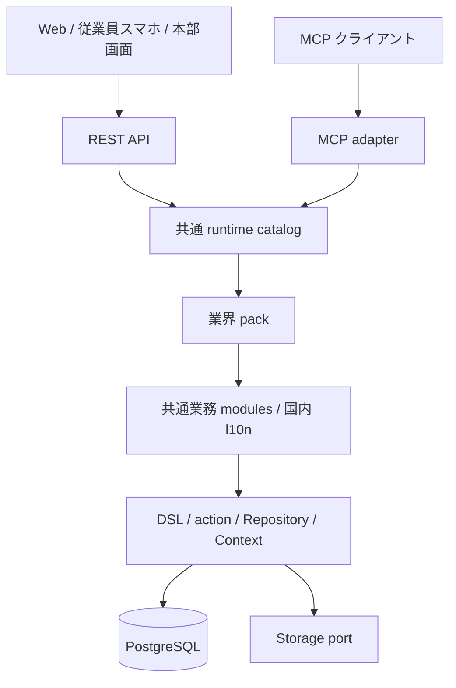

# アーキテクチャ

Daifukuは、1つのPostgreSQLと業務レジストリを共有するモジュラーモノリスです。業務定義をkernelのDSLで宣言し、同じ処理をWeb、REST、MCPから呼びます。moduleが共通業務を、packが業界固有の項目・初期設定・手順を担当します。

矢印は依存と主な呼出方向です。modules間の依存は許可した公開package経由に限り、上位adapterへの逆依存を作りません。[境界検査](../../.dependency-cruiser.cjs) が構造を検査します。

## 守るもの

| 目的 | 実装上の仕組み |
| --- | --- |
| 会社ごとの独立性 | tenant/company scope、app接続のRLS、毎回の所属再確認 |
| 拠点と本人の分担 | Repositoryの行境界、ロール、項目制御、承認時の本人確認 |
| 同じ結果をどの入口でも得る | REST/MCPが共通actionを実行し、業務規則をadapterへ重複しない |
| 金額の再現性 | Decimal、期間付きパラメーター、原資料・計算根拠の保存 |
| 訂正できる履歴 | docstatus、確定後の直接変更拒否、取消/改訂、監査 |
| 拡張しても壊れない境界 | module公開index、宣言的pack、登録と会社別適用の分離 |
| 更新時のデータ保全 | 追加migration、計画表示、DBバックアップと別DBでの実復元 |

## 次に読む

- [プログラム地図](program-map.md): ディレクトリ、adapter、変更先。
- [データと処理経路](runtime-and-data.md): 1リクエスト、伝票、Decimal、イベント。
- [権限境界](permissions.md): テナント/会社/拠点/本人、落とし穴。
- [module・packの拡張](extension-guide.md): 宣言からUI・移行・試験まで。
- [検証・移行・公開](verification-and-release.md): 安全な変更の終え方。
- [文書の管理方法](documentation-contract.md): AIと人が同じ情報を使う仕組み。
- [設計判断ADR](../adr/): 採用理由と変更履歴。

## 現状と将来

現状は国内JPYを中心とした実験的なERPです。単一法人内の店舗・部署業務を足場に拡張します。共通kernelがあることと、全業界の制度・業務へ適合することは別です。業界テンプレートの説明では、実行できる台本と未実装の専門業務を明示します。

外部向けサービスの配信、SSO/MFA、銀行送信、行政への電子申請、変形/裁量/フレックス労働制などの適合は、個別の受入基準で扱います。現在の機能範囲は [STATUS](../STATUS.md)、今回の拡張契約は [workforce-platform](../specs/workforce-platform.md) が入口です。

従業員の申請・承認・給与・領収書の関係は [従業員基盤の設計](workforce.md)、15業界の適用範囲は [業界カタログ](../domain/industry-catalog.md) を参照してください。
