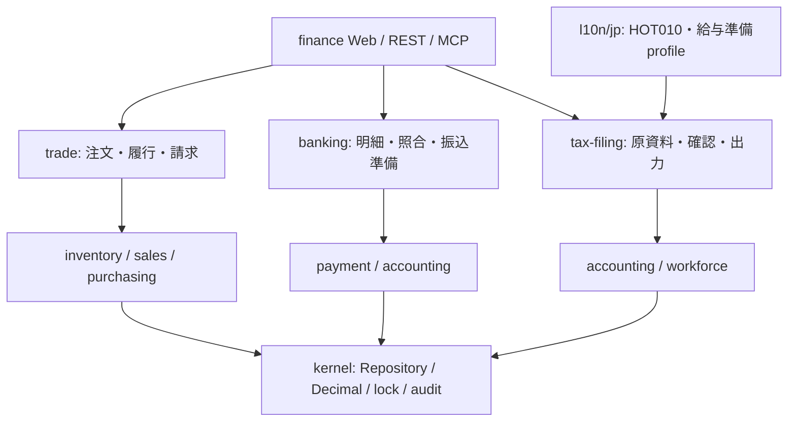

# 商流・銀行・申告準備

[全体像](README.md) / [操作](../manual/appendix-l-commerce-bank-filing.md) / [統合仕様](../specs/commerce-finance.md)

3つのmoduleを既存の伝票・在庫・会計・給与へ接続します。処理はContext/Repositoryと公開actionを通り、Web・REST・MCPで同じ規則を使います。銀行や行政へ送信するadapterは追加していません。

## 責任分担

国別のコード表・文字コード・形式は `l10n/jp` が共通のprofile portへ登録します。共通の申告moduleから日本moduleへ依存しません。runtime catalogが3moduleと国内profileを登録し、移行 `0014_commerce_finance.sql` はtradeの8表、bankingの7表、tax-filingの4表を追加します。

| 変更対象 | 実装の入口 |
| --- | --- |
| 商流の純粋wire/DSL | [contract](../../modules/trade/src/contract.ts)、[entities](../../modules/trade/src/entities.ts) |
| 注文から作成・取消 | [generate](../../modules/trade/src/generate.ts)、[posting](../../modules/trade/src/posting.ts)、[lifecycle](../../modules/trade/src/lifecycle.ts) |
| 入出庫の原資料保護 | [inventory公開port](../../modules/inventory/src/source-documents.ts) |
| 銀行のwire/DSL | [contract](../../modules/banking/src/contract.ts)、[entities](../../modules/banking/src/entities.ts) |
| 取込・候補・消込 | [imports](../../modules/banking/src/imports.ts)、[matching](../../modules/banking/src/matching.ts)、[reconcile](../../modules/banking/src/reconcile.ts) |
| 振込出力 | [transfers](../../modules/banking/src/transfers.ts)、[zengin](../../modules/banking/src/zengin.ts) |
| 申告資料の採取と確認 | [workflow](../../modules/tax-filing/src/workflow.ts)、[会計](../../modules/tax-filing/src/accounting-source.ts)、[給与](../../modules/tax-filing/src/payroll-source.ts) |
| 国別形式の拡張 | [profile port](../../modules/tax-filing/src/profile.ts)、[国内profile](../../l10n/jp/src/filing/profiles.ts)、[出典と版](../../l10n/jp/src/filing/data.ts) |
| UI・認可更新・ダウンロード | [finance client](../../apps/web/src/api/finance.ts)、[共有UI](../../apps/web/src/components/finance-shared.tsx)、[ファイル変換](../../apps/web/src/lib/finance-file.ts) |

## 商流の原資料と残数

見積から受注下書き、確定注文から出荷/入荷、履行から売上/仕入請求へ進めます。数量は小数6桁以内のDecimal、JPYの税抜単価、品目の固定在庫単位を使います。注文確定時の名称・単位・税区分等を保存し、見込税額と請求日の実税額を区別します。

親注文のロック下で、取消されていない履行・請求から残数を再計算します。過剰出荷/入荷/請求、同一明細の重複指定、別注文の明細を拒否します。履行が在庫を動かし、請求が会計へ転記します。履行から生成した請求では在庫を再び動かしません。従来の単独請求による在庫処理は維持します。

生成請求と入出庫には元の商流文書を持たせ、独立した取消/改訂を拒否します。取消は入出金・銀行照合、商流請求、履行、注文の順で整合を戻します。注文の残数を終了しても履行済み未請求は保持し、後から請求できます。

出荷/入荷だけではGL仕訳を作りません。役務・返品専用工程・原価差額配賦・入荷時の未請求債務などの対象外と実例は [商流仕様](../specs/trade-workflow.md) と [業務資料](../domain/trade-workflow.md) を参照してください。

## 銀行原明細・照合・出力の区別

取込は指定UTF-8 CSVを正規化し、選択口座とその版を含むpreview hashを確認後に保存します。同じ口座とexternalIdで内容が同じなら重複、内容が違えば競合です。取り込んだ明細は訂正で書き換えず、照合関係の解除履歴を残します。生CSV全量は保存・一般応答・監査へ残しません。

候補一覧は確定消込を行いません。既存の確定Paymentを選べば関連付けだけを行い、未決済請求を選べば既存Paymentの作成・確定を同じtransactionで実行します。明細日は不変で、請求書から作成するPaymentの計上日は明示できます。同じrequestIdの再送は日付を含め同じ内容だけを受け付けます。

振込準備は未払仕入請求の残額と口座の確認snapshotを固定し、他バッチによる重複準備を予約で防ぎます。初回出力時に現在の版・残高を再検査し、出力設定とバイト列を保存します。再取得はその同一バイト列です。準備/出力はPayment・仕訳・実送金を作らず、取消も銀行側の指図を取り消しません。

全銀profileはJPY総合振込、普通/当座、限定した許容文字、1レコード120バイト、Shift_JIS、改行なしまたはCRLFです。銀行固有の契約・取込条件は導入先で確認します。[SMBCの形式](https://bqa.smbc.co.jp/faq/show/2505?site_domain=web21lite)、[MUFGのレコード仕様](https://web.bizstn.bk.mufg.jp/biz/help/pdf/form_3_1_2_20080512.pdf)、[対応範囲](../domain/japan-bank-integration.md)。

## 申告準備のsnapshotと確認

会計と給与は別のprofile/pack entityを持ちます。採取時点の原資料、各版、profile・一次資料の版、確認した補足情報を固定し、検算結果とともに保存します。作成者とは別の本人が理由と注意事項を確認し、未解決エラーがない資料を確定します。確定後は直接変更せず、取消またはpreviousIdでつながる新しい準備版を作ります。

会計期間または社員/給与のロック下で、確認時・出力時にも原資料を採取し直します。新規仕訳、期間の再開、給与取消、設定変更等でsourceHashが変われば停止します。銀行ファイルの再取得とは異なり、申告資料の再出力も現在の原資料との一致が必要です。SHA-256は内容比較用で、真正性や行政の受理を証明しません。

日本の公式取込profileはHOT010 Ver.3.0の一般商工業・法人単体のBS/PLだけです。税抜帳簿・年度全体の締め・当期損益振替前を前提にし、全勘定科目の対応と貸借を検査します。法人税申告書、資本変動計算書、注記、法定納付税額は作成しません。[国税庁のCSV仕様案内](https://www.e-tax.nta.go.jp/hojin/gimuka/csv_jyoho4.htm)。

給与は2026年の支払日を基準に、確定給与・年末調整・本人情報から独自確認CSVを作ります。未確認と0円、当社と前職の額を分けます。公式375/eLTAXの取込形式、正式な源泉徴収票、個人番号の保存、電子申告/納税は対象外です。[国内の範囲と一次資料](../domain/japan-tax-filing.md)。

## 権限と検証

販売/購買の方向別権限に加え、生成する在庫・請求の既存権限を確認します。銀行は会社全体のaccounting、申告準備は会社全体のaccountingまたはworkforce_payrollを使い分けます。銀行・申告準備では拠点/店舗/本人限定scopeとrelayを拒否します。accountingだけでは給与資料を読めません。口座番号やsnapshotは汎用出力・監査の非公開項目にし、必要な専用actionでのみ返します。

Webはtenant/user/company別の状態を使い、所属metadataを定期再取得します。認可喪失時は資料を非表示にして操作を止め、会社切替後の古い応答を採用しません。これはサーバーでの毎回の認可・ロック・版検査を補助します。

担当回帰は [trade test](../../modules/trade/test/)、[banking test](../../modules/banking/test/)、[tax-filing test](../../l10n/jp/test/tax-filing.db.test.ts)、[HOT010形式検査](../../l10n/jp/test/tax-filing.test.ts) が入口です。移行・Web・既存伝票を含む最終の統合結果は [STATUS](../STATUS.md) で確認してください。実銀行・e-Tax/eLTAXへの接続試験を合成データの検査で代替しません。
