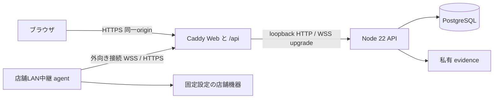

# 共通 Linux 配布と店舗中継の境界

対応仕様: [deployment-edge](../specs/deployment-edge.md)。実操作は [配備手順](../operations/deployment.md)。APIは[ビルド済みJSと管理ツールの分離](compiled-api.md)に従って配布する。

同じ Linux CPU architecture のクラウド VM とオンプレミスに、同一 SHA256 の release bundle を配置する。Node.js 22、PostgreSQL 16、Caddy、systemd はホスト側の前提で、bundle は OS や DB を作成しない。異なる OS・architecture 間の実行互換性、コンテナ、HA、自動フェイルオーバーは今回の対応に含まない。

Web は build 時に `/api` を埋め込み、Caddy の `handle_path /api/*` が prefix を取り除く。API 本体の `/auth`、`/actions`、機器接続などの route は変更しない。Web の公開 origin と API の入口が同じなので、配備ごとの Web 再build や CORS wildcard は不要。開発と E2E は従来どおり明示 `VITE_API_URL` を利用できる。Vite の `VITE_*` は公開成果物に入るため秘密を渡さない。

参照profileは[ブラウザ保護ヘッダー](../operations/deployment.md#ブラウザの保護ヘッダー)を強制適用する。スクリプト・Worker・APIの接続先を同一originに限定し、inline JavaScript・eval・外部frame埋込を拒否する。inline CSSの例外は動的UIと印刷HTMLのために残す。印刷の外部制御スクリプトもWeb成果物の一部としてmanifestに含まれる。CSP・TLS・キャッシュ・Swagger・blob印刷の動作は[実Caddy/ブラウザ試験](../../deploy/test/browser-security.test.mjs)で確認する。

Caddy は最終の外部入口とし、転送元 IP を自身が観測した接続元へ置換する。API は `TRUSTED_PROXY_CIDRS=127.0.0.1/32` だけを信頼する。クラウドロードバランサーや別 proxy を重ねる構成はこの profile で検証しておらず、そのままでは本来の IP を認識できない。信頼対象を全ネットワークへ広げて解決しない。

bundle は commit、Node/pnpm 版、lockfile hash、全ファイル hash・mode・内部 symlink を manifest に持つ。配布元から別途確認した manifest hash と archive hash で検証する。これは内容照合であり、電子署名や信頼された発行者の証明そのものではない。runtime 依存には既存 API の実行と setup に必要な workspace package が含まれる。固定 install の実ファイルと解決用リンクをコピーし、配備時には version range を再解決しない。上流 drizzle-kit の consumer 側読み込みに必要な hoist は、すでに選択した package のものだけを保持する。pnpm 10 の legacy deploy は専用 lock を作らないため今回の固定配布では採用していない。API は現在も identity 処理で owner 接続を必要とするため、owner 秘密を「移行時だけ」と説明してはならない。

release、秘密設定・DB backup・添付、機器 agent の state を分離する。release 内を変更して設定を注入せず、Node の `--env-file` で私有設定を読む。setup は既存の非破壊 plan / 対象確認 / backup 実復元 / migration / 再開を再利用する。service/proxy の設定生成も既定は plan のみであり、サービスの install/start/stop や DB の削除を行わない。

`/health` は生存確認、`/ready` は接続可能性の確認である。後者は owner/app の DB 応答と接続先一致、配布 migration の全 hash と順番・時刻、所有者限定の実体 storage ディレクトリを確認し、失敗時は503と `{ready:false}` だけを返す。最大約2秒のDB待機、同時 probe の共有、短時間 cache により監視の集中を抑える。全表の業務整合性、全 grant、容量、backup 成否まで証明するものではない。

WSS接続の開始は店舗側から行い、その接続上の仕事通知はERPから店舗へ流れる。job本文の取得と結果/状態の送信は店舗がHTTPSで開始する。

店舗側に受信用 port を公開しないことと、ERP 側への到達性は別条件である。外部店舗から私設オンプレ ERP へ届かない場合、管理者が公開 TLS 入口や VPN 等を用意する。onprem は組織所有 FQDN と信頼済み証明書を用い、ブラウザと agent の証明書検証を無効にしない。Caddy の更新で WSS が切断され得るため、中継の再接続・HTTPS 再取得と業務 job の冪等性が必要になる。

## 一次資料

2026-09-12 確認。実装上の追加制約は本仕様の判断である。

- [pnpm deploy](https://pnpm.io/10.x/cli/deploy): 共有 lock と legacy deploy の違い。
- [Vite の環境変数](https://vite.dev/guide/env-and-mode): build 時置換と公開変数の性質。
- [Caddy reverse_proxy](https://caddyserver.com/docs/caddyfile/directives/reverse_proxy): WebSocket upgrade、forwarded header、stream の停止挙動。
- [Caddy Automatic HTTPS](https://caddyserver.com/docs/automatic-https): 公開証明書とローカル CA の信頼要件。
- [systemd.exec の公式ソース](https://github.com/systemd/systemd/blob/main/man/systemd.exec.xml): サービス環境、filesystem protection、書込許可。
- [PostgreSQL 16 SQL dump](https://www.postgresql.org/docs/16/backup-dump.html): DB backup と復元の範囲。
