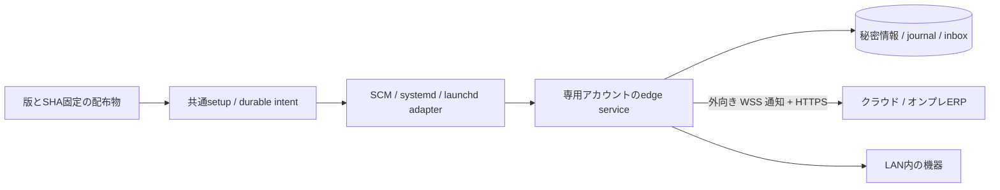

# エッジサービスの導入構造

## 共通契約とOS差分

`apps/edge/setup/main.ts`は引数とOS選択、`engine.ts`は導入/更新の計画と再開、`operations.ts`は状態/開始/停止/削除/ペアリングを担当します。
`ServiceAdapter`の境界でWindows SCM、Linux systemd、macOS launchdの登録方式を分離します。OS操作の前に管理者権限と実際の登録・専用アカウント・所有者を照合します。
業務moduleはOS操作へ依存しません。ERPの機械認可と仕事の契約は従来の`@daifuku/mod-edge-integration/contract`を再利用します。

## ファイルと再開

プログラムは`installRoot/releases/<releaseId>-<manifestHash prefix>`、状態は独立した`statePath`へ置きます。
`installation.json`は管理者所有の導入記録です。導入ID、OS/CPU、固定パス、active版、pending操作と進行段階を保存します。
markerの保存後に専用アカウントを作成し、コードコピー・権限保護・旧サービス停止・登録切替・起動を順に進めます。
途中失敗は同じ版と初回設定で`--resume`を要求します。既存ファイルは一致した内容だけ再利用し、無関係なディレクトリや登録は引き取りません。
同じ導入に対する管理操作もOSが保持する排他ロックを使います。

`bundle.ts`は対象OS/CPU、外から渡されたmanifestハッシュ、全ファイルのハッシュ/サイズ、余剰ファイル、リンク/パス逸脱を検査します。
`configuration.ts`は既存設定契約を検査し、社内CAを管理対象へコピーしてパスを書き換えます。更新は既存設定を保持します。
`io.ts`はexclusive作成・flush・同一ディレクトリの原子的置換、リンク/祖先検査を担当します。
WindowsはMoveFileExのWRITE_THROUGH、POSIXはファイルとディレクトリのfsyncを使用します。
コード側は管理者だけが書き込み、専用アカウントは状態だけを書き込めます。削除操作は登録解除までで、データやアカウントを再帰削除しません。

## 常駐時の契約

`apps/edge/src/main.ts service`は未ペアリングでも終了せず待機します。
`pairing-inbox.ts`は保護されたinboxをprocessingへ取り込み、既存資格情報での回復を先に試し、登録成功確認後に処理ファイルを消します。
失敗時はトークンをログへ出さず、再試行/再発行に備えて保持します。`service.ts`は30秒間隔の再試行と秘密を含まない状態ファイルを担当します。
状態ファイルのPIDとOSが報告する実プロセス、観測日時の鮮度を照合します。サービス登録の存在を実処理の成功と扱いません。

`lock.ts`はLinux flock、macOS zsystem flock、Windows FileStreamの共有拒否を使います。
ロックはOSが保持し、クラッシュ後は解放されます。mtimeの古さやPIDだけによる引継ぎは行いません。
`files.ts`、`windows.ts`、`macos.ts`が私有ファイルの所有者/ACLを検査します。macOSの拡張ACLやWindowsのreparsepointを無視しません。
資格情報とjournalの意味、結果不明な物理処理を自動再実行しない契約は [ADR-0023](../adr/0023-outbound-relay-principal-and-fencing.md) を維持します。

## 配布・検証の入口

`apps/edge/scripts/build.mjs`はedge/setupをNode用単独ファイルにまとめ、実際に含まれるnpm依存のLICENSE/NOTICEを集めます。
`package.py`と`assets.json`が固定版のNode/WinSWおよび全文ライセンスを同梱し、5対象の配布物と検査値を作ります。セットアップ時の外部ダウンローダーはありません。
`.github/workflows/edge-services.yml`は5種類の使い捨てrunnerで、実OSの私有ファイル/排他と実サービス導入・起動・停止・更新・登録解除を検証します。
`native-service-acceptance.mjs`は既存サービス/アカウント/データを検知したら拒否し、GitHub runnerかつ明示フラグがある場合だけ実行します。
物理機器の適合試験、署名配布、GUIインストーラー、OS全版での動作保証はこの試験に含めません。

利用者の手順は [セットアップマニュアル](../manual/edge-service-setup.md)、要件は [仕様](../specs/edge-installers.md)、採用根拠は [一次資料](../domain/edge-service-installation.md) を参照してください。
