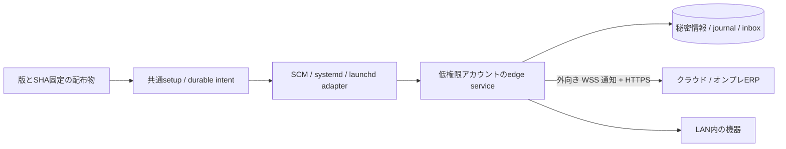

# エッジサービスの導入構造

## 共通契約とOS差分

`apps/edge/setup/main.ts`は引数とOS選択、`engine.ts`は導入/更新の計画と再開、`operations.ts`は状態/開始/停止/削除/ペアリングを担当します。
`ServiceAdapter`の境界でWindows SCM、Linux systemd、macOS launchdの登録方式を分離します。OS操作の前に管理者権限と実際の登録・実行アカウント・所有者を照合します。
業務moduleはOS操作へ依存しません。ERPの機械認可と仕事の契約は従来の`@daifuku/mod-edge-integration/contract`を再利用します。

## ファイルと再開

プログラムは`installRoot/releases/<releaseId>-<manifestHash prefix>`、状態は独立した`statePath`へ置きます。
`installation.json`は管理者所有の導入記録です。導入ID、OS/CPU、固定パス、active版、pending操作と進行段階を保存します。
markerの保存後にLinux/macOSの専用アカウントを作成し（Windowsは組込LocalServiceを使用）、コードコピー・権限保護・旧サービス停止・登録切替・起動を順に進めます。
途中失敗は同じ版・同じ操作の`--resume --execute`を要求します。初回installは元の設定と参照CAも一致する必要があり、updateは保持済み設定を使うため`--config`を受け付けません。最初のmarkerが原子的に保存される前のOS停止では、一時intentを自動採用せず管理者による確認を必要とします。既存ファイルは一致した内容だけ再利用し、無関係なディレクトリや登録は引き取りません。
同じ導入に対する管理操作もOSが保持する排他ロックを使います。

`bundle.ts`は対象OS/CPU、外から渡されたmanifestハッシュ、全ファイルのハッシュ/サイズ、余剰ファイル、リンク/パス逸脱を検査します。
`source.ts`は設定/ペアリング入力を所有者限定で読み、POSIX mode・macOS ACL・Windows DACL・リンク/サイズを検査します。`configuration.ts`は既存設定契約を検査し、社内CAを管理対象へコピーしてパスを書き換えます。更新は既存設定を保持します。
`io.ts`はexclusive作成・flush・同一ディレクトリの原子的置換、リンク/祖先検査を担当します。
WindowsはMoveFileExのWRITE_THROUGH、POSIXはファイルとディレクトリのfsyncを使用します。
コード側は管理者だけが書き込み、サービスアカウントは状態だけを書き込めます。WindowsはLocalServiceのSIDを使うため、同じ組込アカウントで動く別サービスとの分離は保証しません。削除操作は登録解除までで、データやアカウントを再帰削除しません。
macOSはApple標準のUserName/GroupNameによる非root起動を使います。専用アカウントへの明示的なグループ追加と管理権限のある所属を拒否し、OSが一般のローカルアカウントへ算出する所属と区別します。サービス自身もUID/GID・実補助グループを状態へ記録し、管理権限がある場合は機器やERPへ接続しません。setupは稼働定義・正本アカウント・実PID・実identityを照合します。独自のroot実行ランチャーは導入しません。

## 常駐時の契約

`apps/edge/src/main.ts service`は未ペアリングでも終了せず待機します。
`pairing-inbox.ts`は保護されたinboxをprocessingへ取り込み、既存資格情報での回復を先に試し、登録成功確認後に処理ファイルを消します。
失敗時はトークンをログへ出さず、再試行/再発行に備えて保持します。`service.ts`は30秒間隔の再試行と秘密を含まない状態ファイルを担当します。
`readiness.ts`はinstall/update時、OSが報告する稼働PIDと開始後のruntime状態通知を最長60秒待って照合します。登録待機・接続中・資格情報拒否でもプロセスと保存先が機能していれば導入は完了でき、ERP疎通や物理処理の成功を意味しません。statusは現在のPIDと90秒未満の観測、登録所有/競合なしを確認して`runtimeStatusFresh`を返します。phaseは最後のruntime状態であり、別途の連続疎通検査ではありません。

`lock.ts`はLinux flock、macOS zsystem flock、Windows FileStreamの共有拒否を使います。
ロックはOSが保持し、クラッシュ後は解放されます。Linuxはutil-linuxのflock、macOSは標準zshの`zsh/system`、WindowsはWindows PowerShell/.NETを使い、flockの別導入はLinuxだけです。mtimeの古さやPIDだけによる引継ぎは行いません。
`files.ts`、`windows.ts`、`macos.ts`が私有ファイルの所有者/ACLを検査します。macOSの拡張ACLやWindowsのreparsepointを無視しません。
資格情報とjournalの意味、結果不明な物理処理を自動再実行しない契約は [ADR-0023](../adr/0023-outbound-relay-principal-and-fencing.md) を維持します。

## 配布・検証の入口

`apps/edge/scripts/build.mjs`はedge/setupをNode用単独ファイルにまとめ、実際に含まれるnpm依存のLICENSE/NOTICEを集めます。
`package.py`と`assets.json`が固定版のNode/WinSWおよび全文ライセンスを同梱し、5対象の配布物と検査値を作ります。セットアップ時の外部ダウンローダーはありません。
`.github/workflows/edge-services.yml`には5種類の使い捨てrunnerで、実OSの私有ファイル/排他と実サービス導入・起動・停止・更新・登録解除を検証するjobがあります。構成の存在と全対象の成功は別で、対象commitごとの実結果は[作業記録](../log/2026-09-13-edge-installers.md)とActionsで確認します。
`native-service-acceptance.mjs`は既存サービス/アカウント/データを検知したら拒否し、GitHub runnerかつ明示フラグがある場合だけ実行します。
Linuxのunitは実`systemd-analyze verify`でも解析し、単一pathの`WorkingDirectory`と引数列の引用規則を区別します。CI固有の`/opt`権限準備は[harnessの説明](../../.github/ci/README.md)に限定し、本番の祖先検査を緩めません。
物理機器の適合試験、署名配布、GUIインストーラー、OS全版での動作保証はこの試験に含めません。

利用者の手順は [セットアップマニュアル](../manual/edge-service-setup.md)、要件は [仕様](../specs/edge-installers.md)、採用根拠は [一次資料](../domain/edge-service-installation.md) を参照してください。
