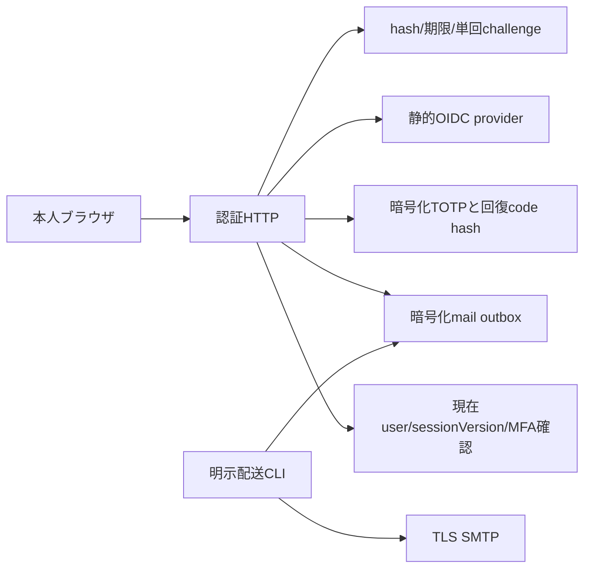

# 認証・企業運営・給与制度の拡張構造

[統合仕様](../specs/enterprise-operations.md) を、認証system service、業務module、外部adapter、専用Webへ分けています。業務の定義と権限をmoduleからadapterへ移さず、同じactionをREST/MCPから呼びます。

## 構成と責任

| 領域 | 正本と入口 | 境界 |
| --- | --- | --- |
| OIDC/MFA/メール | [kernel identity](../../kernel/src/identity/index.ts)、[system tables](../../kernel/src/db/identity-tables.ts)、[HTTP](../../apps/api/src/identity/routes.ts) | 認証専用owner lookupとtenant RLS。業務Repositoryの迂回用portにはしない |
| 外部通信 | [OIDC](../../apps/api/src/identity/oidc.ts)、[SMTP](../../apps/api/src/identity/smtp.ts)、[配送CLI](../../apps/api/src/identity/mail-cli.ts)、[Square](../../apps/api/src/adapters/square-pos.ts) | 設定済み通信先/署名/期限/上限。外部秘密や本文は業務snapshotへ残さない |
| POS | [pos-integration](../../modules/pos-integration/src/index.ts) | raw通知をadapterで検証し最小正規化。inboxと会計転記/再試行/取消は業務action |
| 連結 | [group-accounting](../../modules/group-accounting/src/index.ts)、[会社認可port](../../kernel/src/authorized-companies.ts) | 同一tenant/JPY。元会社ごとに現時点のrole/所属を再読取。子Contextへ内部write capabilityを継承しない |
| FC | [franchise](../../modules/franchise/src/index.ts) | 契約/確認売上/月次精算を既存請求/入出金actionへ接続。別会社への権限昇格なし |
| 給与税保険・年調 | [fiscal contract](../../modules/workforce/src/fiscal-contract.ts)、[給与](../../modules/workforce/src/actions/fiscal-payroll.ts)、[年調](../../modules/workforce/src/actions/year-end.ts) | 期間付き制度値、本人条件、税証跡と本人申告を計算snapshotへ固定 |
| 勤務制度 | [contract](../../modules/workforce/src/work-system-contract.ts)、[entity](../../modules/workforce/src/entities/work-system.ts) | 社員別期間/所定/合意の事前確定。給与とシフトは同じ勤務制度を参照 |

## 認証と配信

第一要素認証だけではMFA済みJWTになりません。OIDCのstate/PKCE/nonceは開始ブラウザの乱数と結び、emailによる自動紐付けを禁止します。step-up、登録確認、再設定、招待受理は単回challengeと現在sessionVersionを使い、更新時に既存セッションを失効します。Contextの `mfaVerified` / `sessionVersion` はAPIとMCPから渡し、会社をまたぐportでも再検証します。

配送は認証専用outboxで、通常の業務event outboxとは別です。SMTP未設定の受付を配信済みとせず、lease/試行上限/固定Message-IDを使います。SMTP受理直後の切断は重複し得るため、exactly-onceを主張しません。[ADR-0022](../adr/0022-identity-challenges-and-delivery.md) と [導入設定](../operations/enterprise-identity.md) を参照してください。

## 会社をまたぐ資料

連結の会社切替portは、現在userをSHARE lockして有効性とセッション/MFAを確認し、対象会社で現在の会社全体所属とroleを取得します。同じtransaction/actor/時計/tenantを保持し、pack設定は対象会社から再取得します。拠点/店舗限定caller、他tenant、無効user、無所属会社を拒否します。親のroleや内部write capabilityで対象会社の権限を補いません。

source取得は会社ID順に会計期間のtransaction lockを取り、全勘定・期間・posted明細の版集合を固定します。確定前に締め状態/資料版/計算結果を再検査します。保存snapshotの詳細はgeneric CRUDとauditで `outputHidden` とし、専用boardでも含まれる会社全てを再認可してから返します。単体元帳は連結処理で変更しません。[ADR-0021](../adr/0021-enterprise-authorization-and-integration.md) と [商業仕様](../specs/enterprise-commerce.md) が契約です。

## 制度と原資料

月次給与は勤怠/賃金の既存計算へ、支払日・保険対象月・確認済み本人条件・2026制度値による自動控除を追加します。外部確認控除方式と自動算定方式をsnapshotで区別します。年調は支払年に属する確定給与/税証跡と本人申告/前職資料を集め、未確認や不足資料を黙って除外しません。確定年調へ使った資料は依存側を取り消すまで変更できません。

勤務制度は通常制、暦月1か月変形、1〜3暦月フレックスです。制度と日別所定は開始前に固定し、給与は日/週/期間超過を重複させず集計します。シフトは勤務制度・期間残枠を資料版に含み、フレックスの本人の始終業選択を置き換えません。金額はDecimal、時間は整数分です。[2026給与資料](../domain/japan-payroll-automation.md) と [給与仕様](../specs/enterprise-payroll.md) を先に読んで改修してください。

## Webと検証

本人設定 `/account`、本人申告 `/me`、管理 `/workforce/payroll` と `/workforce/systems`、企業運営 `/commerce/pos`・`/commerce/group`・`/commerce/franchise` が専用画面です。会社/本人変更と401/403/404では機微な取得資料を撤去し、同じ本人の一時通信失敗では未送信入力を保持します。

外部adapterは合成OIDC/JWKS、検証付きTLS SMTP、署名済みSquare通知で試験します。企業機能のDB/純関数試験と、通常のブラウザー試験に加え、`pnpm test:identity:e2e` が専用空DBから認証を検証します。本番provider接続・業務適合・行政送信をこの試験結果から推定しません。統合gateと公開状態は [STATUS](../STATUS.md) と作業記録を確認してください。
