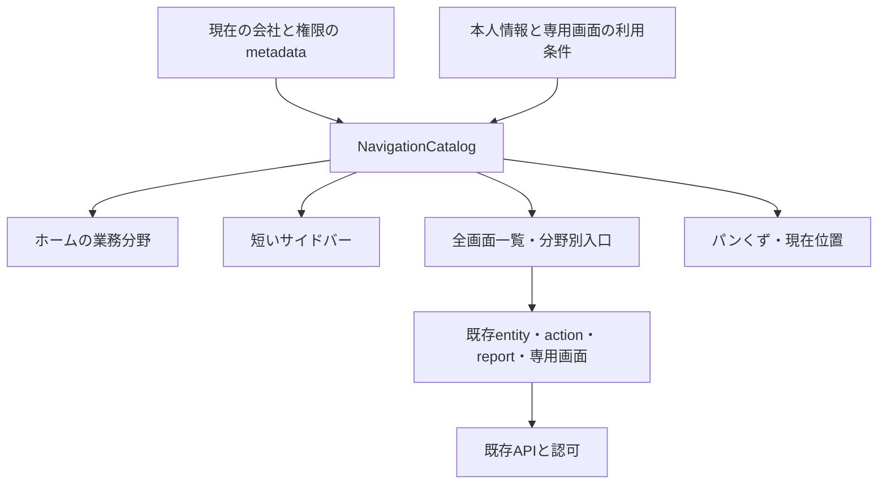

# 業務分野と画面ナビゲーション

[受入仕様](../specs/navigation-workspaces.md) / [操作マニュアル](../manual/appendix-n-navigation.md) / [プログラム地図](program-map.md)

## 責任と境界

Webのナビゲーションは、権限内の画面を探すための表示モデルである。module/packが持つ業務定義や、API・Repository・Contextによる認可は変更しない。metadataから画面カタログを一度組み立て、ホーム、サイドバー、全画面検索、業務分野、現在位置の解決に同じ分類を使う。

## カタログの契約

公開入口は [navigation.ts](../../apps/web/src/lib/navigation.ts)。`NavigationEntry`、`NavigationWorkspace`、`NavigationCatalog`、`WorkspaceId` と `WORKSPACES` を公開し、表示部品は個別に分類規則を複製しない。[navigation-types.ts](../../apps/web/src/lib/navigation-types.ts) が型、[navigation-data.ts](../../apps/web/src/lib/navigation-data.ts) が8分野・module対応・専用画面の定義を持つ。

| 関数 | 責任 |
| --- | --- |
| `buildNavigation` | metadata、専用画面の利用条件、module menuから許可された画面を構築 |
| `searchNavigation` | 名前・別名・説明・module・URLを正規化して検索 |
| `findNavigationEntry` | 一覧・新規・詳細を含む現在のpathnameに対応する画面を解決 |
| `findNavigationWorkspace` | 現在のpathnameが属する業務分野を解決 |
| `workspaceForModule` | 既知moduleを表示分野へ対応させ、未知moduleをその他へ送る |

分野は販売・仕入、在庫・商品、人事・労務、会計・資金、店舗・連携、分析・レポート、設定・管理と、未分類のその他。個別のtable帳票は分析・レポートへ集約し、元のmodule名を検索情報として保持する。同じ画面を複数分野へ重複登録しない。

専用画面、順序を持つmodule menu、親に従属しないentity、table帳票を候補にし、hrefで重複を除く。entityは読取可能なmetadataだけを使い、伝票の `lines` に登録された明細は独立した一覧入口に出さない。カタログ全体を先頭件数で切り捨てず、検索と表示ページングを通してすべての許可された入口へ到達可能にする。

## URLと権限

専用画面は既存のactionの存在や本人・設定権限など、実際のページに対応する利用条件で出し分ける。menuからの汎用action画面は既存 `ActionPage` が扱えるnongeneric・nontable・pack以外のactionに限定する。menuのない汎用actionを自動的に全件掲載するものではない。設定画面とテナント管理画面はそれぞれ既存の利用条件を使う。ピボット・テンプレート一覧・自分のアカウントなど従来から常設の画面は入口を保持し、実際の操作や分析対象は各ページの認可で決まる。

module menuを任意のURL転送機構にしない。登録済みのアプリ内routeと、metadataに存在するentity・action・reportだけをリンクへ変換する。外部URL、query/hashを混ぜたroute、encoded pathやdot segmentを使う曖昧なrouteは採用しない。既存URLは改名しない。

入口の非表示は認可ではない。既存のAPI認可、会社/拠点/本人境界、項目権限、直接開いたページの権限エラーを保持する。会社切替時のquery keyと既存のmetadata再取得・エラー処理を継承し、古い会社のカタログを新しい会社用として固定保存しない。

## 検索と表示

検索対象は日本語・英語の名称、別名、説明、module、href。NFKC、大小文字、カタカナからひらがなへの変換を行い、空白で区切った語をAND条件で照合する。表示言語の名称の完全一致・先頭一致・部分一致の順に重みを付け、同じ順位はfeatured、localeの自然順、hrefで安定させる。空の検索語はカタログ順を保持する。検索はカタログだけに対して行い、業務記録の横断検索や追加APIは作らない。

`/workspaces` は全画面、`/workspaces/<workspace>` は分野別の入口。種類は `workspace`（業務画面）、`record`（マスター・記録）、`report`（帳票）、`action`（操作）、`setting`（設定）。分野に検索・種類条件がない時はfeaturedを「よく使う操作」に置き、通常一覧から除く。条件がある時は全該当entryを一覧へ戻す。通常一覧は24件ずつで、カタログを切り捨てない。空の分野はメニューとホームへ出さない。

[menu-search.ts](../../apps/web/src/lib/menu-search.ts) はURLの `q`（最大120文字）、既知の `kind`、`page`（2〜10000の整数、1は省略）だけを受け入れる。画面は検索・種別変更で先頭へ戻し、結果減少時のページを末尾へ収める。入力変更は履歴を置換、ページ・分野変更は履歴を追加するため、画面を開いた後にブラウザの戻る操作で絞込状態へ戻れる。個人設定を保存する機能ではない。

ホームでは分野カードを先に示す。「伝票の状況を確認」のdetailsが開いている間だけ、選択moduleの伝票を既存 `useDocstatusCounts` へ渡す。初期moduleはsales、存在しなければ最初の伝票module、それもなければ先頭module。状態ごとの `limit=1` 取得はこのmoduleに限定する。関連マスターは先頭8件、帳票は先頭5件を近道として示し、分野・分析へのリンクから残りへ到達できる。初回に全module・全伝票の状態件数を取得する構成へ戻さない。

## 現在位置と入力保護

パンくずはブラウザ履歴の推測ではなく、現在のpathnameとカタログから決定する。ホームから分野・一覧・新規/詳細へ辿れる経路を示し、現在の項目には `aria-current` を使う。entityの詳細はUUID形式の正規のpathだけを一覧へ対応させ、似たprefixを誤認しない。直接URLで入った場合も一覧や分野へ戻れる。権限上見えないentityの名称を補完のために取得しない。カタログで解決しないpathは「現在の画面」を示す。

パンくず・分野・メニューは既存routerのリンクを使い、未保存フォームの移動阻止を通す。入力保護のために `window.location` や独自の履歴操作へ置き換えない。小画面のdrawerは760pxのCSS境界に従い、modal中の本文inert、Tabの循環、Escape、フォーカス移動・復帰を扱う。pathname変更時は本文へフォーカスし、本文へのskip linkも用意する。現在位置はdocument titleにも反映する。

`/account` と公開認証画面は既存の独立layoutを維持し、共通パンくずの対象外である。アカウント画面は既存のホームへのリンクを使う。

## 保存と変更範囲

ナビゲーションのための個人設定、履歴、お気に入り、localStorage/DB保存は追加しない。会社別metadataと検索中の表示状態だけを使う。ピボットの分析設定保存は独立した契約であり、このカタログへ転用しない。

## 表示と検証の入口

| 責任 | ソース |
| --- | --- |
| 現在の会社・権限のカタログ | [api/navigation.ts](../../apps/web/src/api/navigation.ts) |
| 分野・画面カード | [workspace-cards.tsx](../../apps/web/src/components/workspace-cards.tsx) |
| 検索・種類・分野・24件ページング | [workspaces-page.tsx](../../apps/web/src/pages/workspaces-page.tsx) |
| ホーム・選択moduleの件数 | [home-page.tsx](../../apps/web/src/pages/home-page.tsx)、[dashboard.ts](../../apps/web/src/api/dashboard.ts) |
| 共通メニュー・drawer | [sidebar.tsx](../../apps/web/src/components/sidebar.tsx)、[router.tsx](../../apps/web/src/router.tsx) |
| 現在位置・title | [screen-trail.tsx](../../apps/web/src/components/screen-trail.tsx) |
| 分野の見た目とレスポンシブ表示 | [navigation.css](../../apps/web/src/navigation.css) |
| カタログ・権限・重複・検索・URL境界 | [navigation.test.ts](../../apps/web/src/lib/navigation.test.ts) |
| 画面間の操作・入力保護・モバイル・権限 | [navigation.spec.ts](../../apps/web/e2e/navigation.spec.ts) |

受入手順は [仕様](../specs/navigation-workspaces.md)、実行結果は作業ログへ記録し、この文書を試験成功の証拠にはしない。
