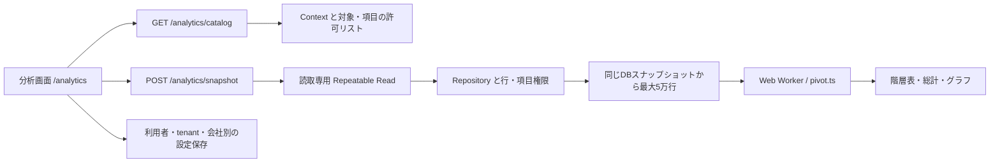

# レポーティングとブラウザ・ピボットの構造

[AI向け入口](../../AI_INDEX.md) / [仕様](../specs/reporting-pivot.md) / [操作マニュアル](../manual/appendix-m-analytics.md) / [TableResult規約](../conventions/reports.md)

## 責任の分担

既存の帳票は業務actionが集計し、`TableResult` を返す。`/analytics` のピボットは、許可された対象・期間・状態の記録をAPIが完全に取得し、その記録をWeb Workerで集計する。保存するのは分析設定であり、業務document・仕訳・確定帳票を作成または更新しない。

APIパスはAPI基底URLからの相対パス。自由SQL、任意entity、自由な結合条件は受け取らない。

| 層 | 実装 | 責任 |
| --- | --- | --- |
| 対象定義 | [catalog.ts](../../apps/api/src/analytics/catalog.ts) | 9対象の粒度・業務日付・指標・初期状態、項目権限による候補削減 |
| 読取API | [routes.ts](../../apps/api/src/analytics/routes.ts)、[snapshot.ts](../../apps/api/src/analytics/snapshot.ts) | 入力検証、完全取得、参照名、数値変換、閲覧条件の識別子 |
| DB境界 | [withContext](../../kernel/src/db/client.ts) | `readOnlySnapshot: true` による `repeatable read` / `read only` トランザクション |
| 対象取得 | [analytics client](../../apps/web/src/api/analytics.ts) | キャッシュ保存を抑えた取得、利用者・会社別query key、閲覧条件の再確認 |
| 画面状態 | [analytics-page.tsx](../../apps/web/src/pages/analytics-page.tsx)、[analytics.ts](../../apps/web/src/lib/analytics.ts) | 期間解決、対象変更、18の推奨設定、取得結果と入力条件の一致判定 |
| 集計 | [pivot.ts](../../apps/web/src/lib/pivot.ts)、[Worker](../../apps/web/src/workers/pivot-worker.ts)、[Worker制御](../../apps/web/src/lib/pivot-worker-client.ts) | 十進集計、階層の各段階の小計、件数上限、取消・古い結果の破棄 |
| 表示 | [controls](../../apps/web/src/components/analytics-controls.tsx)、[result](../../apps/web/src/components/analytics-result.tsx) | 行列の階層操作、ページング、グラフの表示範囲 |
| 設定保存 | [analytics-storage.ts](../../apps/web/src/lib/analytics-storage.ts) | 保存形式の検証、利用者・tenant・会社の分離、容量・件数制限 |

## 対象と指標の意味

全moduleと対象packが利用可能で、必要な項目を閲覧できる場合、9対象と各2種類、計18テンプレートを提供する。ロール・会社・適用pack・項目権限によって候補と件数は減る。

| 対象ID | 1行の粒度 / 期間の基準 | 初期状態 / 初期指標 | 比較テンプレートの行階層 |
| --- | --- | --- | --- |
| `sales_invoice` | 売上請求書 / 請求日 `date` | 確定済み / 税抜額 `subtotal` | 取引先 |
| `purchase_invoice` | 仕入請求書 / 請求日 `date` | 確定済み / 税抜額 `subtotal` | 取引先 |
| `stock_ledger` | 商品・倉庫の移動行 / `date` | 取消行を含む全行 / 原価増減 `costDelta` | 倉庫→商品 |
| `workforce_attendance` | 社員・勤務日 / `workDate` | 承認済み / 実働時間 `workedMinutes` | 拠点→社員 |
| `workforce_leave_request` | 有給申請 / 取得日 `leaveDate` | 承認済み / 申請日数 `days` | 拠点→社員 |
| `workforce_expense` | 経費申請 / 使用日 `expenseDate` | 承認済み・精算済み / `amount` | 拠点→費目 |
| `workforce_payroll` | 社員・給与期間 / 期間終了日 `periodEnd` | 確定済み / 総支給 `grossPay` | 拠点→社員 |
| `restaurant_chain_closing` | 店舗・営業日の締め / `date` | 確定済み / 税抜額 `subtotal` | 店舗 |
| `bank_statement` | 銀行取引明細 / 記帳日 `bookedOn` | 全行 / 符号付き入出金差額 `signedAmount` | 銀行口座→入出金区分 |

月次テンプレートは行を「年→年月」、列なし、初期指標の合計、折れ線グラフとする。比較テンプレートは上表の行階層と「年月」の列、棒グラフとする。いずれも初期期間は直近12か月。参照項目が閲覧不可なら該当階層を除き、初期指標が閲覧不可なら利用可能な先頭指標を使う。

売上・仕入請求の `balance` / `paidAmount` は取得時点の値であり、過去基準日の債権債務ではない。在庫移動原価は期間増減であり、期末残高ではない。異単位の数量を足さないため、在庫数量はこのピボットの指標に含めない。店舗日次締めと売上請求は重複し得るため結合しない。店舗材料原価から会計利益を推定しない。

勤怠はミリ秒を分に換算し、APIで小数6桁に四捨五入した文字列を渡す。実働・深夜時間と法定時間外の分類は別。銀行の差額は入金が正、出金が負で、絶対額は取引量。残高や資金繰り予測ではない。請求に複数通貨が混在した場合は、通貨軸を外して合算できないよう取得を止める。

## 完全取得と閲覧境界

`snapshotInput` は対象ID・開始日・終了日・状態だけを受け取り、未知のプロパティ、実在しない日付、逆転期間を拒否する。対象は毎回カタログから再認可する。状態フィルターの元項目も読取権限を確認し、非公開状態を絞込み条件として推測できないようにする。

取得は会社・tenantの確認前から始まる読取専用のRepeatable Readトランザクション内で行う。Repositoryが会社・拠点・店舗・本人の行制限を適用し、同一スナップショットをID昇順で500行ずつ読み取る。各ページの総件数、取得行数、途中の空ページを検査する。5万行を超えるとエラーにし、部分的な行や総計を返さない。成功応答だけが `complete: true` を持つ。

読み取ったページは直ちに許可リストの項目へ絞り、給与計算JSONや証拠資料を保持・送信しない。参照名は取得済みの参照IDだけを対象に、参照先のRepositoryと表示項目権限を確認して解決する。識別子を付けて同名の取引先・社員を同じグループへ混ぜない。名前が読めない場合は元の参照IDを使用する。

`scopeKey` はtenant・会社・actor・ロール・拠点/店舗範囲・適用pack・sessionVersion・利用可能な項目を含む不透明なハッシュで、認可の代用品ではない。クライアントはカタログを通常30秒間隔と画面再フォーカス時に再取得する。キー変更時は分析画面を作り直し、古い取得とWorkerを終了する。カタログ取得エラー時にも旧分析画面を残さない。背景タブ・停止端末で30秒以内の消去を保証する仕組みではなく、各API呼出しの認可が境界である。

## ブラウザ集計と上限

行・列は各3階層まで、指標は1〜3個。年・四半期・年月・日は記録された日付で分け、ブラウザの時差で月を移動しない。四半期・年月にも年を含める。未設定と空文字は別のグループとする。

| 集計方法 | 計算契約 |
| --- | --- |
| 合計・最小・最大 | 十進文字列を係数BigIntと小数桁に分解して計算 |
| 平均 | 各小計・総計へ元行の合計と有効値件数を蓄積。子グループ平均の平均にはしない。最低6桁、元入力がそれ以上ならその桁数で四捨五入 |
| 値のある件数 | `null` / `undefined` / 空白文字列を除いた件数 |
| 記録件数 | 指標値の欠測にかかわらず元行を数える。重複排除件数ではない |

欠測を0へ置き換えない。数値観測がない合計・平均等は `null` となり、表では `—`。空集合の件数は0。独自計算式、比率指標、重複排除件数、一般的な加重平均は現段階の選択肢に含まない。

入力は最大5万行。小計・総計を含むセル数×指標数が10万を超える場合は停止する。全組合せの密な配列は作らず、存在する組合せとその階層小計をMapへ蓄積する。数値入力は最大128桁・小数30桁も検査する。1回の集計ごとに新しいWorkerを使い、再計算・画面終了では旧Workerをterminateし、20秒のタイムアウトでも停止する。Worker非対応時は説明を出し、UIスレッドで大量集計を代行しない。

表示は行50グループ・列12グループずつ、別枠の総計を常に残す。展開は既存の階層小計を使い、再取得は不要。全体展開操作・保存する展開キーは各軸1000個まで。ページや折り畳みで総計は変化しない。

グラフは行の最下層グループを軸順に先頭24個まで取り、各グループの全列に対する集計値を使う。親の小計を重ねて二重計上しない。ランキングではなく、除外グループを「その他」へ足すこともない。棒・折れ線の描画座標のみNumberへ近似し、正確な数値は集計表を参照する。

## 期間・設定・既存帳票

期間は今月、先月、直近12か月、直近24か月、固定日付。日本時間の今日を基準にし、12/24か月は当月を含む月初から今日まで、先月は月初から月末まで。相対期間は保存した日付を固定せず、呼出し時に再解決する。対象またはテンプレートの選択は対応する軸・状態・指標へ初期化して取得する。期間・状態変更後は明示の適用操作を待ち、旧結果を新条件の結果として見せない。軸・指標だけの変更は取得済み行をWorkerで再集計する。

保存形式は `localStorage` の `daifuku.analytics.v1.[tenant,user,company]`。最大30件、名前80文字、保存文字列25万文字で、版・キー・軸・集計方法・日付・展開キーを読取/書込時の両方で検証する。設定名、対象、条件、軸、指標、グラフ、展開状態を保存する。行データ、トークン、集計値は保存しない。展開キーは表示対象の名称を含み得る。端末間同期・共有・バックアップ対象のDB保存は行わない。保存領域の禁止・破損・旧形式・上限超過は説明を表示し、分析自体は継続できる。

保存・削除は同じ保存キーを名前とする [Web Locks API](https://developer.mozilla.org/en-US/docs/Web/API/Web_Locks_API) の排他ロック内で最新一覧を読み直してから反映する。HTTPSまたは信頼できるlocalhostで対応ブラウザを使用し、Web Locksが使えなければ書き込まない。同一ブラウザの別タブからの変更は `storage` イベントで一覧へ反映するが、編集中の設定と読み込んだ版は保持する。同じ分析が他タブで更新・削除されていた場合、内容全体の比較で競合を検出し、再読込または別名保存を案内する。ロック待機中の分析切替は選択世代で区別し、先行保存の完了が新しい選択へ戻り値を書き戻さない。

既存の `/r/<action>` は [report.ts](../../apps/web/src/lib/report.ts) が入力の明示default/titleを保持し、認識できる日付・年月・年を補完する。会計年度や参照IDは推測しない。表の検索・正確な小数ソート・25/50行ページングは受信済み行だけの表示処理であり、サーバーの `totals` とCSVの対象条件を変更しない。詳しくは [UI規約](../conventions/ui.md) を参照する。

## 検査と拡張

純粋な集計契約は [pivot.test.ts](../../apps/web/src/lib/pivot.test.ts)、期間とテンプレートは [analytics.test.ts](../../apps/web/src/lib/analytics.test.ts)、保存境界は [analytics-storage.test.ts](../../apps/web/src/lib/analytics-storage.test.ts)、Worker取消は [pivot-worker-client.test.ts](../../apps/web/src/lib/pivot-worker-client.test.ts) に置く。APIの許可リスト・完全取得は [API unit](../../apps/api/test/analytics.test.ts)、会社/本人/拠点のHTTP境界と読取スナップショットは [API DB tests](../../apps/api/test/analytics.db.test.ts) を参照する。この文書は試験実行・配備成功の記録ではない。

対象を増やす場合は、粒度、業務日付、既定状態、加算可能な単位を先に決める。カタログ定義・公開wire契約・権限試験・推奨テンプレートの説明を同時に更新する。正式帳票と同じ名称を使うなら、残高基準日や取消処理を含む同等の計算契約が必要。

## 参考にした公式資料

2026-09-13に確認した [Odoo Reporting](https://www.odoo.com/documentation/18.0/applications/essentials/reporting.html) と [Metabase Pivot tables](https://www.metabase.com/docs/latest/questions/visualizations/pivot-table) は、行列・指標の分離、階層展開、軸交換の参考。[Odoo Favorites](https://www.odoo.com/documentation/18.0/applications/essentials/search.html) は名前付き条件の再利用、[Power BI Matrix](https://learn.microsoft.com/en-us/power-bi/visuals/power-bi-visualization-matrix-visual) は固定見出し・小計の参考にした。

帳票の問いと原資料を分ける考え方は [ERPNext Sales analytics](https://docs.frappe.io/erpnext/sales-analytics)、[Accounting reports](https://docs.frappe.io/erpnext/accounting-reports)、[Banking](https://docs.frappe.io/erpnext/banking-in-erpnext)、件数・合計・平均の区別は [Microsoft PivotTable集計](https://support.microsoft.com/ja-jp/excel/sum-values-in-a-pivottable) を参照する。ここでの9対象・上限値・保存方式は大福帳の現実装に合わせた設計判断であり、これらの製品との機能同等性を示すものではない。
