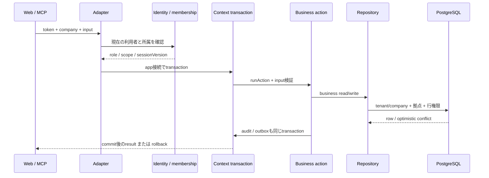
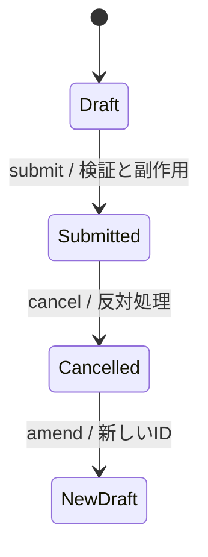

# データと処理経路

[全体像](README.md) / [権限](permissions.md)

## 1リクエストの流れ

RESTは [request-context](../../apps/api/src/request-context.ts) と [routes](../../apps/api/src/routes/) を、MCPは [tools](../../apps/mcp/src/tools.ts) と [session](../../apps/mcp/src/session.ts) を使います。入力をZodで検証しても認可の代わりにはなりません。[runAction](../../kernel/src/actions/run.ts) とRepositoryが認可・行条件を適用します。

## 業務データの形

Entityは `id/tenantId/companyId/version/createdBy/updatedBy` などの共通項目とDSLの業務項目を持ちます。company scopeが既定です。金額/数量はDBではnumeric、domainではDecimal、JSONでは文字列として扱います。JSの浮動小数で途中計算してからDecimalに包む実装は避けます。

Documentはentityに `docstatus/number/amendedFrom` を加えます。draft=0、submitted=1、cancelled=2。確定後の訂正は取消と改訂で履歴をつなぎます。明細のCRUDも親documentの状態・所属を確認します。計算値・状態・他伝票への連動IDはserverOwnedなどで汎用書込みから保護します。

申請の「提出・承認・差戻し」と会計documentのdocstatusを混同しません。モジュールの業務状態で申請を進め、最終確定時に元の条件・版・承認を再照合します。給与などの確定内容は、後日マスターを変えても変化しない計算根拠を残します。

## 並行実行と再実行

[withLock](../../kernel/src/transactions.ts) は会社/tenantを含むbusiness keyをトランザクション中ロックし、「まだ行がない」時点の競争も直列化します。単純な「SELECTで無い→INSERT」だけに頼りません。行の版はexpectedVersionで照合し、競合をユーザーに返します。

一部失敗を記録して継続するときはsavepointを使います。業務全体の失敗はrollbackします。確定伝票や残数消費を作ってから別transactionで監査を付ける構造にしません。

## 日付・時刻・制度値

業務日とUTCの瞬間を区別します。サーバーの `ctx.now()` が打刻や監査の基準になり、テストは時刻を注入して再現します。Webで表示する会社の日付と、SQL/JSのタイムゾーン変換を混ぜません。

税率・賃金条件・制度パラメーターは有効期間を持つデータです。対象期間に該当しない条件を「最新値」で埋めません。入力未確認と正当な0円を区別します。制度上の計算と会社の任意ルールを同じ固定定数にしません。

## 監査・イベント・添付

Repositoryの変更は [audit](../../kernel/src/audit.ts) に記録されます。外部配信予定はtransactional outboxを通し、未実装の外部workerを「配信済み」と扱いません。ストレージは [storage port](../../kernel/src/storage.ts) を使い、moduleからファイルシステムへ直接アクセスしません。

監査や添付の参照も元行の権限を確認する必要があります。給与などの新しい機微データを追加するときは、通常一覧だけでなくexport、audit、関連ref、MCP、エラーログも確認します。
