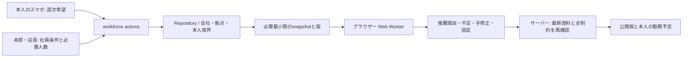

# 社員条件・勤務希望・シフト推薦の構造

[AI入口](../../AI_INDEX.md) / [仕様](../specs/employee-shift-planner.md) / [設計判断](../adr/0020-browser-shift-planning.md) / [操作ガイド](../operations/shift-planning.md)

## 処理の流れ

| データ | 責任と公開範囲 |
| --- | --- |
| 社員 | 在籍・雇用期間・現在拠点。既存HR権限を維持 |
| 勤務条件 | 雇用区分、スキル、週目標/上限、日上限、勤務日数・連勤・勤務間隔。担当管理者/HRが設定 |
| 週次希望 | 本人が7日分の可能時間帯・希望・不可を提出。未提出は割当不可 |
| 計画 | 拠点/週の需要と下書き割当、seed、元資料の版。担当管理者/HRのみ |
| 公開勤務 | 公開計画から記録した本人行。本人への応答に他人・下書きを含めない |

## コードを読む順序

1. [純粋な型](../../modules/workforce/src/scheduling/types.ts) と [wire contract](../../modules/workforce/src/shift-contract.ts)。金額を扱わず、時刻は日付＋整数分。
2. [DSL entity](../../modules/workforce/src/entities/shift.ts)。table・schema・REST/MCPは通常のregistryから生成する。
3. [snapshot](../../modules/workforce/src/shift-source.ts)。給与金額、経費、有給理由を含めない。
4. [純粋エンジン入口](../../modules/workforce/src/scheduling/index.ts)。評価と推薦を分ける。
5. [worker](../../apps/web/src/workers/shift.worker.ts)、[実行管理](../../apps/web/src/lib/shift-worker-client.ts)、[React hook](../../apps/web/src/lib/use-shift-recommendation.ts)。
6. [管理UI](../../apps/web/src/components/shift-planner.tsx) と [本人UI](../../apps/web/src/components/employee-shifts.tsx)。

## 制約と目的関数

制約は在籍、勤務条件の登録、本人の提出時間、休暇申請日、必要スキル、時間重複、日/週上限、週日数、連勤、最小勤務間隔、休憩分を扱う。会社policyと個人上限の厳しい方を使い、隣接週の公開勤務を週の前後6日ずつ取得する。会社policyの週開始も月曜に限定し、それ以外は明示的に拒否する。各勤務は同じ日付の範囲内で、休憩の具体的な時刻は計画しない。

hard違反をゼロに保ったうえで、必要人数の充足を優先する。soft評価は勤務希望との一致、本人の週目標からの差、社員間の目標達成率の標準偏差を使う。目標時間0の分母は60分とし、割当を禁止したい日は本人希望を不可にする。雇用区分そのもの、年齢・性別などの保護属性を評価点に使わない。

`preferenceRate`は優先希望と一致した割当の割合（0～1）。`fairness`は対象社員の計画時間/目標時間の標準偏差（小さいほど偏りが少ない）。指標は実勤務時間・賃金・評価査定ではない。勤務不可の人数と各除外理由は複数条件に該当し得るため、理由の件数を合算して社員数とみなさない。

## 保存と公開

`sourceRevision`は関連資料の版を比較する。編集中に資料が変わった場合は入力を残し、最新資料で再評価する。公開直前に全制約を再検査し、画面側の合格だけで公開しない。不足のある公開には理由と確認が必要。

公開済み本文の変更は禁止し、改訂下書きの公開と旧版の引退を原子的に行う。後から希望/休暇/勤務条件が変わると、公開版の再評価により要調整が分かる。計画から打刻・給与の原資料を作成しない。

## 実行とデータ保護

1回ごとに専用workerを作り、終了・キャンセル・20秒の時間切れ・画面離脱で停止する。以前のworkerから届く結果は無視する。会社/拠点/週/入力の変更でも旧結果を消す。employee snapshotをlocalStorageやIndexedDBへ保存しない。

容量は100人、7日、42枠、1枠20人。既定1,200反復、エンジン上限10,000反復。実測時間とbrowser bundleのサイズは作業記録で管理する。入力不足や欠員を隠さず、過大入力は黙って切り捨てずに拒否する。
