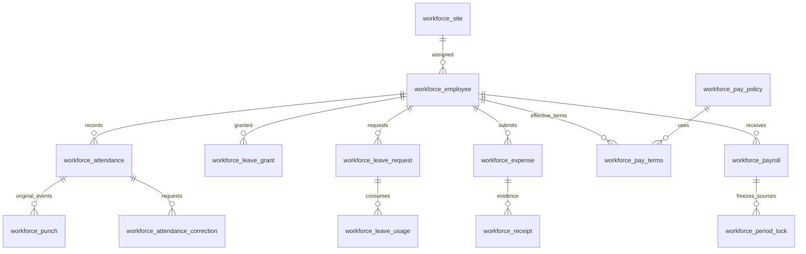
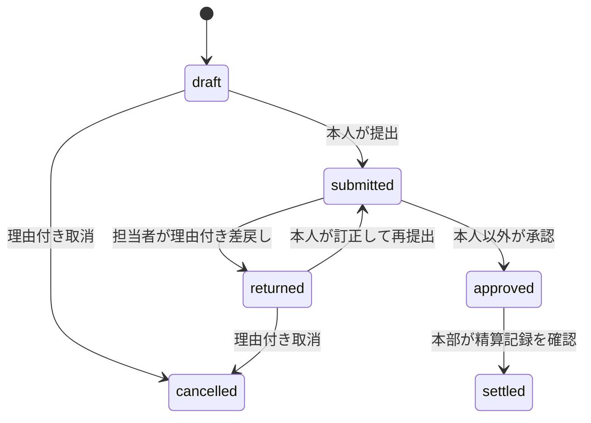

# 従業員・本部・拠点をつなぐ設計

[全体像](README.md) / [受入基準](../specs/workforce-platform.md) / [権限ADR](../adr/0019-workforce-access.md) / [国内業務の根拠](../domain/japan-workforce.md)

## 責任の分担

| 層 | 責任 | 実装 |
| --- | --- | --- |
| kernel | 現在の会社所属、siteIds/storeIds、本人行条件、監査、ロック、保存port | [company-access](../../kernel/src/company-access.ts)、[scope](../../kernel/src/store-access.ts) |
| workforce | 勤怠、有給、経費、賃金条件、給与の業務状態と計算 | [公開入口](../../modules/workforce/src/index.ts)、[module](../../modules/workforce/src/module.ts) |
| workforce-evidence | 経費申請に従属する領収書の所有者・版・状態・内容検査 | [公開入口](../../modules/workforce-evidence/src/index.ts)、[service](../../modules/workforce-evidence/src/service.ts) |
| API / MCP | 同じContextを作り業務actionを実行。APIだけがバイナリmultipartを受ける | [API](../../apps/api/src/routes/workforce-evidence.ts)、[MCP session](../../apps/mcp/src/session.ts) |
| Web | 本人のスマホ画面、担当範囲の承認画面。通信は型付きcontractを使用 | [wire contract](../../modules/workforce/src/contract.ts)、[router](../../apps/web/src/router.tsx) |

業界packとは独立したmoduleなので、農場、学校、製造拠点、店舗、本部などで同じ従業員基盤を使えます。`workforce_site` は会社内の担当拠点・部署です。任意深さの組織階層やグループ企業の連結労務を表すものではありません。

## データの関係

従業員は会社に所属する有効な利用者へ明示的に結びます。氏名やメールの一致から本人を推定しません。申請の `employeeId/userId/siteId` はサーバーが記録し、汎用CRUDから偽装できません。個別の項目・参照・制約は [entity定義](../../modules/workforce/src/entities/index.ts) を正本とします。

## 状態と不変条件

勤怠は打刻の事実と承認する勤務記録を分けます。元打刻は追記専用です。訂正申請には申請理由と提案時刻を残し、本人以外の確認を経ます。クライアントが現在時刻を自由に渡して通常打刻を偽装する経路は設けません。

有給は本部が資格・根拠を確認して付与し、利用日の有効な残高で承認します。付与台帳と利用台帳を分け、取消も履歴を保持します。半日二件・同時申請・期限・勤怠との重なりを含めた確認が必要です。入社日だけで資格や法定取得義務の達成を自動判定しません。

上の図は経費の通常の流れです。正確な各状態の許可操作は [経費action](../../modules/workforce/src/actions/expenses.ts) にあります。領収書を追加できるのは本人の下書き・差戻し中だけです。申請を返さずに提出済み証憑を差し替えることはできません。

給与は期間付きの賃金条件と計算policy、承認済みの原資料から下書きを作り、控除・手当・根拠の確認後に確定します。東京の暦日をまたぐ勤務は、暦日ごとの休日区分モデルがない初版では給与自動計算を明示的に拒否します。本人へ公開するのは確定明細です。拠点管理者へ給与金額を一括公開しません。原資料の更新と確定が競合しないよう、従業員単位のロックと確定期間の記録を使います。

## 同時操作と再試行

従業員の申請・承認・給与・領収書追加は共通の `workforce:employee:<employeeId>` ロックを使います。業務更新は同じトランザクション内で行い、`expectedVersion` が古い入力を拒否します。打刻や新規申請の `idempotencyKey` は同じ操作の再送に使い、別の入力を同じキーで再利用しません。

領収書追加は親経費の版も進めます。同じ版を読んだ提出処理が証憑変更を見落とすことを防ぎます。同一申請への同一digest追加は拒否し、添付本体のdigest・サイズをダウンロード時にも照合します。

## バイナリ保管

許可形式はPNG、JPEG、PDF、1ファイル10MB、1申請10件です。拡張子だけで判断せず、MIMEと先頭署名を照合します。これは完全なファイルパーサーやウイルス検査ではありません。取得時はダウンロードとして返し、`nosniff` と `private, no-store` を付けます。

データベースとファイル保存は同一の原子的トランザクションにはなりません。ファイル保存後にDB処理が失敗すると参照のない保存物が残り得ます。現行portは保存物を自動削除しません。運用ではDBと添付保存領域を組にしてバックアップ・復元し、保管期限・容量・検査の手順を別途定めます。別会社・他人の領収書を汎用添付機能へ複製して権限を迂回しません。

## 拡張するとき

新しい勤務制度・給与計算・組織階層を追加するときは、通常制の既存値を都合よく変更するのでなく、適用期間と受入例を持つ契約を追加します。法制度の根拠は [domain文書](../domain/japan-workforce.md)、実装例は [仕様](../specs/workforce-backend-contract.md) と対応試験を確認します。従来の外部確認控除と、今回の2026年月額甲欄・確認本人条件に基づく税保険自動算定を区別します。年末調整、事前確定した通常/1か月変形/フレックスの構造は [企業運営拡張](enterprise-operations.md)、制度の対象/対象外は [給与仕様](../specs/enterprise-payroll.md) を参照してください。

## 領収書の内部項目

`workforce_receipt.storageKey` は `outputHidden` を宣言し、汎用REST/MCPの取得・一覧と監査の公開出力から管理者を含めて除外する。`hidden` は画面表示の指定だけであり、秘密の出力制御には用いない。専用APIは公開DTO `ReceiptInfo` を返し、downloadの内部Repository読取りでだけ保存先を利用する。独自レポート/actionは、必要な公開項目だけを選ぶDTOを定義する責任を持つ。
