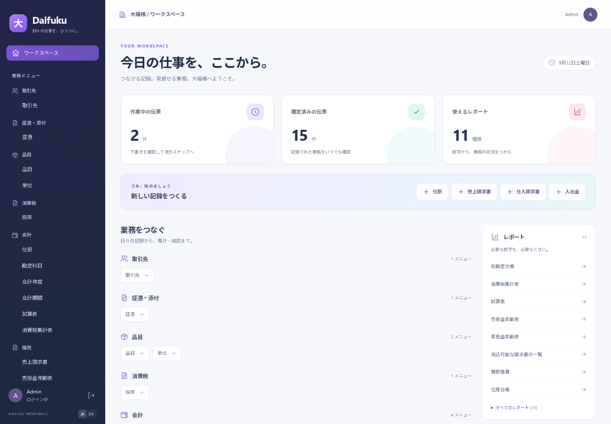

# 2026-09-12 共通基盤・不具合修正・UI改修

利用者の依頼に基づき、全体レビューで見つかった共通契約と実装の不整合を修正した。対象は現在の会計・販売・購買・入出金・在庫・契約・小売・不動産と、それらを支えるkernel・API・MCP・Web。新業種の機能開発は含めない。

## 実装の要点

会社・テナントの境界をDB参照制約まで通し、計算結果と出所リンクを通常CRUDで書き換えられないようにした。共通ロック、内部書込み権限、保存版の照合を使い、確定・取消・明細編集・並行消込を整合させた。権限付き検索・集計・監査、outbox失敗時のロールバックも回帰試験に加えた。

請求書には発行時の表示情報と統制勘定、明細の単位を保存する。消込は有効日付きの履歴にし、過去の残高と後日取消を再現する。会計/在庫の締めと逆転記、重複入居、敷金の所有情報を保護した。根拠のない旧履歴を現在値で補う処理は入れていない。

API/MCPの定義読込を `apps/runtime` に統合した。.envを先に読み、DB生成は全導入パックのスキーマを使う。無効化を理由に既存テーブルを削除しない。MCPは接続後も現在の利用者・権限・会社を検証する。パックCLIは同じメールアドレスだけで導入先を推測せず、会社コードまで識別して曖昧な候補を拒否する。添付はストレージの参照先、長さ、SHA256を確認する。

UIは濃紺のサイドバー、紫・シアン・コーラルのカード、明るい背景と余白で統一した。集計は実DBの件数を使う。商品選択で説明・単価・税区分を補完し、計算値は表示専用にした。未保存変更があると確定・取消・削除を止め、取消確認で訂正日を指定できる。スマホでカードが重なる問題と、閉じたナビゲーションが読み上げ対象に残る問題も実画面で確認して修正した。

PC・スマホの最終表示（実データのサンプル画面）:

[スマホのホーム](images/2026-09-12-ui-refresh/home-mobile.png) / [ログイン](images/2026-09-12-ui-refresh/login-desktop.png) / [請求書](images/2026-09-12-ui-refresh/invoice-desktop.png)

## 移行と環境

旧migration7本で請求・明細・入金・仕訳を作ったDBへ、新しい0007を適用して検証した。生成された外部キーが一意制約より先になる順序問題を直し、元伝票に基づく履歴の補完を追記した。会社間の不正参照や、JPYへ読み替えられない外貨取引がある場合は移行全体を失敗させ、旧状態を残す。

検証用PostgreSQL16.15と画面用サンプルDBを `../review/` 配下の独立したローカル環境で用意した。PC全体のDBサービスと業務DBは変更していない。UIはlocalhost:5173、APIはlocalhost:3100。ソース配布スクリプトは.envを含めず、DB/添付のバックアップとは区別する。

## 検証結果

- `pnpm gate` 通過。型検査、ESLint、依存境界、unit 386件 / 42 files、DB 297件 / 41 files（PostgreSQL16.15、DB部分394.61秒）。
- 最後の取消/導入先の追補後に全体の型・ESLint・依存境界・unitを再実行。unit **388件 / 43 files**、境界 **505 modules / 2495 dependencies・違反ゼロ**。
- 取消の追補と影響範囲は8 suites / **57 DB tests通過**。販売・購買・入出金・請求連動在庫・小売台本・旧DB移行を再実行し、今回追加した5ケースも含む。ログ `../review/final-followup-db.log`。
- 導入先特定・seed・RESTオプションのPG16追補は3 suites / **8 DB tests通過**（27.40秒、`../review/final-target-db.log`）。重複を除くDBケースは全体297件＋取消新規5件＋導入先新規3件で305件。
- Webの型検査・本番build通過。API/MCP/runtime各packageの型検査も通過。
- Playwright全**8 E2E通過**（89秒）。最後のAPIで請求書作成→商品補完→未保存ガード→保存→確定→指定日取消、入金消込の3件を再実行し通過（31.5秒）。
- CUAとChromiumでPC/390pxスマホ幅を表示確認。モバイルメニューの開閉・非表示も確認。画面用デモデータだけを使用。
- マニュアルを再生成。14章・画像37枚・内部リンク52件を確認し、旧UI35枚と今回の補遺2枚を区別。
- `git diff --check` 通過。移行・単体・E2Eのログは独立した `../review/` に保存。

同じテストを複数回通した分を合算して総件数を水増ししない。全体gate後の追補は、変更された範囲の再実行と新規ケースに分けて記録した。

## テストの変更理由

古いテストが許容していた計算項目の任意更新や商品単位変更は、新契約では拒否する。拒否後に元の値が保持されることを確認し、金額・貸借・在庫の期待値は維持した。パック未適用の試験には専用の未適用会社を用意し、設定保持の試験と混同しないようにした。

DB試験のセットアップは全スキーマを構築するため、ローカルI/O負荷下で従来の10秒を超えた。fixtureのhookTimeoutを60秒へ増やし、各業務テストの30秒制限と検証内容は維持した。

## 関連記録と限界

- [共通kernel](2026-09-12-foundation-kernel.md)、[業務処理](2026-09-12-domain-foundation.md)、[UI](2026-09-12-ui-refresh.md)、[敷金](2026-09-12-deposit-identity.md)
- [導入先の追補](2026-09-12-runtime-target-followup.md)、[移行手順](../upgrade-foundation.md)、[現状](../STATUS.md)、[再開手順](../HANDOFF.md)、[新UIの操作補遺](../manual/appendix-c-ui-refresh.md)

今回の到達点は、現行の国内・JPYの業務を複数業種へ伸ばすための共通契約を補強した状態。多通貨・海外制度・製造・履行管理などは未実装。元資料がない履歴の自動復元、外部配信のexactly-once、実運用の性能保証は含まない。旧マニュアル画像は旧UIと区別して補遺を用意する。公開・pushは行っていない。
