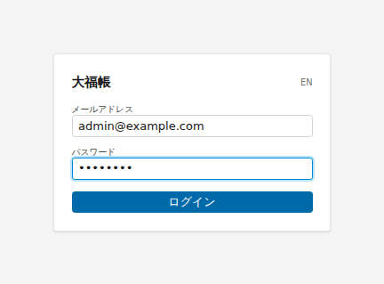
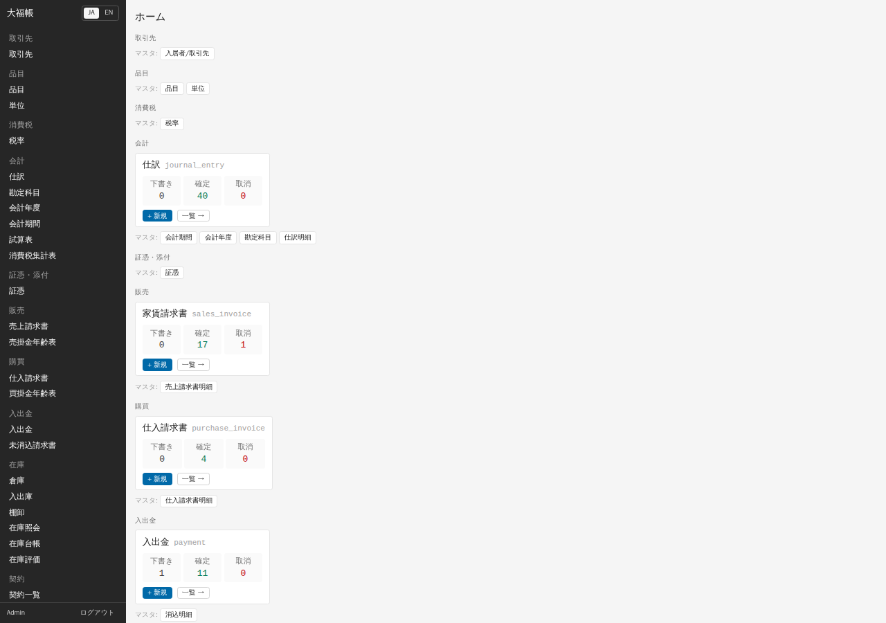
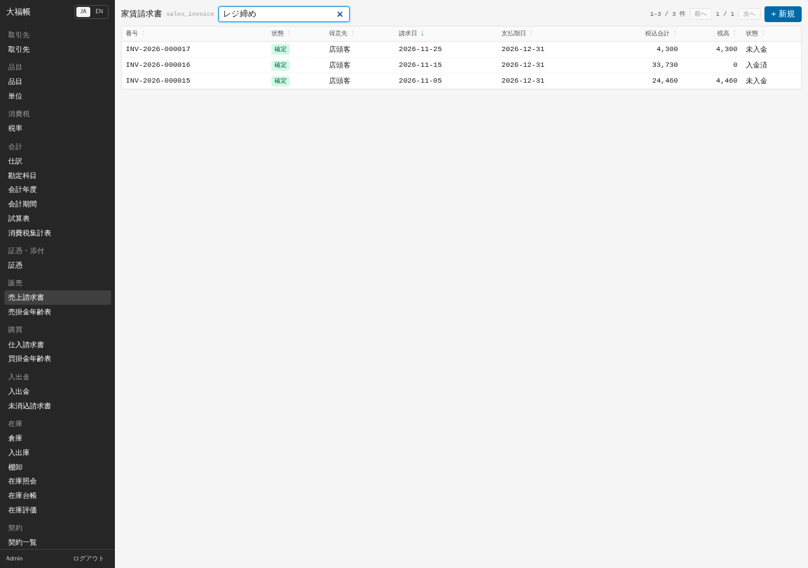
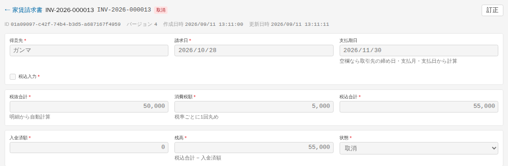
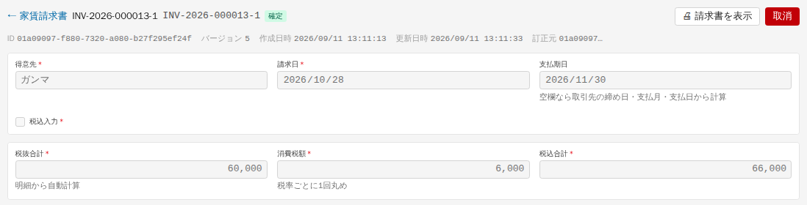
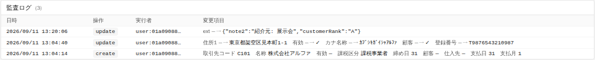
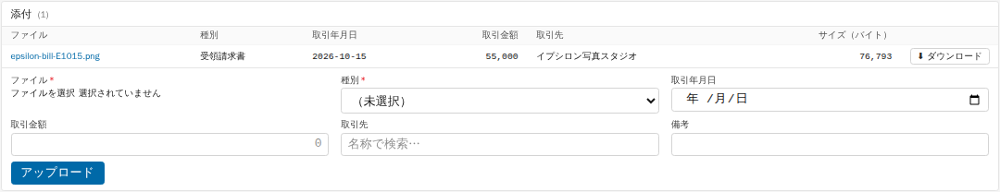
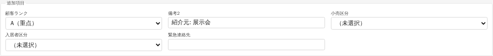
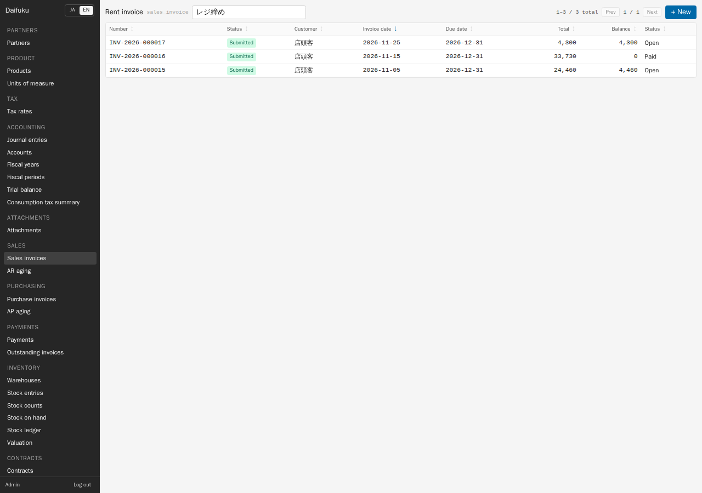

# 02 画面の基本

2026-09-13の業務分野・画面検索に合わせて導線を更新しました。画像は旧UIです。現在の入口は「[付録N](appendix-n-navigation.md)」、入力操作の変更点は「[付録C](appendix-c-ui-refresh.md)」を参照してください。

## ログイン

ブラウザで大福帳の画面（開発環境では `http://localhost:5173`）を開くと、ログイン画面が出ます。管理者から受け取ったメールアドレスとパスワードを入れて「ログイン」を押します。ログインは 12 時間有効で、切れると「セッションが切れました。再度ログインしてください。」と表示されてログイン画面に戻ります。

## 画面の構成

左側の藍色の帯が **サイドバー**（メニュー）です。ホーム、自分の勤怠・申請（利用可能な場合）、「すべての画面を探す」と、販売・仕入などの業務分野が並びます。分野を選ぶと、その目的に合う専用画面・マスター・記録を探せます。画面名が分かる場合は「すべての画面を探す」を使います。伝票の明細は親の伝票内で操作します。左上のロゴまたはホームへの項目でホームに戻ります。言語切替「JA / EN」、利用者名とログアウトは左下にあります。スマートフォンでは上部のメニューボタンでサイドバーを開きます。

**ホーム** では業務分野のカードから作業を始めます。伝票件数を見る場合は「伝票の状況を確認」を開いてmoduleを選びます。そのmoduleの「下書き・確定・取消」件数を実際の記録から取得します。画面上部のパンくずから、ホーム・分野・一覧へ戻れます。

## 一覧画面

メニューから台帳を選ぶと一覧画面になります。

- **検索**: 見出しの右の「検索…」欄に文字を入れると、少し待ってから絞り込まれます。どの項目を検索するかは台帳ごとに決まっています（例: 品目はコード・名称・カナ、売上請求書は備考）。
- **並べ替え**: 列の見出しを押すと昇順、もう一度押すと降順になります。日本語の名称は読み（五十音）順ではなく文字コードの順に並びます。
- **ページ送り**: 1 ページ 50 件です。右上に「1–50 / 120 件」のように件数が出ます。
- **新規作成**: 右上の「+ 新規」。行を押すとその記録の画面が開きます。

**CSV の書き出しは、一覧画面にはありません。** 表を CSV で保存できるのはレポート画面（「[06 月次](06-monthly.md)」）だけです。

## フォーム（入力画面）

- 項目名の横の赤い「*」は必須、「🔒」は作成後に変更できない項目です（例: 取引先コード）。
- 「保存」（キーボードでは Ctrl+Enter）で保存します。「キャンセル」で一覧に戻ります。
- 入力に誤りがあると、項目の下に赤字で理由が出ます。
- 金額欄は、入力中はカンマなし、欄から出るとカンマ区切りで表示されます。
- 他の人が同じ記録を先に保存していた場合は「他のユーザーが先に更新しました」と出ます。「再読み込み」を押して最新の内容を表示してから入力し直してください。

新規作成ではチェックボックスや選択肢の既定値が表示されます。例えば取引先の「有効」は最初からオンです。自動計算の合計・残高などは入力不要で、保存後に読み取り専用で表示されます。「税込入力」はその伝票に使う単価の税込・税抜に合わせて確認してください。

変更すると「未保存の変更」と表示され、保存するまで「確定」「取消」「削除」などは押せません。保存中も競合する操作を止めます。保存せずに別の画面へ移動する場合は、変更を破棄するか確認されます。閲覧権限だけの利用者には保存ボタンを表示しません。

## 明細グリッド

請求書や仕訳のように明細を持つ伝票では、フォームの下に表形式の明細欄が出ます。

1. 「+ 行を追加」で行を足します。最後の行で Enter を押しても行が増えます。
2. 品目・勘定科目などは、欄に文字を入れると候補が出るので選びます。品目を選ぶと、登録済みの品名・単価・税区分・単位が対応する欄に補われます。数量と今回の取引条件を確認してください。
3. 行の右端の「↑」「↓」で順番を入れ替え、「×」で行を削除します。
4. 表の下の「合計」は画面上での足し算で、「参考値」です。正式な金額は保存したときにシステムが計算します。

ヘッダと明細は「保存」1 回でまとめて保存されます。

## 伝票の状態（下書き・確定・取消・訂正）

請求書・入出金・仕訳・入出庫・棚卸・契約などの **伝票** には状態があり、見出しの横に色付きの札で表示されます。

| 状態 | 意味 | できる操作 |
|---|---|---|
| 下書き | 保存しただけ。帳簿には反映されない | 編集、「確定」、「削除」 |
| 確定 | 帳簿に反映された。伝票番号が付く | 「取消」（仕訳を除く） |
| 取消 | 確定を取り消した。記録は残る | 「訂正」 |

- **確定** すると伝票番号（例 `INV-2026-000012`）が付き、ほとんどの項目と明細が変更できなくなります。売上・仕入の請求書や入出金は、確定した時点で仕訳が自動で作られます。
- **確定した伝票は削除できません。** 誤りに気づいたら「取消」してから「訂正」します。取消すと自動で作られた仕訳も逆向きの仕訳で打ち消されます。
- **訂正** を押すと、取り消した伝票の内容を写した新しい下書きができます（見出しの下に「訂正元」）。直して確定すると、元の番号に「-1」が付いた番号（例 `INV-2026-000013-1`）になります。
- 入金済みの請求書は取消できません。先に入金を取消してください。
- 「取消」の確認画面には「訂正日（任意）」があります。空欄は元の取引日での取消です。元の期間が締まっている場合は、開いている期間の訂正日を指定して「取消」を押します。
- **仕訳は取消できません。**「取消」ボタンは表示されますが、押すとエラーになります。訂正は「逆仕訳」で行いますが、v0.1 では画面から逆仕訳を作れないので、管理者に依頼してください（「[09 AI から使う](09-ai.md)」の `accounting.reverse_entry`）。

## 監査ログ

記録の画面のいちばん下に「監査ログ」があります。いつ・誰が・どの操作（作成 create、更新 update、確定 submit など）で・どの項目をどう変えたかが、新しい順に並びます。監査ログは誰にも消せません。実行者欄は現在、利用者名ではなく内部の ID（`user:…`）で表示されます。AI エージェントが操作した場合は `agent:` と表示されます。

## 添付（証憑）

記録の画面の「添付」欄から、請求書や領収書のファイルをその記録に結び付けて保存できます。

1. 「ファイル」でファイルを選びます（PDF・PNG・JPEG・CSV・XML・テキスト、20 MB まで）。
2. 「種別」（受領請求書、発行請求書、領収書、契約書、銀行明細、その他）を選びます。
3. 電子帳簿保存法の検索に使うため、「取引年月日」「取引金額」「取引先」も入れておきます。
4. 「アップロード」を押します。一覧の「ダウンロード」で取り出せます。

同じ内容のファイルを二度アップロードすると、重複としてエラーになります。**保存した証憑は削除できません**（管理者も同じ）。差し替えは管理者が「訂正版で差し替え」（`attachment.supersede`）で行い、古いファイルも残ります。

## 追加項目

導入テンプレートなどが足した項目は、フォームの下の「追加項目」の枠にまとめて表示されます。使い方は通常の項目と同じです。

## 言語の切替（JA / EN）

サイドバー下部の「JA」「EN」で、メニュー・項目名・ボタンの言語を切り替えます。入力したデータ（取引先名など）は切り替わりません。レポートの標準的な条件名は日本語で補完されますが、帳票が独自に指定した名称や一部の設定項目は、日本語表示でも英語の場合があります。

---

検証: 2026-09-11 実機で確認 — ログイン、ホーム、一覧の検索・見出しでの並べ替え（昇順/降順）・件数表示、フォームの保存と入力エラー表示、同時更新時の「他のユーザーが先に更新しました」、新規作成でチェックボックスがオフのまま保存されること（取引先「有効」）、明細グリッドの行追加・Enter での行追加、確定・取消・訂正（番号 `-1`）、取消による仕訳の打ち消し（試算表で確認）、入金済み請求書の取消拒否（API）、確定済み請求書の削除拒否（API）、仕訳の「取消」がエラーになること、監査ログ、添付のアップロード・重複エラー・削除拒否（API）、追加項目の保存、JA/EN 切替。未検証: セッション切れの表示、20 MB の上限、許可されないファイル形式、`attachment.supersede`。
