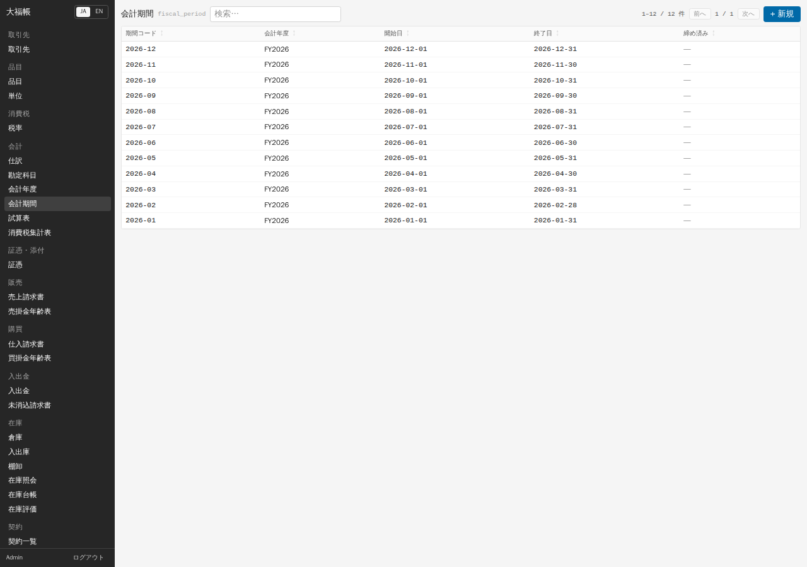
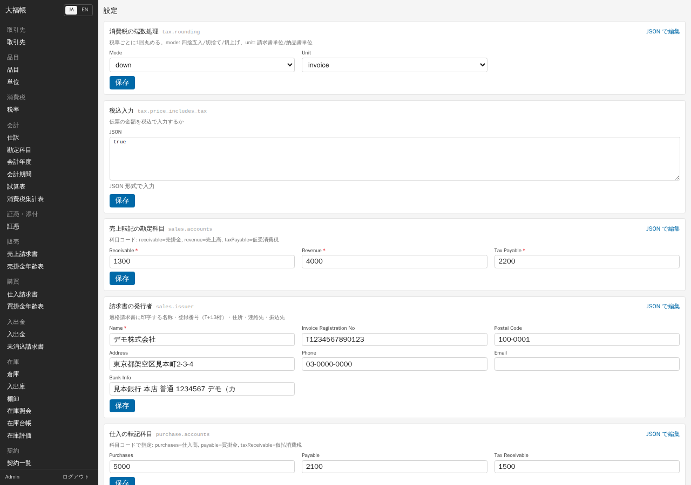
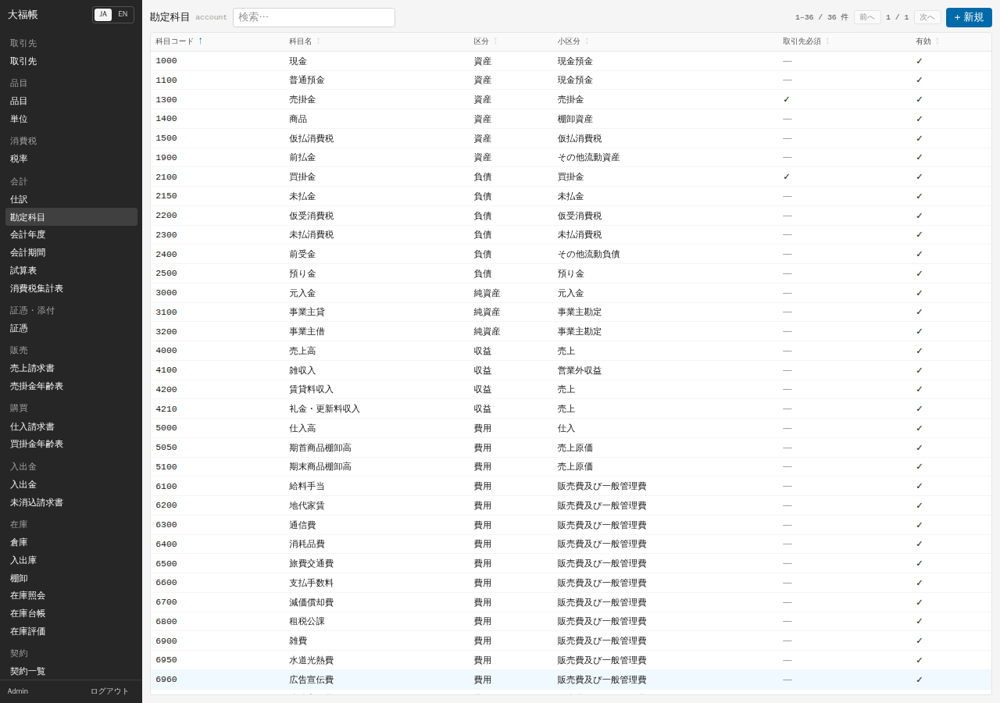
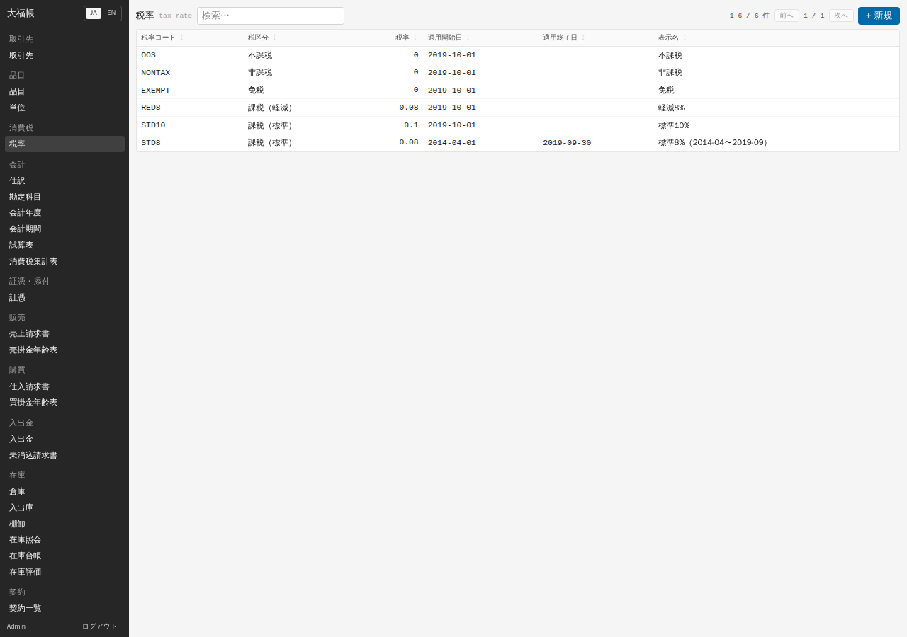

# 03 初期設定

2026-09-12追補: 新規導入・既存環境の更新は [安全な導入と更新](../operations/setup.md)、利用者/会社/店舗の設定は [付録E](appendix-e-operations-control.md) を参照してください。本章のデモ初期化は練習専用で、既存データを残す更新手順ではありません。

使い始める前に、会計年度・会社の設定・勘定科目・税率・請求書の発行者情報を確認します。`pnpm db:reset` で作ったデモ環境には日本向けの初期値が入っているので、多くはそのまま使えます。

## 会計年度と会計期間

会計年度は 12 か月の「年度」と、月ごとの「会計期間」でできています。初期状態では当年 1 月〜12 月の年度（`FY2026`）と 12 の会計期間が作られています。「会計」→「会計期間」で確認できます。

- 仕訳（請求書などから自動で作られる仕訳を含む）は、日付が **開いている会計期間** に入っていないと確定できません。
- 翌年度の年度と期間は、管理者が `accounting.open_fiscal_year`（開始日を指定）で作ります。開始月は 1 月以外でもかまいません。既存の年度と期間が重なる場合は拒否されます。v0.1 では画面から実行するボタンが無いので、管理者に依頼してください（「[09 AI から使う](09-ai.md)」）。
- 月の締め方は「[06 月次](06-monthly.md)」を見てください。

## 設定画面

サイドバーの一番下「設定」（管理者か settings ロールの利用者のみ）で、会社ごとの設定を変えます。項目ごとに枠があり、値を変えて枠の中の「保存」を押すと反映されます。

| 設定 | 意味 | 日本向けの初期値 |
|---|---|---|
| 消費税の端数処理 | 税額を「税率ごとに 1 回」丸める方法（down 切捨て / half_up 四捨五入 / up 切上げ）と単位（invoice 請求書ごと。delivery_note 納品書ごとも選べるが、v0.1 の売上請求書は請求書ごとに計算する） | 切捨て・請求書ごと |
| 税込入力 | 請求書の単価を税込で入力するかの既定（`true` / `false` を直接入力する欄）。各伝票のチェックも確認する | `false`。小売の税込運用では導入時に `true` を明示設定（通常のテンプレート適用は保存済み設定を維持） |
| 売上転記の勘定科目 | 売上請求書の確定時に使う科目コード（売掛金・売上高・仮受消費税） | 1300 / 4000 / 2200 |
| 請求書の発行者 | 適格請求書に印字する名称・登録番号など（下記） | 未設定 |
| 仕入の転記科目 | 仕入高・買掛金・仮払消費税の科目コード | 5000 / 2100 / 1500 |
| 入出金の勘定科目 | 現金・普通預金・前受金などの科目コード | 1000 / 1100 など |
| マイナス在庫を許可 | 在庫が足りないときに出庫を許すか | 許可しない |
| 仕入請求書から自動入庫 / 売上請求書から自動出庫 | 物品の請求書を確定したとき在庫を自動で動かすか | どちらも する |
| 既定の倉庫コード | 自動入出庫の倉庫 | MAIN |
| 契約の日割り / 契約請求書を自動で確定 | 継続契約の既定 | 日割り / しない |

設定画面の細目の名前（Mode、Revenue、Name など）は英語で表示されます。枠の説明文を参考にしてください。

**在庫を使わない業種の場合**（デザイン事務所など）: 物品の品目を売上請求書に使うと、在庫が無いため確定できません。「仕入請求書から自動入庫」と「売上請求書から自動出庫」の値を `false` にするか、在庫を先に入庫してください。

## 勘定科目

「会計」→「勘定科目」に、中小企業向けの科目表（現金 1000、普通預金 1100、売掛金 1300、商品 1400、仮払消費税 1500、買掛金 2100、仮受消費税 2200、預り金 2500、元入金 3000、売上高 4000、仕入高 5000、地代家賃 6200、外注費 6980 など）が入っています。

科目を足すときは「+ 新規」で、コード（後から変更不可）、名称、区分（資産・負債・純資産・収益・費用）、既定の税区分、「消費税の役割」を入れます。「消費税の役割」は、仮受消費税の科目だけ「仮受消費税（売上税額）」、仮払消費税の科目だけ「仮払消費税（仕入税額）」にし、他は「なし」にします。消費税集計表はこの印を見て税額を集めます。売掛金・買掛金のように「取引先必須」にチェックが入った科目は、仕訳の明細で取引先を入れないと確定できません。

## 税率

「消費税」→「税率」に、税区分ごとの率と適用期間が入っています（標準 10%、軽減 8%、非課税・免税・不課税は 0%、2019-09-30 までの標準 8%）。税率は「期間付きのデータ」で、請求書の日付に有効な率が使われます。

税率が改正されたときは、古い行の「適用終了日」を入れ、新しい率の行を「適用開始日」付きで足します。なお、2027 年 4 月からの飲食料品 1% は、2026-09-10 時点で閣議決定のみ・法案未成立の情報で、初期データには入っていません。

## 締め日と支払条件

請求書の「支払期日」は、取引先ごとの「締め日」「支払月」「支払日」から自動で計算されます（「[04 マスタ](04-masters.md)」）。

- 月末締め翌月末払い: 締め日 31、支払月 1、支払日 31（初期値）
- 20 日締め翌月 10 日払い: 締め日 20、支払月 1、支払日 10。10 月 20 日の請求書の支払期日は 11 月 10 日になります。
- 当月末払い（家賃など）: 締め日 31、支払月 0、支払日 31

請求書の「支払期日」を手で入れた場合は、その日付が優先されます。

## 発行者情報（適格請求書の登録番号）

売上請求書の「請求書を表示」で出る適格請求書には、設定「請求書の発行者」の内容が印字されます。

1. 「設定」を開き、「請求書の発行者」の枠を探します。
2. Name（名称、必須）、Invoice Registration No（登録番号。`T` と数字 13 桁）、Postal Code（郵便番号）、Address（住所）、Phone（電話）、Email、Bank Info（振込先）を入れます。
3. 枠の中の「保存」を押します。「設定を保存しました」と出れば完了です。

登録番号が国税庁の公表サイトに実在するかの照合は行いません。

---

検証: 2026-09-11 実機で確認 — 会計期間の一覧、設定画面での「請求書の発行者」と「売上転記の勘定科目」の変更・保存、印刷した適格請求書への反映（「[05 日常業務](05-daily.md)」）、`accounting.open_fiscal_year`（FY2027 の作成と、重なる年度の拒否）、在庫が無い物品の売上請求書が確定できないこと、20 日締め翌月 10 日払いの支払期日（10-20 → 11-10）、勘定科目・税率の一覧表示。未検証: 画面からの勘定科目の追加、支払期日を手で入れたときの優先、税率の追加・適用終了日の設定、端数処理を切捨て以外に変えたときの計算、自動入出庫を `false` にしたときの動作。
