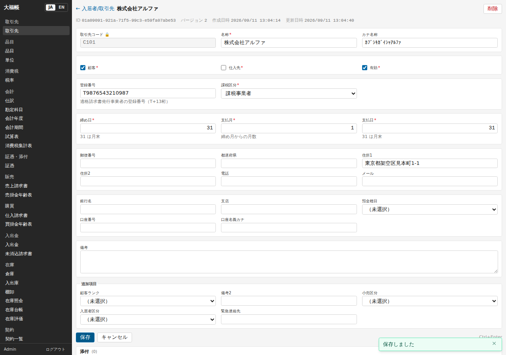
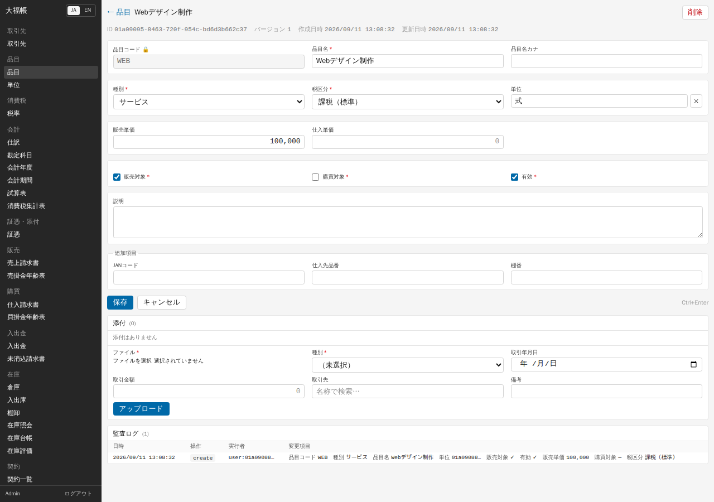

# 04 マスタ（取引先・品目・倉庫）

伝票を入力する前に、取引の相手（取引先）と、売り買いするもの（品目）を登録します。

## 取引先

「販売・仕入」→「取引先」→「+ 新規」で登録します。顧客も仕入先も同じ台帳で、「顧客」「仕入先」のチェックで区別します（両方に入れてもかまいません）。

| 項目 | 入れ方 |
|---|---|
| 取引先コード | 社内で決めた短いコード。**後から変更できません** |
| 名称・カナ名称 | カナは半角カナに変換されて保存されます |
| 顧客 / 仕入先 / 有効 | チェックで指定。新規作成では「有効」はオン、顧客・仕入先はオフが初期値です |
| 登録番号 | 相手が適格請求書発行事業者なら `T` + 13 桁 |
| 課税区分 | 「課税事業者」または「免税事業者」。仕入先の場合、ここが仕入税額控除の計算に効きます（下記） |
| 締め日・支払月・支払日 | 支払期日の計算に使います。31 は月末、支払月は締めた月から何か月後か（0 = 当月、1 = 翌月） |
| 住所・電話・メール | 住所 1 は適格請求書の宛名の上に印字されます |
| 銀行名・支店・預金種目・口座番号・口座名義カナ | 振込先の控え（v0.1 では振込データの作成には使いません） |
| 追加項目 | 導入テンプレートが足した項目（顧客ランク、小売区分、入居者区分など） |

**課税区分と仕入の控除について**: この画面の「課税事業者」は、実際には「適格請求書発行事業者として登録している」という意味で使われます。「免税事業者」にした仕入先からの仕入請求書は、消費税の全額ではなく **経過措置の割合だけ** が控除の対象になります（2026 年 9 月 30 日までの日付は 80%、2026 年 10 月 1 日から 70%）。残りは費用に含めて計上されます（「[05 日常業務](05-daily.md)」）。

**支払条件の例**

| 条件 | 締め日 | 支払月 | 支払日 |
|---|---|---|---|
| 月末締め翌月末払い（初期値） | 31 | 1 | 31 |
| 20 日締め翌月 10 日払い | 20 | 1 | 10 |
| 当月末払い | 31 | 0 | 31 |

**削除について**: 伝票や仕訳で使われている取引先は削除できません（エラーになります）。取引をやめた相手は削除せず「有効」のチェックを外してください。

## 品目と単位

「在庫・商品」→「品目」→「+ 新規」で登録します。

| 項目 | 入れ方 |
|---|---|
| 品目コード | 後から変更できません |
| 種別 | 「物品」は在庫の対象になります（仕入で自動入庫、売上で自動出庫）。作業や役務は「サービス」にします |
| 税区分 | 課税（標準 10%）、課税（軽減 8%）、免税、非課税、不課税 |
| 単位 | 個・式・時間・kg・箱 など（「在庫・商品」→「単位」で確認・追加） |
| 販売単価・仕入単価 | 単価の控え。税込か税抜かは項目上区別されないので、会社で決めてそろえます（小売テンプレートのサンプルは販売単価が税込、仕入単価が税抜） |
| 販売対象・購買対象・有効 | 新規作成ではオンが初期値です。今回の品目に合わせて変更します |
| 追加項目 | 小売テンプレートを適用すると JAN コード・仕入先品番・棚番が出ます |

軽減税率（8%）の対象になるか（飲食料品の譲渡に当たるか）の判断はシステムでは行いません。品目を登録するときに税区分を正しく選んでください。

請求書の明細で品目を選ぶと、品名・単価・税区分・単位が対応する欄へ補われます。販売では販売単価、仕入では仕入単価を使います。単価を登録していない品目では単価を入力してください。補完後も今回の数量・単価・税区分を確認できます（「[付録 C](appendix-c-ui-refresh.md)」）。

## 倉庫

「在庫・商品」→「倉庫」に、初期状態で「本店（主倉庫）」（コード `MAIN`、既定の倉庫）が入っています。仕入・売上の請求書からの自動入出庫は、設定「既定の倉庫コード」の倉庫で行われます。倉庫を増やすときは「+ 新規」で、倉庫コード・倉庫名を入れます。「既定の倉庫」のチェックは 1 か所だけにしてください。

複数の倉庫を使う場合、在庫の平均単価は倉庫ごとに計算されます。小売テンプレートのレジ締めは、既定の倉庫以外を指定すると確定できません。

---

検証: 2026-09-11 実機で確認 — 画面からの取引先の新規作成と更新（カナの半角変換、「有効」がオフのまま保存される問題）、追加項目の保存、課税区分「免税事業者」の仕入先での 70% 控除（10 月 15 日付）、支払条件 20 日締め翌月 10 日払いの期日、使用中の取引先の削除拒否（API）、画面からの品目の新規作成（サービス・単位「式」）、倉庫の一覧、明細で品目を選んでも単価等が入らないこと。未検証: 80% 控除（9 月 30 日以前の日付）、倉庫の追加と複数倉庫での平均単価、単位の追加、レジ締めで既定以外の倉庫を指定したときの拒否（台本の記述による）。
