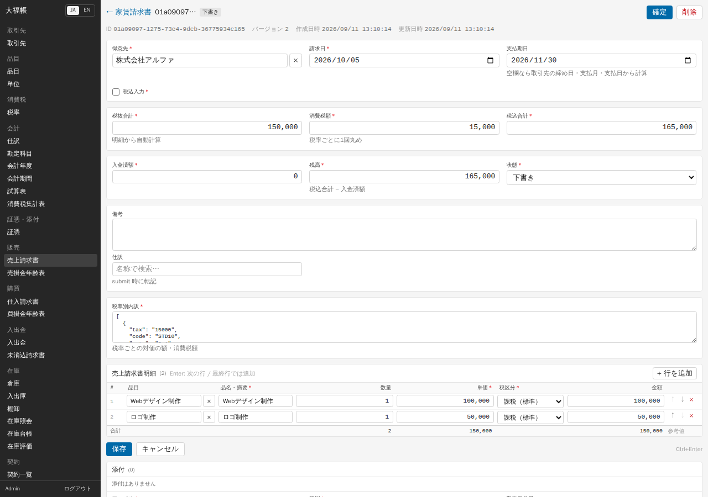
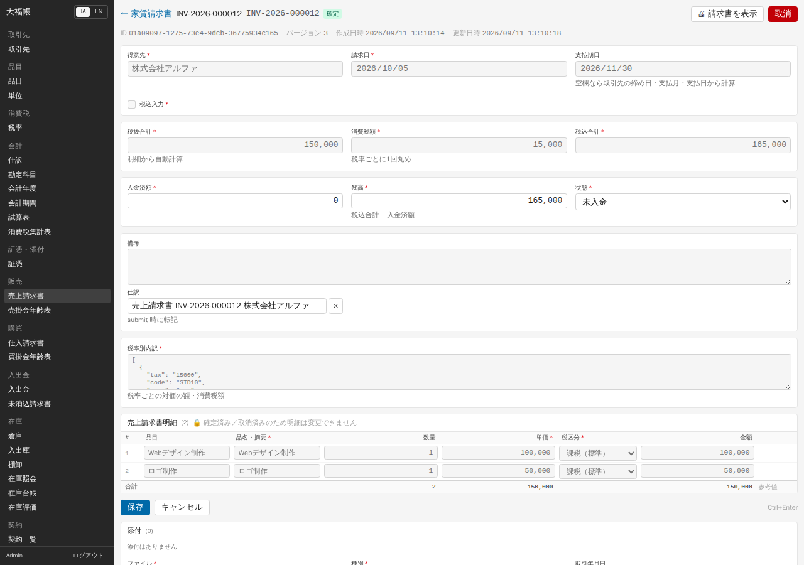
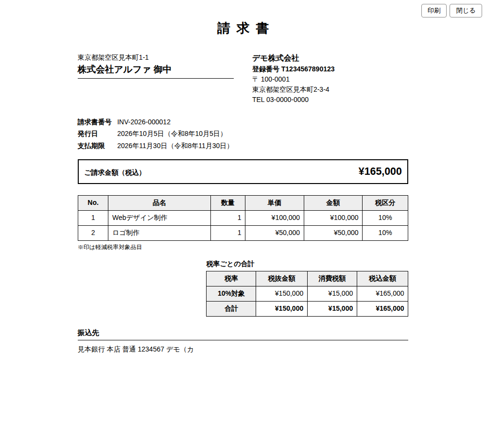
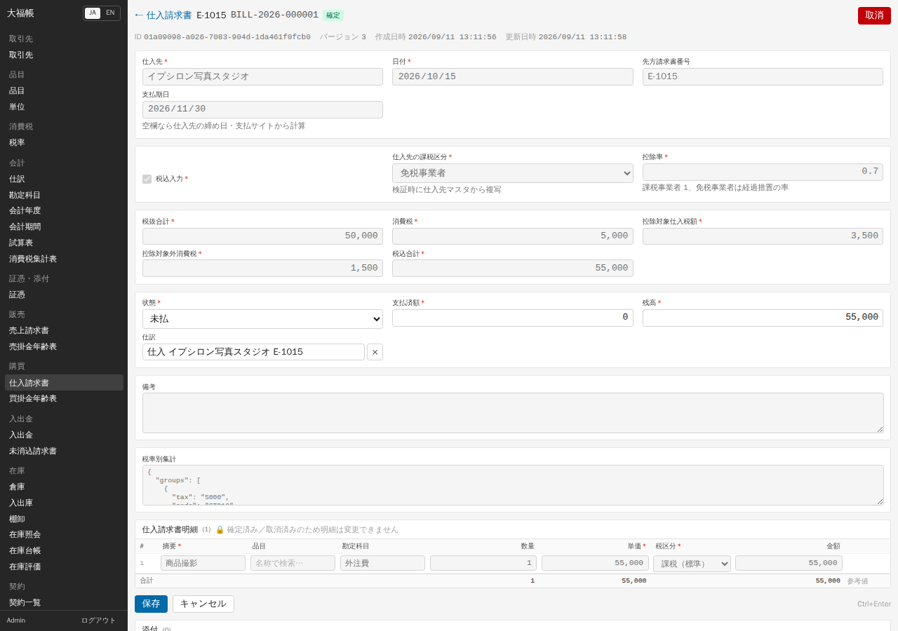
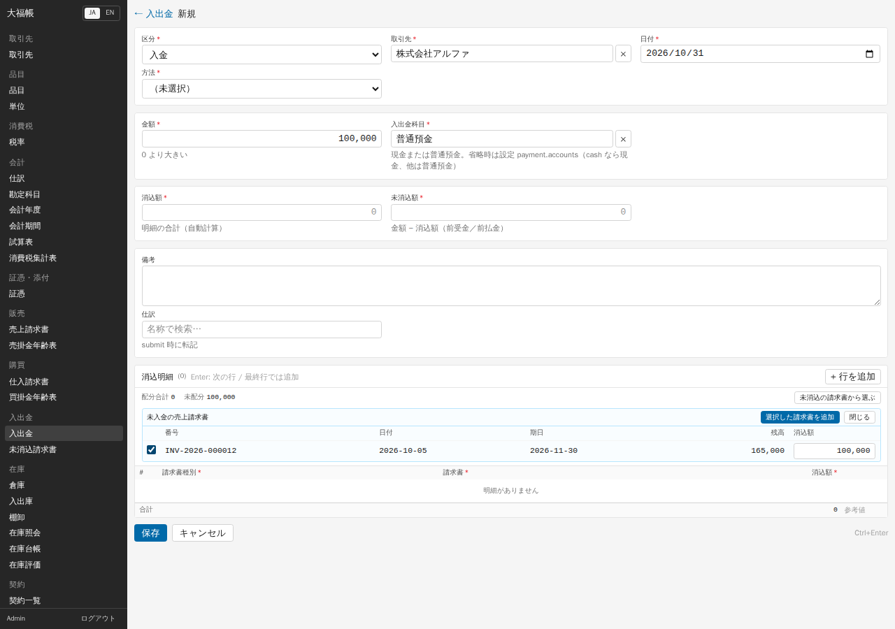
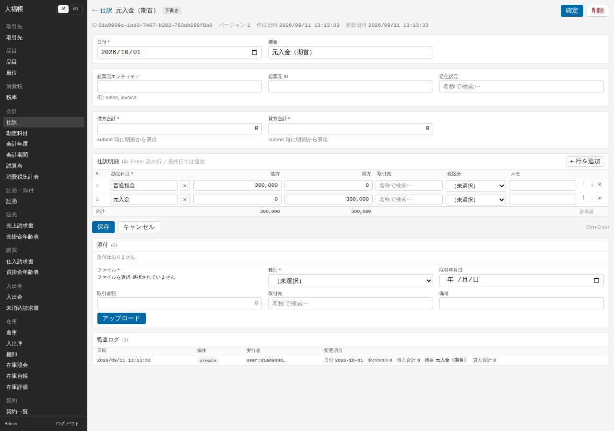
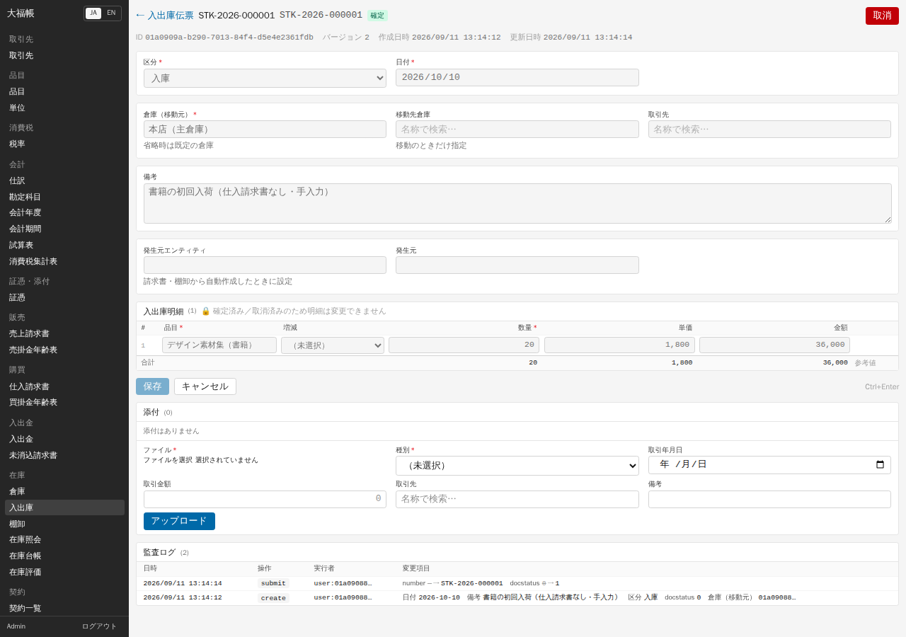
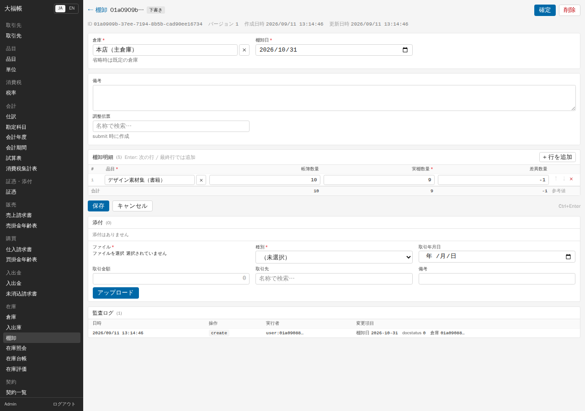
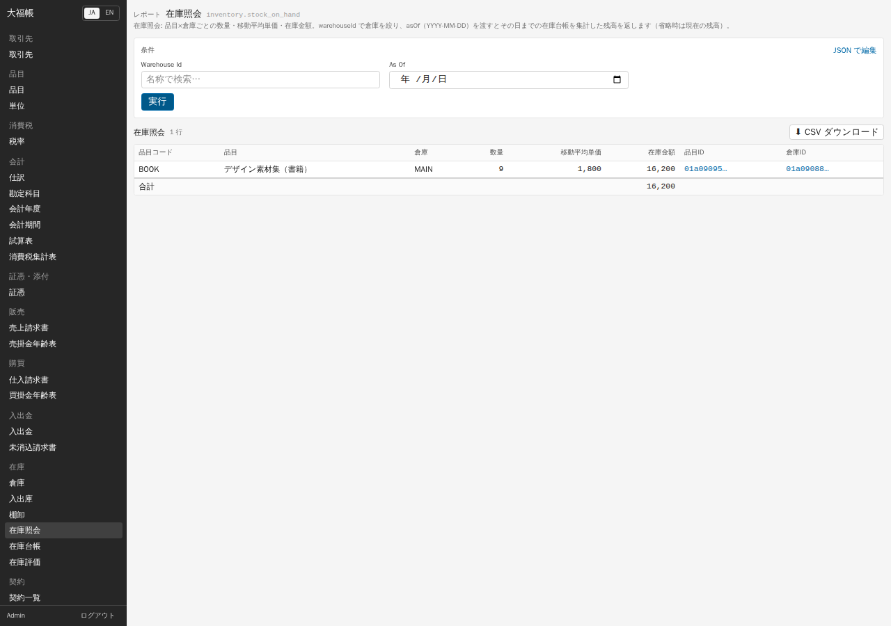

# 05 日常業務

この章の例は、架空のデザイン事務所の 2026 年 10 月の取引（付録 B の「個人事業」の台本をもとにしたもの）です。

物品の見積・受発注・分納・分割請求、銀行明細からの確認消込は [付録L](appendix-l-commerce-bank-filing.md) を参照してください。以下の単独請求と、商流から生成した請求を同じ取引へ重ねて登録しないでください。

## 売上請求書を作る

1. 「販売」→「売上請求書」→「+ 新規」を押します。
2. 「得意先」に取引先名を入れて候補から選び、「請求日」を入れます。「支払期日」は空欄のままにすると、保存時に取引先の支払条件から計算されます。
3. 単価を税込で入れるときは「税込入力」にチェックを入れ、税抜なら外します。会社設定だけで判断せず、この伝票のチェックを確認してください。
4. 明細の「+ 行を追加」を押し、「品目」を選びます。品名・単価・税区分・単位が対応する欄へ補われるので、「数量」と今回の条件を確認し、必要なら直します。未登録の単価は手で入力します。
5. 金額・税率別内訳などの自動計算値は入力不要です。旧版の回避策だった `[]` の手入力も不要です。
6. 「保存」を押すと下書きになり、税抜合計・消費税額・税込合計が計算されます。消費税は **1 枚の請求書につき税率ごとに 1 回** 端数処理されます。
7. 内容を確かめて「確定」を押します。確認画面でも「確定」を押すと、伝票番号が付き、状態が「未入金」になります。保存後に内容を変更した場合は、再保存するまで確定できません。

確定すると、次の仕訳が自動で作られます: 借方 売掛金（税込合計）／貸方 売上高（明細ごとの税抜額）、仮受消費税（税率ごとの税額）。明細に「物品」の品目があると、既定の倉庫から自動で出庫されます。在庫が足りないと「insufficient stock …」というエラーで確定できないので、先に入庫してください（下記「在庫」）。

「税抜合計」「入金済額」「残高」「状態」などは読み取り専用です。税率別内訳は区分・率・税抜・税額・税込の表で確認できます。入金は「入出金」で記録します。取消や訂正が必要な場合は「[付録 C](appendix-c-ui-refresh.md)」の訂正日の説明を参照してください。

## 適格請求書を印刷する

確定した売上請求書の右上の「🖨 請求書を表示」を押すと、新しいタブに適格請求書が開きます。「印刷」でブラウザの印刷画面になります（PDF 保存はブラウザの機能で行います）。

印字されるもの: 発行者の名称・登録番号・住所・電話（設定「請求書の発行者」）、宛名（取引先名と住所 1）、請求書番号、発行日と支払期限（和暦を併記）、明細、税率ごとの税抜金額・消費税額・税込金額、軽減税率の品目の「※」印、振込先。ブラウザがポップアップを止めた場合は、このサイトのポップアップを許可してください。

## 仕入・経費の請求書を入力する

受け取った請求書は「購買」→「仕入請求書」で入力します。

1. 「+ 新規」を押し、「仕入先」「日付」「先方請求書番号」を入れます。
2. 受け取った請求書が税込の金額なら「税込入力」にチェックを入れ、税抜なら外します。
3. 商品の仕入なら「品目」を選び、補完された摘要・仕入単価・税区分を確認します。経費なら「摘要」「勘定科目」（例: 外注費）「単価」「税区分」を入れます。品目も勘定科目も無い行は保存できません。
4. 「保存」→「確定」を押します。

**免税事業者からの仕入（経過措置）**: 仕入先の課税区分が「免税事業者」だと、確定時に「控除率」が日付から決まり（2026-10-01 からは 0.7）、消費税額のうち控除率の分が「控除対象仕入税額」、残りが「控除対象外消費税」になります。控除対象外の分は、明細の費用科目に上乗せして計上されます。

確定時の仕訳: 借方 費用または仕入高（税抜額）、仮払消費税（控除対象の税額）、費用（控除対象外の税額）／貸方 買掛金（税込合計）。物品の明細は既定の倉庫に自動で入庫されます（入庫単価は税抜単価）。一つの免税事業者からの年間仕入が 1 億円を超える部分の扱いは、v0.1 では計算しません。

## 入金・支払を記録して請求書に消し込む

「入出金」→「入出金」で、入金も支払も同じ画面で入力します。

1. 「+ 新規」を押し、「区分」（入金 / 支払）、「取引先」、「日付」、「方法」、「金額」、「入出金科目」（現金 または 普通預金）を入れます。
2. 明細欄の上の「未消込の請求書から選ぶ」を押します（区分と取引先を入れるまでは押せません）。
3. その取引先の未入金（支払なら未払）の請求書が一覧で出るので、消し込む請求書にチェックを入れます。「消込額」には、残高と未配分額の小さい方が入ります。一部だけ入金された場合は消込額を直します。
4. 「選択した請求書を追加」を押すと、明細に行が入ります。上の「配分合計」「未配分」を確認します。
5. 「保存」→「確定」を押します。

確定すると、請求書の「入金済額」「残高」が更新され、残高が 0 になると状態が「入金済」になります。仕訳は、入金なら 借方 普通預金／貸方 売掛金、支払なら 借方 買掛金／貸方 普通預金 です。請求書に配分しなかった金額（未配分）は、前受金（支払なら前払金）に計上されますが、v0.1 には後からそれを請求書に充当する機能がありません。配分合計が金額を超えていると、保存も確定もできません。

## 仕訳を入力する

請求書や入出金から自動で作られない取引（元入金、振替など）は「会計」→「仕訳」で入力します。

1. 「+ 新規」を押し、「日付」「摘要」を入れます。起票元・逆仕訳元・合計などの自動設定項目は入力不要です。
2. 明細に「勘定科目」と「借方」または「貸方」の金額を 1 行ずつ入れます（1 行に借方と貸方の両方は入れません）。
3. 「保存」→「確定」を押します。借方と貸方の合計が一致しない、明細が 2 行未満、日付が締めた期間に入っている、取引先必須の科目に取引先が無い、のどれかに当たると確定できません。

確定した仕訳は取消も削除もできません。誤りは逆仕訳（貸借を入れ替えた仕訳）で打ち消してから正しい仕訳を入れますが、v0.1 では画面から逆仕訳を作れないので管理者に依頼します。

## 在庫の入出庫と棚卸

物品の在庫は、仕入請求書・売上請求書の確定で自動で動きます。それ以外の動き（請求書のない入荷、社内使用、倉庫間の移動）は「在庫」→「入出庫」で入力します。

1. 「+ 新規」を押し、「区分」（入庫・出庫・移動・調整）、「日付」、「倉庫（移動元）」、移動なら「移動先倉庫」を入れます。
2. 明細に「品目」「数量」を入れ、入庫なら「単価」（税抜の取得単価）も入れます。調整の場合は「増減」を選びます。
3. 「保存」→「確定」を押します。

在庫の単価は **移動平均法** で計算されます（入庫のたびに平均単価を改定し、出庫では改定しない）。

**棚卸** は「在庫」→「棚卸」で行います。「倉庫」「棚卸日」を入れ、明細に「品目」と「実棚数量」を入れて保存すると、「帳簿数量」と「差異数量」が表示されます。「確定」すると、差異の分だけ調整の入出庫伝票が自動で作られ、在庫が実地の数量に合わせられます。

現在の在庫は「在庫」→「在庫照会」で、品目・倉庫ごとの数量・移動平均単価・在庫金額を確認できます。

---

検証: 2026-09-11 実機で確認（画面で操作）— 売上請求書の作成（`[]` を入れないと保存できない問題を含む）・確定・自動仕訳（売掛金/売上高/仮受消費税）・適格請求書の表示、確定済み請求書の「残高」「状態」を手で変えて保存できてしまうこと（確認後に元へ戻した）、免税事業者の仕入請求書（控除率 0.7、3,500/1,500）、入金の消込パネルでの一部消込と確定、仕訳の作成・確定、入庫伝票、棚卸と差異の調整、在庫照会。API で確認: 在庫不足の物品の売上請求書が確定できないこと、支払（区分 支払）の消込と確定。API で確認（続き）: 締めた期間の日付の仕訳が確定できないこと、小売の仕入請求書（税抜入力）の自動入庫が税抜単価になること。未検証（仕様書・自動テストの記述による）: 取引先必須の科目で取引先が無いときの拒否、品目も勘定科目も無い仕入明細の拒否、配分合計が金額を超えるときの保存拒否、画面からの支払の消込、未配分額（前受金）の発生、出庫・移動・調整の区分、ポップアップが止められた場合の表示、税込入力の売上請求書の計算（小売テンプレートのレジ締めでは確認、「[07](07-templates.md)」）。
