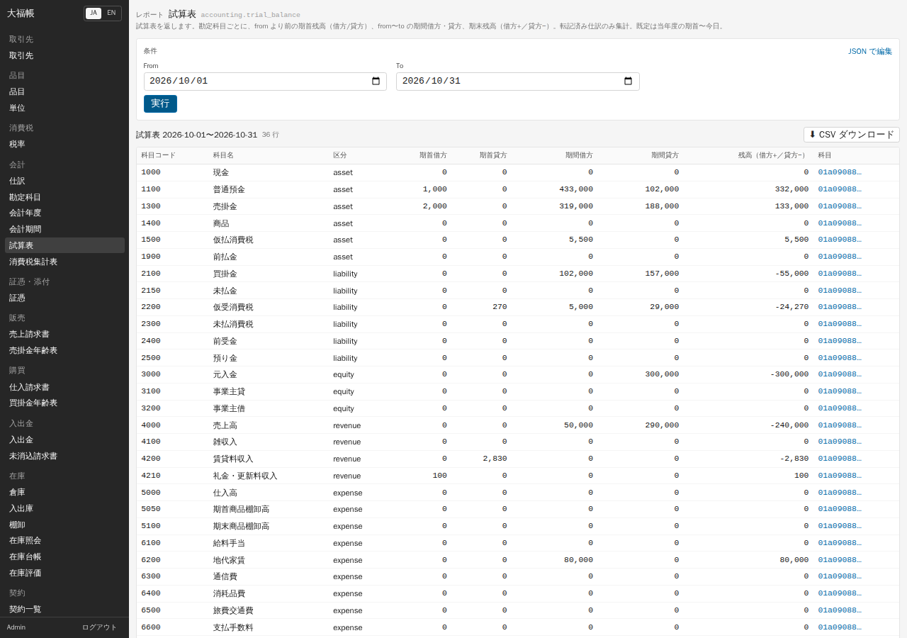
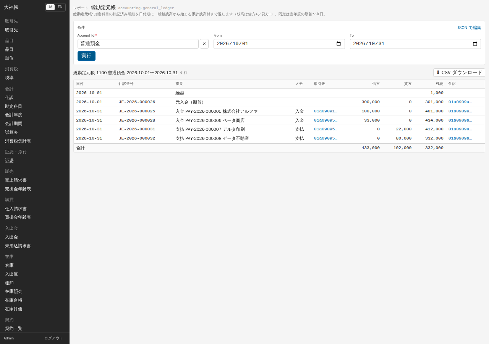
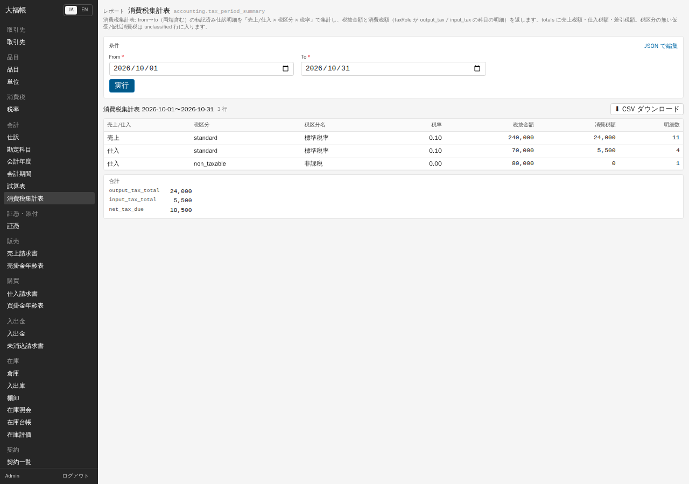
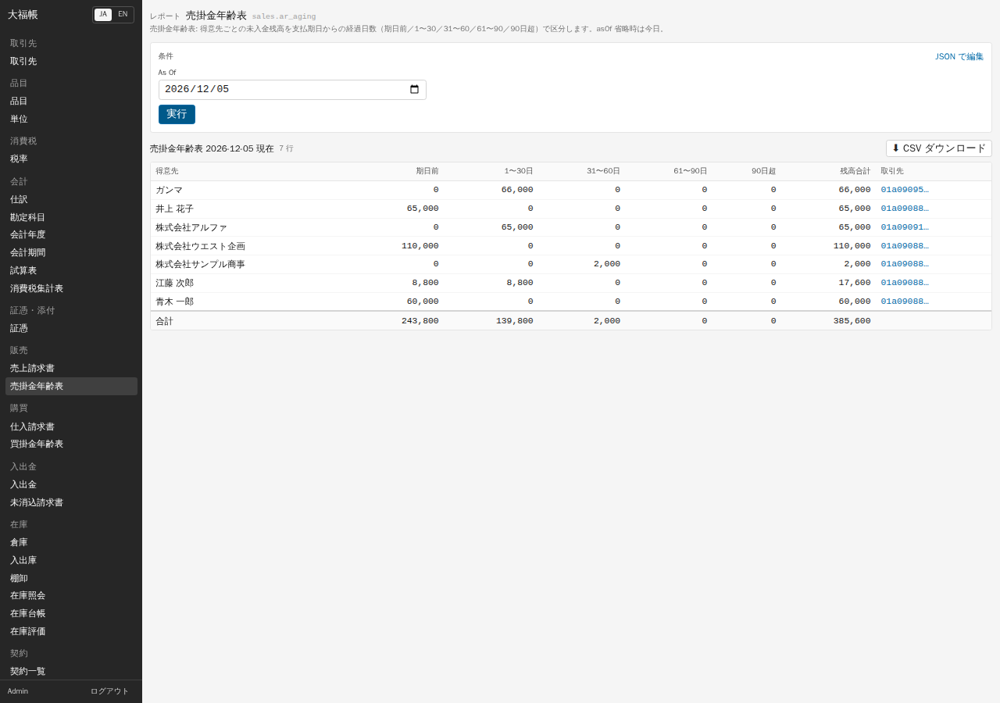
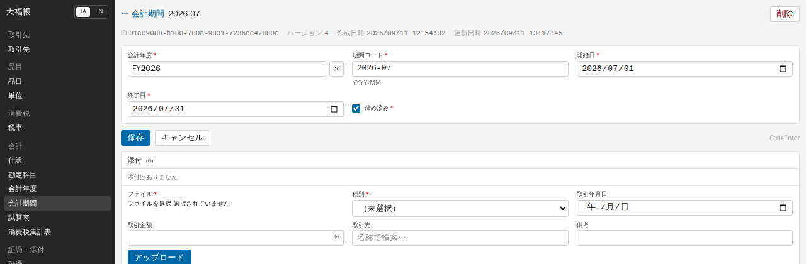
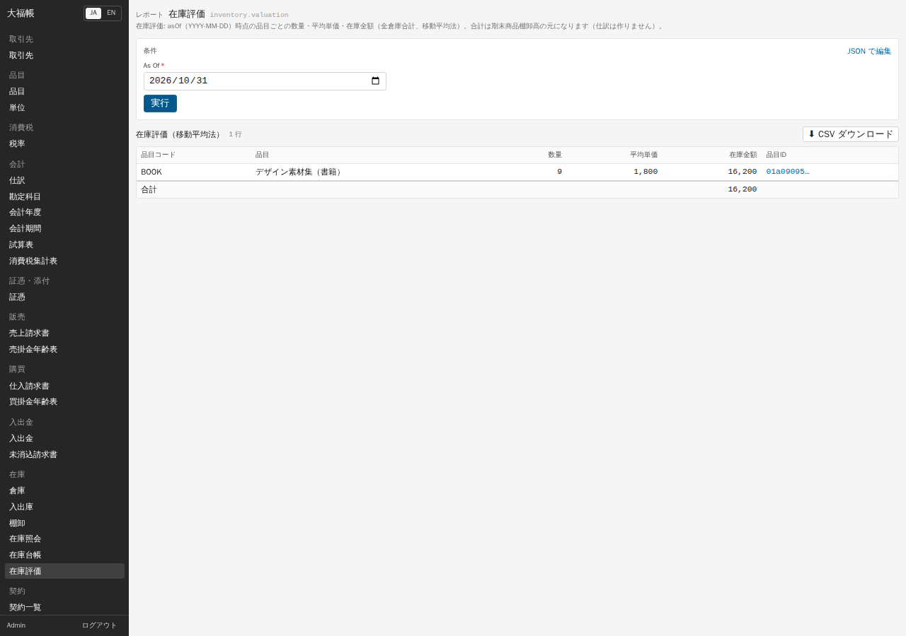

# 06 月次の作業

締め済み年度からのBS/PLと給与の申告準備、原資料の確認・出力は [付録L](appendix-l-commerce-bank-filing.md) にあります。HOT010用の会計資料は当期損益振替前を対象にします。資料出力は行政への提出を行いません。

月末には、帳簿の残高を確かめ、消費税の集計を確認し、未入金・未払を洗い出してから、その月を締めます。この章の表はすべて「レポート」画面で作ります。

## レポート画面の使い方

1. 「分析・レポート」から対象のレポートを選びます。「すべての画面を探す」でも帳票名を検索できます。
2. 「条件」欄で期間や基準日、科目などを確認します。認識できる日付・年月・年には初期値が入り、今月・先月などの簡単入力も使えます。帳票が明示する項目名や初期値は保持されます。詳しくは [付録M](appendix-m-analytics.md) を参照してください。
3. 「実行」を押すと表が出ます。
4. 「⬇ CSV ダウンロード」で、表示中の表を CSV ファイルに保存できます（Excel で開けます。内部 ID の列も含まれます）。

表の右側に「科目」「取引先」などの内部 ID（`01a09088…` のような文字）の列が出ることがありますが、業務では使いません。

## 試算表

「分析・レポート」から「試算表」を開きます。期間を指定すると、勘定科目ごとに期首残高（借方・貸方）、期間中の借方・貸方、期末の残高が出ます。残高は借方がプラス、貸方がマイナスで表示され、一番下の合計行で残高の合計が 0 になっていれば貸借が一致しています。確定した仕訳だけが集計されます。取引の無い科目も 0 の行として表示されます。

## 総勘定元帳

「分析・レポート」から「総勘定元帳」を開きます。科目（例: 普通預金）を選び、期間を確認して実行すると、その科目の仕訳明細が日付順に、繰越残高から始まる累計残高付きで出ます。画面の初期期間は当月です。条件を省略してAPIを呼ぶ場合の年度初期値とは区別してください。

## 消費税集計表

「分析・レポート」から「消費税集計表」を開きます。期間を指定すると、確定した仕訳の明細を「売上 / 仕入」×「税区分」×「税率」で集計し、税抜金額と消費税額を出します。表の下の「合計」欄の意味は次のとおりです。

| 表示 | 意味 |
|---|---|
| output_tax_total | 売上の消費税額（仮受消費税）の合計 |
| input_tax_total | 仕入の控除対象の消費税額（仮払消費税）の合計 |
| net_tax_due | 差引（売上の税額 − 仕入の税額）。納付見込額の目安 |

- 非課税の取引（家賃など）は、税額 0 の行として出ます。
- 免税事業者からの仕入の「控除対象外消費税」は費用に含まれるので、仕入の税額には入りません。
- 集計は仕訳の日付（請求書なら請求日）で行います。
- **これは申告書ではありません。** 簡易課税、2 割特例、課税売上割合、申告書の様式には対応していません。申告は税理士や会計ソフトで行ってください。

## 売掛金年齢表・買掛金年齢表

「分析・レポート」から「売掛金年齢表」または「買掛金年齢表」を開きます。基準日（As Of）を入れると、取引先ごとに未入金（未払）の残高を、支払期日からの経過日数で「期日前」「1〜30 日」「31〜60 日」「61〜90 日」「90 日超」に分けて出します。期日当日は「期日前」に入ります。督促の対象を探すときに使います。

## 期間の締め

その月の入力が終わったら、会計期間を「締め済み」にします。締めた期間の日付では、仕訳も、請求書・入出金の確定（自動で作られる仕訳）もできなくなります。

1. 「会計・資金」から「会計期間」を開き、締める月（例: `2026-07`）の行を押します。
2. 「締め済み」にチェックを入れて「保存」を押します。
3. 締めを戻すときは、同じ画面でチェックを外して「保存」します。

締めと再開は監査ログに「update」として残ります。管理者は同じことを `accounting.close_period` / `accounting.reopen_period` アクションで行うこともできます（監査ログ上はどちらも同じ「update」です）。会計期間の画面には「削除」ボタンも表示されますが、押さないでください。

## 在庫評価

「分析・レポート」から「在庫評価」を開きます。基準日を入れると、その日時点の品目ごとの数量・平均単価・在庫金額（全倉庫の合計、移動平均法）が出ます。合計が期末商品棚卸高の元になります。

**税務上の注意**: 棚卸資産の評価方法を税務署に届け出ていない場合、税務上の評価は「最終仕入原価法」になります（法人税法施行令 31 条、所得税法施行令 102 条。開発資料 `docs/domain/inventory.md` による）。大福帳の在庫評価は移動平均法なので、申告に使うなら移動平均法の届出が要ります。最終仕入原価法の評価額は v0.1 では出せません。

在庫評価の金額から「商品 / 期末商品棚卸高」の決算整理仕訳を作る機能は、小売テンプレートの「月次締め」にあります（「[07 導入テンプレート](07-templates.md)」）。テンプレートを使わない場合は、仕訳画面で手入力します。

## 月末の作業の流れ（例）

1. 当月の請求書・入出金をすべて確定する（下書きが残っていないかホームの件数で確認）。
2. 棚卸をして確定する（物品を扱う場合）。
3. 試算表で普通預金・現金の残高を通帳や現金と照合する。
4. 売掛金年齢表・買掛金年齢表で、期日を過ぎた残高を確認する。
5. 消費税集計表を確認し、CSV を保存する。
6. 会計期間を締める。

---

検証: 2026-09-11 実機で確認（画面で操作）— 試算表・総勘定元帳（科目選択）・消費税集計表（10 月: 売上 標準 240,000/24,000、仕入 標準 70,000/5,500、非課税 80,000）・売掛金年齢表（期日当日が「期日前」に入ることは API で確認）・買掛金年齢表・在庫評価の実行、試算表の CSV ダウンロード（BOM 付き UTF-8、内部 ID の列を含む）、会計期間の「締め済み」チェックでの締めと解除、締めた期間の日付の仕訳の確定拒否（API）、`accounting.close_period` / `reopen_period`（API。監査ログの action 欄が空で update として残ること）。未検証: 締めた期間の日付の請求書・入出金の確定拒否（仕訳と同じ検査を通るはずだが未確認）、会計期間の削除、期間を省略した総勘定元帳。
