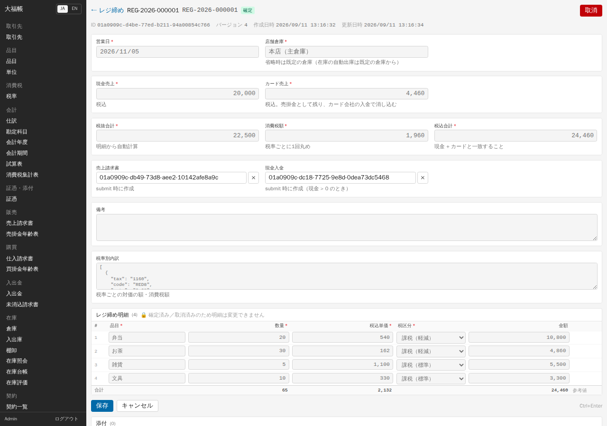
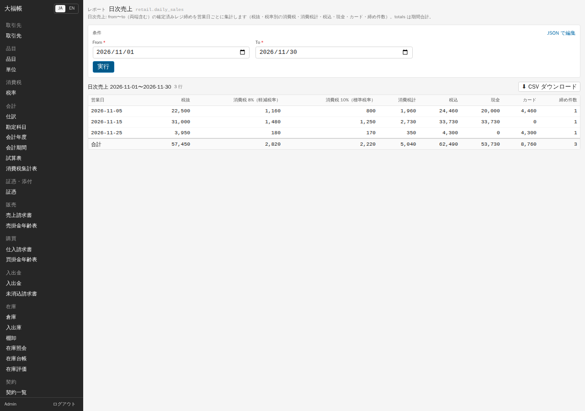
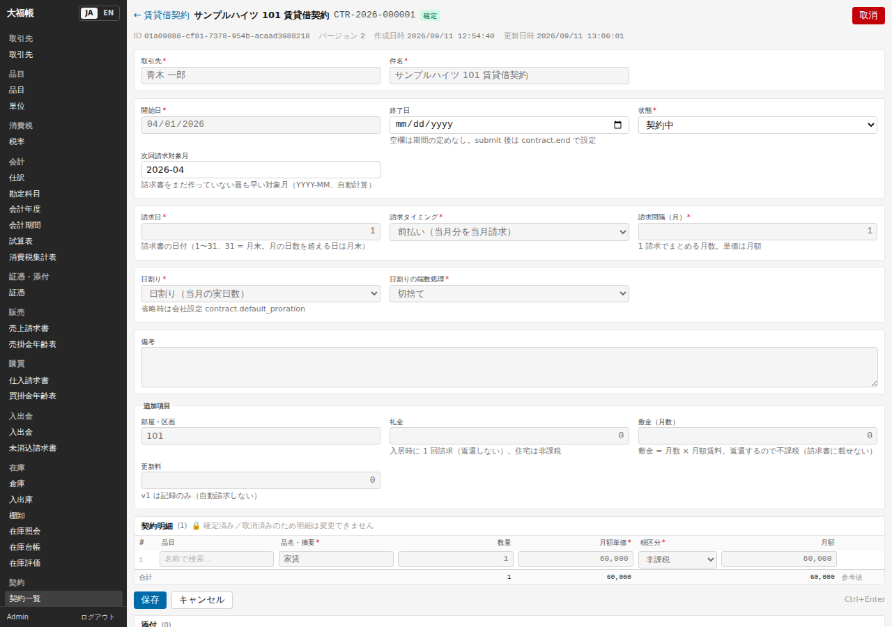
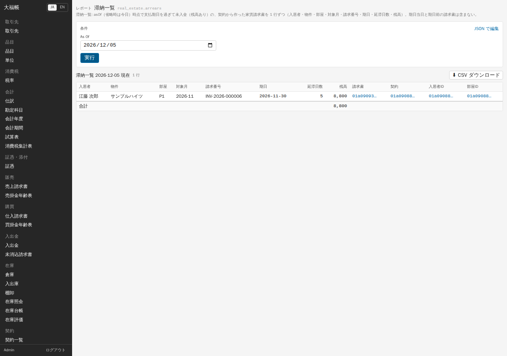
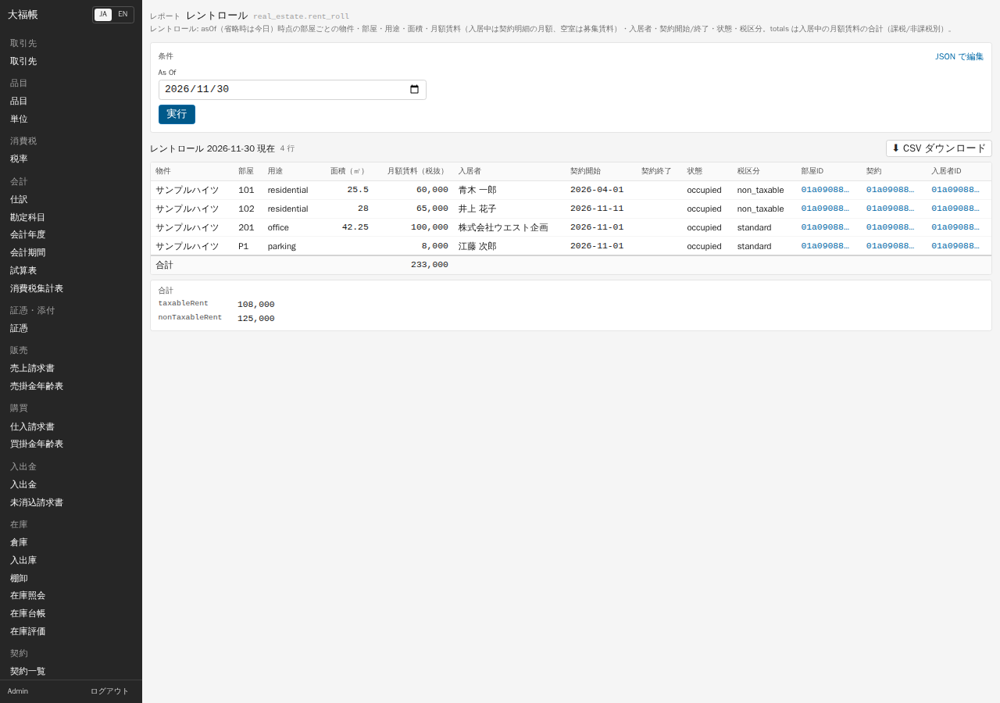

# 07 導入テンプレート（小売・不動産）

## テンプレート（pack）とは

導入テンプレートは、特定の業種で使うための「足し算」をひとまとめにしたものです。大福帳の基本の機能（請求書・入出金・仕訳・在庫・契約）はそのままに、次のものを足します。

- その業種だけの台帳と伝票（小売の「レジ締め」、不動産の「物件」「部屋・区画」など）
- 既存の台帳への追加項目（品目の JAN コード、取引先の入居者区分など）
- 業種向けのレポートと処理（日次売上、レントロール、滞納一覧、入居・退去など）
- 勘定科目の追加、設定の既定値、画面の呼び名の変更、練習用のサンプルデータ

テンプレートの **適用** は、管理者が会社ごとに行います（`pnpm pack:apply <名前> --sample`、または API `pack.apply`。「[01 導入](01-install.md)」）。適用すると、サイドバーにそのテンプレートのメニュー（「小売」「賃貸管理（不動産）」）が現れます。

**注意**

- 1 つの会社では業種テンプレートの組合せと転記科目を管理者が確認してください。通常の適用は保存済みの設定を維持するため、初回導入でも税込入力・転記科目が業種の想定と合っているか確認します。強制適用は設定を上書きします。
- 画面の呼び名やテンプレートのメニューは、現在の会社に適用したテンプレートに従います。本書の画像は、旧版で複数テンプレートが混在していたデモ環境のものです（「[00 はじめに](00-index.md)」）。
- v0.1 では、テンプレートの処理の多く（入居、家賃請求の作成、月次締めなど）に **画面のボタンがありません**。下の手順で「管理者が実行」と書いたものは、管理者が API か AI（MCP）から実行します（「[09 AI から使う](09-ai.md)」）。

## 小売テンプレート（食品を扱う小さな店）

軽減税率（8%）と標準税率（10%）が混ざる税込価格の店で、1 日の売上をレジ締めでまとめて計上し、月末に棚卸と三分法の決算整理をする流れです。

### 1 日の締め: レジ締め

1. 「小売」→「レジ締め」→「+ 新規」を押します。
2. 「営業日」、「店舗倉庫」（既定の倉庫を選ぶ）、「現金売上」「カード売上」（どちらも税込）を入れます。
3. 明細で「品目」を選び、「数量」と補完された「税込単価」「税区分」を確認します。単価が未登録なら入力してください。返品は数量をマイナスで入れます。
4. 「保存」すると、税率ごとに 1 回丸めた消費税額と税抜合計が計算されます。**現金売上 + カード売上 が税込合計と一致しないと保存できません。**
5. 「確定」を押します。

確定すると、次のものが自動で作られます。

- 売上請求書（得意先「店頭客」、備考「レジ締め REG-…」）と、その仕訳
- 物品の自動出庫（数量がプラスの行だけ）
- 現金売上がある場合、その額の入金（現金）と請求書への消込

カード売上の分は、請求書の残高（売掛金）として残ります。カード会社から入金されたら、「入出金」で入金を入力して消し込みます。

### 日次売上

「小売」→「日次売上」で期間を指定すると、営業日ごとの税抜、消費税（8%・10% 別）、税込、現金、カード、締め件数が出ます。

### 月末: 棚卸と月次締め

1. 「在庫」→「棚卸」で実地の数量を入れて確定します（「[05 日常業務](05-daily.md)」）。紛失などの差異はここで在庫に反映されます。
2. 管理者が `retail.close_month`（対象月 `YYYY-MM`）を実行します。月末の在庫評価額で「借方 商品 / 貸方 期末商品棚卸高」の仕訳が作られます。前月にも締めていれば、前月分を「期首商品棚卸高 / 商品」に振り替える仕訳も作られます。同じ月に 2 回実行しても仕訳は増えません。

在庫評価は会社の全品目・全倉庫が対象です。デモ環境では小売の商品以外の在庫も合計に入ったため、台本の 7,700 円ではなく 23,900 円で仕訳されました。

**小売テンプレートでできないこと**: 返品した商品の在庫戻し（棚卸の差異で調整）、カード会社の入金手数料の自動計上（手で仕訳）、POSの商品/在庫連携、ポイント、レシート（適格簡易請求書）の発行。複数店舗運営は [付録E](appendix-e-operations-control.md)、別の共通機能であるSquare決済仮勘定連携は [付録H](appendix-h-enterprise-operations.md) を参照してください。

## 不動産テンプレート（賃貸管理・自主管理）

家主が自分で住居・事務所・駐車場を貸す場合の流れです。住宅の家賃は非課税、事務所・駐車場は課税、敷金は預り金（売上ではない）として扱います。

### 1. 物件と部屋を登録する

「賃貸管理（不動産）」→「物件」で建物を、「部屋・区画」で部屋を登録します。部屋の「用途」（住宅 / 事務所 / 店舗 / 駐車場）で、家賃の税区分の既定が決まります（住宅 → 非課税、それ以外 → 課税 10%）。貸付期間が 1 か月未満の住宅は課税になります。駐車場は、住宅に付いていて家賃と別に料金を取らない場合は非課税ですが、テンプレートは区画貸しの駐車場として課税にします。

### 2. 賃貸借契約を作る

「賃貸管理（不動産）」→「賃貸借契約」→「+ 新規」で、「取引先」（入居者）、「件名」、「開始日」、「請求日」（毎月何日付で請求するか）、「請求タイミング」（前払い）、「日割り」を入れ、「追加項目」に「部屋・区画」「礼金」「敷金（月数）」を入れます。明細に「家賃」などの品名と月額単価を入れます（税区分は部屋の用途から入ります）。保存して「確定」します。

### 3. 入居と家賃の請求（管理者が実行）

- `real_estate.move_in`（契約を指定）: 部屋を「入居中」にし、開始月の家賃請求書（月の途中からなら日割り、切捨て）を作って確定します。礼金があれば同じ請求書に「礼金」行を足します。敷金の受領日を渡すと「借方 普通預金 / 貸方 預り金」の仕訳も作ります。
- `contract.generate_invoices`（対象月 `YYYY-MM`、`submit: true`）: 翌月以降の家賃請求書を契約ごとに 1 枚ずつ作ります。同じ月に 2 回実行しても二重には作られません。導入前から住んでいる入居者は、`move_in` ではなくこちらで当月分から請求します。

作られた請求書は「販売」→「売上請求書」（デモ環境の表示は「家賃請求書」）に並びます。

### 4. 入金を消し込む

入居者から振り込まれたら、「入出金」で入金を入力し、「未消込の請求書から選ぶ」で家賃請求書に消し込みます（「[05 日常業務](05-daily.md)」）。

### 5. 滞納一覧とレントロール

「滞納一覧」は、基準日に支払期日を過ぎて入金されていない家賃請求書を、入居者・部屋・対象月・延滞日数・残高付きで一覧にします。期日前の請求書や期日当日のものは入りません。

「レントロール」は、基準日時点の部屋ごとの用途・面積・月額賃料・入居者・契約期間・状態・税区分と、月額賃料の合計（課税 / 非課税別）を出します。用途・状態・税区分は英語のコード（residential = 住宅、office = 事務所、store = 店舗、parking = 駐車場、occupied = 入居中、vacant = 空室、non_taxable = 非課税、standard = 課税）で表示されます。

入居者の支払条件は、取引先で「締め日 31・支払月 0・支払日 31」（当月末払い）にしておきます。初期値（翌月末払い）のままだと期日が 1 か月遅れ、滞納一覧に出るのも遅れます。

### 6. 退去と敷金の返還（管理者が実行）

- `real_estate.move_out`（契約と終了日）: 契約に終了日を入れ、終了日を過ぎていれば部屋を「空室」にします。終了日前に実行した場合は、終了日後にもう一度実行すると空室になります。
- `real_estate.return_deposit`（敷金、日付、金額、差し引く額）: 「借方 預り金 / 貸方 普通預金（返す額）・雑収入（差し引く額）」の仕訳を作ります。全額を一度に精算します。原状回復費の控除は税区分なしで計上されます。この精算の訂正フローは未対応なので、課税処理が必要な場合は入力前に管理者へ確認してください。自動生成された仕訳の直接変更では訂正できません。

**不動産テンプレートでできないこと**: 更新料の自動請求（記録のみ）、管理会社としてのオーナー精算、月の途中で退去したときの請求済み家賃の返金・調整、礼金を家賃と別の科目に計上すること（どちらも賃貸料収入）。

---

検証: 2026-09-11 実機で確認 — 不動産: 契約の画面からの確定、`move_in`（日割り 43,333 円＋礼金 65,000 円、敷金受領）、`contract.generate_invoices`（11 月分 1 件、12 月分 4 件）、入金と消込（API）、滞納一覧（12-05: 8,800 円・5 日）とレントロール（合計 233,000、課税 108,000・非課税 125,000）の画面表示、11 月の消費税集計（課税 208,000/20,800、非課税 168,333）、`move_out`（終了日前は入居中のまま）、`return_deposit`（65,000 円のうち 22,000 円控除）。小売: 画面からのレジ締めの作成・確定（売上請求書・自動出庫・現金入金が作られること、カード分が残高に残ること）、2 件目以降のレジ締め（API）、レジ締めの取消（API。作られた入金と請求書が取消になり、在庫も戻る）、日次売上の画面表示（台本と一致）、棚卸、`retail.close_month`（2 回目は `alreadyClosed: true`）、両テンプレート適用時の売上科目の衝突。現金＋カードが合計と一致しないときの保存拒否（API、差額がヒントに出る）。未検証: 物件・部屋の画面からの新規登録、`move_out` の再実行による空室化、1 か月未満の住宅の課税判定、返品を含むレジ締めの画面入力（API で数量 −1 を確認）。
