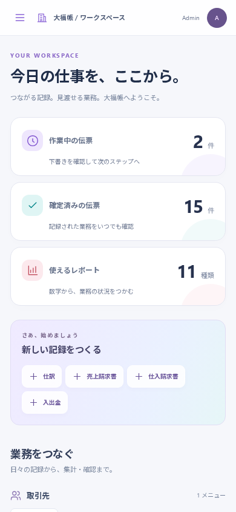

# 付録 C 新UIの使い方（2026-09-12）

この補遺はv0.1マニュアルの画面操作を更新するものです。他の章の画像35枚は2026-09-11に撮影した旧UIで、現在の配色・配置・入力欄とは異なります。画像内の空欄や編集可能な計算値を再現する必要はありません。この補遺の2枚は2026-09-12の新UIです。

## 新しいワークスペース

白い背景と藍色のサイドバーが基本です。ホームでは実際の下書き・確定件数、利用できるレポート数を確認し、「新しい記録をつくる」から入力を始められます。業務カードは台帳・伝票・レポートへの入口です。小さな画面では上部のメニューボタンでサイドバーを開き、項目を選ぶか閉じるボタンで戻ります。言語切替とログアウトはサイドバー下部です。

「レポート」と「すべてのエンティティ」は見出しを押して展開します。会社に適用したテンプレートと利用者の権限に応じて、利用できるメニューが変わります。同じメールアドレスを複数組織で利用している場合は、ログイン画面の「組織を指定してログイン」を開き、管理者から受け取った組織IDを指定します。

## 入力と自動計算

チェックボックスや選択肢には既定値を表示します。取引先の「有効」、品目の「販売対象・購買対象・有効」は新規作成時からオンです。「税込入力」は今回の単価の税込・税抜に合わせて確認してください。

請求書の明細で品目を選ぶと、登録済みの品名・単価・税区分・単位が対応する入力欄へ補われます。売上は販売単価、仕入は仕入単価です。価格未登録の品目は単価を入力し、補完後も数量や取引条件を確認します。品目を選び直すと、その品目の値で再び補われます。

合計・残高・状態・税率別内訳などは自動設定され、直接入力しません。新規請求書で `[]` を手入力する旧版の回避策は不要です。保存後の税率別内訳は「税区分・税率・税抜金額・税額・税込金額」の表で確認します。明細の参考合計と、保存済みの正式な金額を区別してください。

## 保存してから確定する

1. 入力を変えると「未保存の変更」と表示されます。この間は確定・取消・削除などを押せません。
2. 「保存」を押し、完了を待って金額と内容を確認します。保存中や別の処理中は、その理由を表示して入力を止めます。
3. 「確定」を押し、確認画面でも「確定」を押します。

未保存のまま画面を離れる場合は、変更を破棄するか確認されます。他の利用者の更新と競合した場合、入力は勝手に置き換わりません。最新の記録を読み込んで内容を確認してください。閲覧モードでは編集や保存はできません。

## 取消日を指定する

「取消」を押すと確認画面が開きます。「訂正日（任意）」が空欄なら元の取引日で取消します。元の会計期間が締まっている場合は、開いている期間の日付を入れて「取消」を押します。例えば9月12日の請求書を9月13日付で打ち消すなら、訂正日は `2026-09-13` です。

入金済みの請求書は先に入出金の取消が必要です。自動生成された仕訳を単独で直すのではなく、請求書・入出金など起票元の文書から取消してください。取消後に「訂正」を押すと、修正用の新しい下書きを作成します。

---

検証: 2026-09-12、隔離したデモ環境でChromiumの全8件のE2Eが通過。新規請求書を画面から作成し、商品補完、計算値の手入力不要、単価変更中の確定・削除不可、再保存、確定、訂正日指定取消の要求と応答を確認した（`apps/web/e2e/foundation-ui.spec.ts`）。デスクトップと390px幅はルート担当が実画面確認。既定値・計算項目の送信除外・補完・ロック理由・内訳の表示変換はWeb unitで確認。全業種の全画面を今回撮影し直したものではない。
