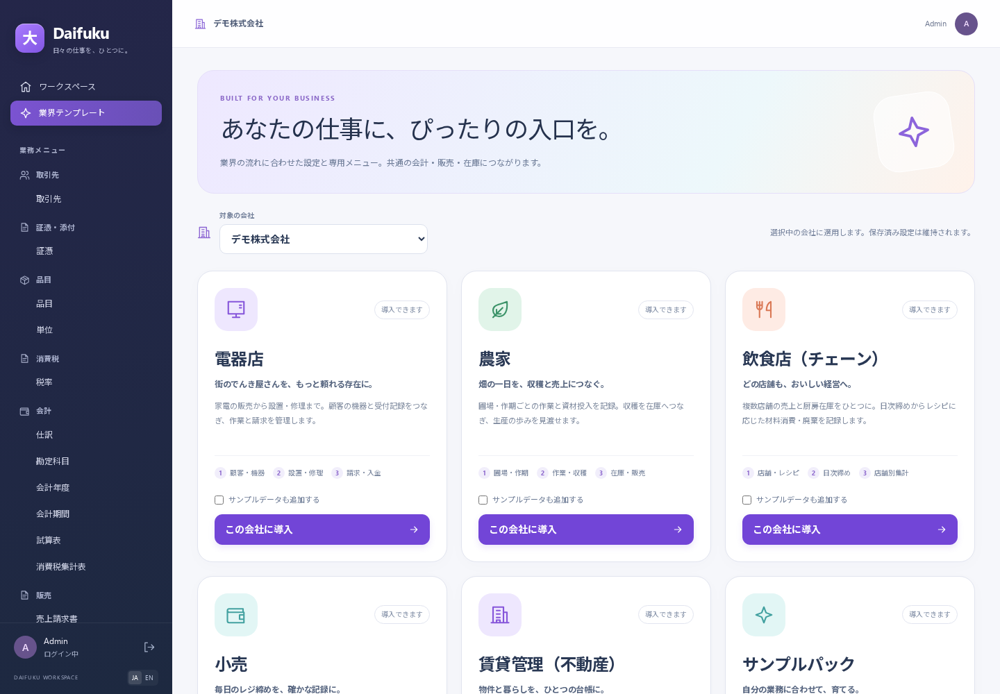

# 付録 D 業界テンプレートを試す（2026-09-12）

電器店・農家・飲食店チェーンの、受付や日々の記録から請求・在庫へつながる初版です。国内・円建ての業務を想定しています。この付録では、練習用の会社を分けて、最初の一件を操作します。名前・商品・数量・価格はすべてサンプルです。



## 1. 3つのサンプル会社を用意する

管理者がすでに用意していれば、次の「会社を選ぶ」へ進んでください。

導入とデータベースの移行が済んだ **初期 Demo データのある練習用データベース** を使います。管理者は接続先の設定を確認し、プロジェクトのルートで次を実行します。

```sh
pnpm demo:industries
```

元の Demo 会社を残して、同じ Demo の利用者が選べる3社を追加します。それぞれの会社に基本マスタ、対応するテンプレート、サンプルが入ります。

| テンプレート | 新しく作る会社の表示名 |
| --- | --- |
| 電器店 | 電器店サンプル｜あかり電器 |
| 農家 | 農家サンプル｜ひなた農園 |
| 飲食店（チェーン） | 飲食チェーンサンプル｜こもれび食堂 |

同じコマンドを再実行しても、作成済みのサンプル会社を再利用し、保存済みの設定や変更した会社名を保ちます。既存会社との識別ができない場合は停止します。データの消去や会社の流用で解決せず、管理者が対象を確認してください。

## 2. 会社を選ぶ・画面から導入する

1. Demo の管理者でログインし、サイドバーの「業界テンプレート」を開きます。
2. 会社の選択欄で、試したいサンプル会社を選びます。画面が読み直されるので、表示されている会社名を確認します。
3. 「利用中」のカードにある業務メニューから、台帳・伝票・レポートを開きます。

自分で用意した会社に導入する場合も、この画面で会社を選んでから「この会社に導入」を押します。**「サンプルデータも追加する」は任意で、最初は選択されていません。** 確認画面の会社名とテンプレート名を見て実行してください。導入済みの会社でも、まだサンプルを入れていなければ「サンプルを追加」を使えます。

画面からの導入は、保存済みの設定を保ちます。税込・税抜入力や在庫の自動入出庫が、テンプレートの推奨値へ自動で切り替わるとは限りません。サンプルは会社ごとに一度追加でき、繰り返し練習するための初期化機能ではありません。

会社の切替は「業界テンプレート」画面で行います。入力中の伝票は先に保存してください。**ログインと会社の選択はタブ単位**です。別タブではログイン状態と対象会社を確認し、この更新より前から使っていた画面では再ログインしてください。

## 3. 電器店：修理受付を請求まで進める

対象会社は「あかり電器」です。最初は、商品在庫を使わないサンプルの修理技術料で試します。

1. 「設置・修理受付」でサンプルの修理受付を開き、お客様、顧客の家電、症状、明細を確認します。
2. テンプレートの「作業を開始」を開き、「受付伝票」でその修理受付を選んで実行します。
3. 「作業完了を記録」で同じ受付を選び、完了日と作業報告を入力して実行します。完了日は受付日以降にします。これで作業が確定し、明細も編集できなくなります。
4. 「作業の請求書を発行」で同じ受付を選び、実行します。請求日は省略すると完了日になります。標準のサンプルでは修理技術料8,000円に税800円が加わり、請求額は8,800円です。
5. 「未完了・請求待ち」で残りの受付を確認します。入金は共通の「入出金」で記録し、作られた売上請求書へ消し込みます。

作業操作の画面では、対象を選ぶ→入力する→「実行」→確認、の順に進めます。受付の番号を控えておくと選びやすくなります。同じ受付の請求を再実行しても、請求書は増えません。

保証対応かどうかは担当者が判断します。無償対応は請求区分を「無償・保証対応」にし、請求明細を入れずに開始・完了します。本体販売を加える場合は、先に仕入・在庫を準備してください。

詳しい手順と取消は「[電器店の実行台本](../domain/scenario-appliance-store.md)」を参照してください。

## 4. 農家：作期を確定して収穫を記録する

対象会社は「ひなた農園」です。サンプルの作期・農作業・収穫は下書きなので、確認してから確定します。

1. 「作期」で「2026年トマト（デモ）」を開き、圃場「北畑（デモ）」、作物「トマト（デモ）」、期間を確認し、「確定」を押します。
2. 「収穫」でサンプルの下書きを開きます。2026年7月1日、倉庫 `FARM`、数量100kg、評価単価200円を確認して確定します。
3. 在庫が100kg・評価額20,000円増えたことを確認します。「圃場・作期集計」で作期を含む期間と基準日を指定すると、収穫量と評価額を確認できます。

サンプルの「農作業・資材投入」は、資材10kgを消費する内容です。**先に資材を仕入れ・入庫しないと確定できません。** 作業を記録した後、未確定の作業や収穫がなくなったら「作期を終了」で終了日を指定できます。

収穫した商品の販売には共通の売上請求書を使います。自動出庫を使う場合は、会社の出庫倉庫を `FARM` に合わせるか、販売に使う倉庫へ移動します。収穫の評価額は売上や利益ではなく、収穫だけで販売仕訳は作られません。

仕入・資材消費・販売・入金までの手順は「[農家の通し台本](../domain/scenario-farm.md)」を参照してください。

## 5. 飲食店チェーン：食材を入れて日次締めをする

対象会社は「こもれび食堂」です。この会社の中に、サンプル店舗「青葉店」と「港店」があります。会社間の合算ではなく、同じ会社の店舗を比較する形です。

**サンプルに食材在庫や売上実績は含まれません。** 最初は青葉店だけで、次の一日を試します。

1. 「店舗・厨房」で青葉店の厨房倉庫を確認します。「在庫」→「入出庫伝票」で、2026年9月1日付の入庫を作り、その倉庫に米 `RC-RICE` を10kg・評価単価500円、鶏肉 `RC-CHICKEN` を5kg・評価単価1,000円で入れて確定します。
2. 「店舗の日次締め」で新規作成し、店舗を青葉店、営業日を2026年9月12日にします。「メニュー販売数」に確定レシピ `RC-CURRY-V1`、提供方法「店内飲食」、販売数10、税込単価1,100円を入れます。
3. 現金売上を11,000円、カード・QR売上を0円にして保存し、合計を確認して確定します。現金・カード・QRの合計が税込売上と一致する必要があります。
4. 売上請求書、現金入金、米2kg・鶏肉1kgの材料消費出庫が作られたことを確認します。「店舗別日次集計」で、この日の青葉店の売上と材料消費を見ます。

食材が足りなければ締めは確定できません。同じ店舗・営業日の有効な締めは一件です。練習を続けるときは別日を使うか、元の締めを正規の取消操作で訂正してください。カード・QR売上は入金待ちとして残り、後日の入金で消し込みます。

2店舗、持帰り、廃棄、後日の入金を含む例は「[飲食店チェーンの実行台本](../domain/scenario-restaurant-chain.md)」を参照してください。

## 6. 実際の運用へ進む前に

- 在庫の自動入庫・出庫の設定を会社ごとに確認し、自動処理と手入力で同じ在庫を二重に動かさないようにします。単独の在庫入庫は仕入債務の記録にはなりません。
- 伝票は保存してから確定します。自動生成された請求・在庫を訂正するときは、元の受付・農作業・収穫・日次締めから取り消します。入金済みなら先に入金の訂正が必要です。取消日の使い方は「[付録 C 新UIの使い方](appendix-c-ui-refresh.md)」を参照してください。
- 3業界の入口を用意した初版です。家電リサイクルの申請・法令台帳、農薬の法定記録・補助金手続き、これらpack単独でのPOS商品連携・給与・フランチャイズ精算は含みません。共通機能として追加したSquare決済仮勘定連携/FCは [付録H](appendix-h-enterprise-operations.md)、給与は [付録I](appendix-i-fiscal-and-work-systems.md) を参照してください。サンプルの税率・評価単価・保証情報だけで、個別事業の制度対応を確認したことにはなりません。

---

操作名とサンプル内容は2026-09-12時点の実装・各業界の実行台本に基づきます。以前の章にある「業務操作に画面がない」という説明は、ここで紹介したテンプレートの操作には当てはまりません。
