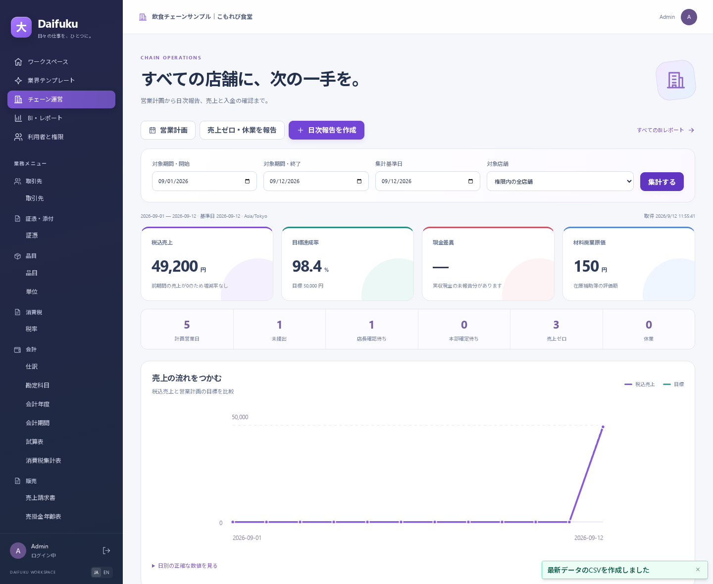

# 付録 E チェーン運営・利用者管理・BI（2026-09-12）

営業計画と日次報告、担当する会社・店舗、数字の根拠をつなぐ画面です。既存の会計・販売・在庫は共通基盤を使います。まず練習用の飲食チェーン会社で試してください。

## 1. 安全に導入・更新する

管理者向けの手順は [安全な導入と更新](../operations/setup.md) にあります。`pnpm run setup install` / `pnpm run setup upgrade` は、初期状態では変更計画を表示します。確認した接続先に対して明示的に実行すると、DBバックアップを別の空DBへ実復元してから移行します。既存DBや利用者のパスワードをリセットして進めることはありません。

更新0009は会社への所属と店舗権限、営業計画、日次報告の確認状態を追加します。更新前の管理者はテナント管理者へ、テナント共通の業務ロールはそのテナントの既存各社への所属へ移します。**古いログインセッションは無効になるので再ログインしてください。** 過去の伝票に存在しなかった店長の確認履歴・実収現金は補完しません。

DBのdumpには添付ファイル本体やruntime.envの接続・JWT秘密は含まれません。これらも別に保全する手順を導入ガイドに記載しています。dumpには利用者の認証ハッシュなどDB内の情報が含まれるため、dump自体もアクセスを制限して保護します。

## 2. 利用者と会社・店舗を設定する

サイドバーの「利用者と権限」はテナント管理者が利用できます。

1. 「利用者を追加」で名前、メール、12文字以上の初期パスワードを指定します。作成通知メールは送られません。
2. 作成した利用者を一覧で選び、「権限を設定する会社」を選択します。
3. 業務ロールとアクセス範囲を指定します。店舗を限定するときは「指定した店舗のみ」を選び、担当店舗を選択して保存します。
4. 画面の「アクセス変更の履歴」で、実行者、日時、変更前後を確認します。パスワード値は履歴に表示しません。

| 設定 | 担当できること |
| --- | --- |
| テナント管理者 | 利用者の作成・無効化、全会社の管理、所属・権限設定 |
| 会社の管理者 | 所属した会社の業務・設定。テナント全体の利用者管理権限は含まない |
| 店舗スタッフ | 担当店舗の日次報告の作成・修正・提出、許可された店舗の分析 |
| 店長 | 担当店舗の提出内容の承認・差戻し、営業計画の参照、店舗スタッフの業務 |
| 本部の全社業務権限 | 営業計画の登録、承認済み報告の確定、売上・入金・材料在庫の処理 |

店舗限定の所属には、店舗に対応した操作だけが公開されます。会計・在庫の汎用伝票へのアクセスは付与されません。同じ利用者でも会社ごとに異なるロールや担当店舗を持てます。テナント管理者は会社所属によらず全会社を管理できるので、店舗担当者には通常この権限を付けません。

権限、有効状態、パスワードの変更は既存のログインにも反映されます。本人の管理者権限・有効状態・所属は本人から変更できず、最後の有効なテナント管理者は削除できません。別の管理者が同じ情報を先に保存した場合、入力を保持して最新情報の確認を促します。未保存のまま利用者・会社・ページを切り替えると確認が表示されます。

## 3. 店舗の日次業務を回す

「業界テンプレート」で飲食チェーンの会社へ切り替え、「チェーン運営」を開きます。現在選択中の会社名を上部で確認してください。

1. 本部が「営業計画」で対象店舗、開始・終了日、営業曜日、1営業日の税込売上目標を登録します。選択しない曜日は休業予定です。確定計画や実績を上書きせず、過去の目標変更は拒否します。
2. 店舗スタッフが「日次報告を作成」で店内・持帰りの明細、決済別売上、材料廃棄、現金売上の実収額を入力して保存します。現金の実収が未点検なら空欄のままにします。
3. 営業したが売上がなかった日は「売上ゼロ・休業を報告」を選び、理由を書きます。休業した場合も区分と理由を明記します。この操作は下書きを作るため、内容を確認して提出します。
4. 一覧の「提出」で店長へ渡します。提出後は直接の明細編集もできません。修正が必要なら店長が理由を付けて「差戻し」します。
5. 店長が「承認」すると「本部確定待ち」になります。本部が「本部確定」で売上・入金・材料消費・廃棄を確定します。在庫不足などで失敗した場合は一式を確定せず、原因を直して再実行します。

確定済みの伝票は内容を書き換えません。訂正は既存の取消・改訂操作を使います。過去の会計期間が締まっている場合は、開いている期間の訂正日を指定する規則を維持しています。店舗担当者が本部の財務・在庫確定を代行することはできません。

一覧は「未確定だけ」と「計画のない日も表示」で絞れます。50件ごとにページ送りできます。「報告を開く」から日次締めの内容を確認してください。

## 4. 数字とその根拠を確認する

対象期間・集計基準日・店舗を選んで「集計する」を押します。業務日の区切りは **Asia/Tokyo** です。会計上有効な日で売上・取消・消込を計算し、提出・承認の状態は現在の状態を表示します。

| 表示 | 読み方 |
| --- | --- |
| 税込売上 | 選択期間内の計上日・取消有効日の売上増減。取消はその有効日の期間で差し引く |
| 目標達成率 | 税込売上÷確定した営業計画の目標。目標が0なら「—」 |
| 前期間比 | 直前の同じ日数の期間と比較。前期間が0なら増減率は「—」 |
| 現金差異 | 申告された現金売上実収額−現金売上。未点検を含む場合は「—」 |
| 材料消費・廃棄原価 | 在庫補助簿の評価額。会計上の利益ではない |
| 未提出 | 営業予定に対して未提出の店舗日。売上ゼロ・休業報告と区別 |
| 計画なし | 営業計画のない店舗日。未提出と断定しない |

例えば9月12日の売上を9月14日付で取り消した場合、9月12日だけの期間には売上、9月14日だけの期間には取消のマイナスを表示します。集計基準日を後日に変えても、期間外の取消を9月12日の売上へ戻して差し引きません。入金残高表は別に、集計基準日までの有効な消込と残高を表示します。

グラフの「日別の正確な数値を見る」を開くと日別表が表示されます。「店舗別パフォーマンス」の店舗ボタンで、その店舗へ絞り込めます。「集計の根拠となる日次締め」の伝票リンクは元の記録へ、本部の「売上伝票と消込の確認」は請求書と基準日時点の残高へつながります。

## 5. BIレポートとCSV

「BI・レポート」には、その会社・権限で利用できるレポートが並びます。会計・販売・購買・入出金・在庫・契約と、導入済みの業界レポートを業務分野や名前で絞り込めます。

レポートを開いて条件を指定し「実行」を押します。結果には取得日時・行数・集計条件・計算情報が付属します。条件を変えると、表示中の結果が前回の条件であることを示し、再集計までCSVを無効にします。

CSVの作成時はサーバーが現在の出力権限を再確認し、同じ入力条件で最新データを再取得します。画面表示から出力までに業務データが変わると数値も更新されます。表示権限だけでは出力できず、対象元データすべての出力権限が必要です。CSV内の文字列による表計算式の実行を抑止する共通処理も適用します。

## 今回の範囲

1法人内の店舗運営と会社・店舗への所属管理を対象にしています。SSO/MFA、招待メール・本人によるパスワード再設定、POS自動連携、連結会計、フランチャイズ精算、自由SQLの外部BI、定期配信は含みません。接続・サービス公開・災害復旧・負荷容量の運用判断は、導入先ごとに別途確認します。
