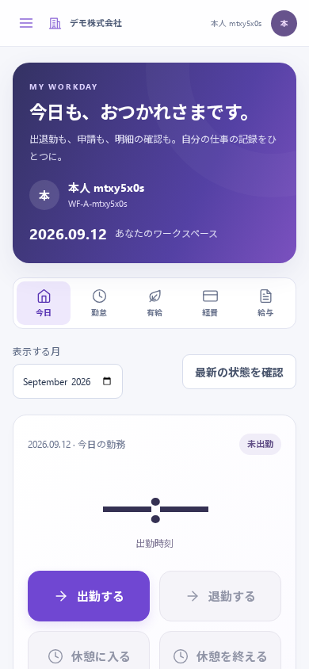
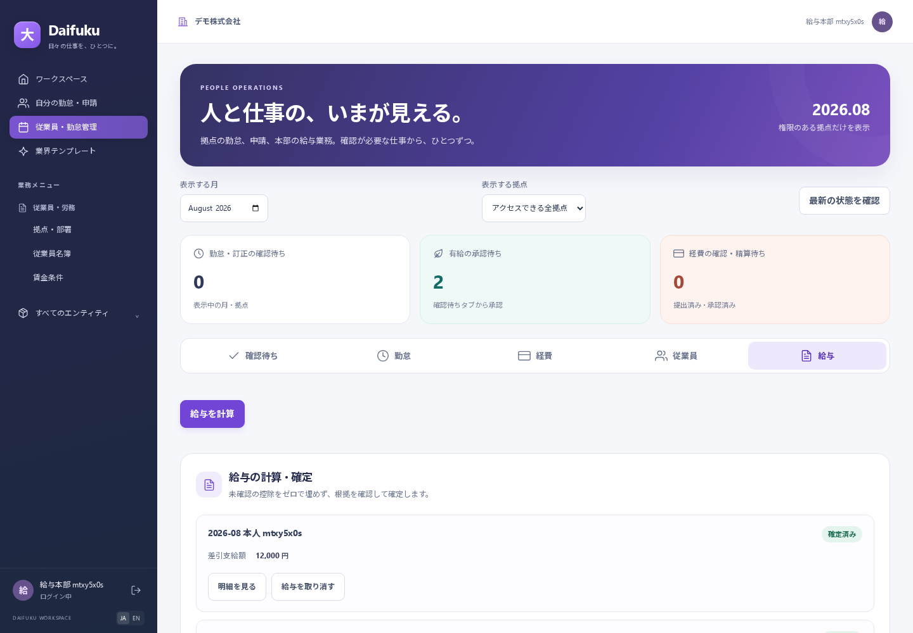

# 補遺F — 従業員の勤怠・有給・経費・給与

本補遺は従業員ポータル `/me` と、本部・拠点管理画面 `/workforce` の説明です。従来の v0.1 マニュアル画像には、この機能は含まれません。

## 運用を始める前に

「利用者と権限」で利用者を作成し、対象会社への所属と業務ロールを設定します。本人は `workforce_employee`、拠点管理者は `workforce_manager`、人事本部は `workforce_hr`、給与・精算本部は `workforce_payroll` です。拠点を限定する場合は「指定した拠点のみ（人事・勤怠）」を選び、担当拠点を指定します。兼務するチェーン店舗の権限は必要な場合だけ明示します。

管理画面の「従業員」タブで、次の順に準備してください。

1. 「拠点・部署」で勤務先を登録します。
2. 「従業員を登録」で、その会社に所属する利用者、拠点、従業員番号、氏名、入社日を指定します。利用者IDの手入力は不要です。
3. 更新前から利用している会社で制度がない場合は「初期制度を準備」を実行します。既存の制度は上書きしません。その後「勤怠・給与制度」で、制度の適用期間、会社の週の起算日、就業規則などを確認します。
4. 給与担当が「期間付き賃金条件」で、従業員ごとの時給・月給、適用期間、割増計算の基礎、全日有給の換算時間と確認根拠を登録します。未確認の条件は給与計算に使用できません。
5. 人事担当が「有給を付与」で、付与日、有効期限、日数と資格確認の根拠を記録します。勤続期間・出勤率等から日数を自動決定する機能ではありません。

本人は自分の記録だけを利用します。拠点管理者は担当拠点内、本部は権限を与えられた会社内を確認します。管理者自身の申請も別の担当者による承認が必要です。

## スマートフォンでの本人操作

本人ロールのみの利用者は、ログイン後に「自分の勤怠・申請」が開きます。兼務する場合はメニューから選びます。「今日」「勤怠」「有給」「経費」「給与」のタブを切り替えます。月の選択は履歴の表示に使います。新しい出勤日はサーバーの日本時間で決まり、前の日から退勤していない勤務がある場合は、その勤務を継続して表示します。

390px幅の本人画面です。上部のタブで申請・明細に移動し、大きなボタンから出退勤・休憩を記録します。画像の会社・従業員番号・氏名は、ブラウザ試験が作成した架空のデータです。

### 打刻と訂正

「出勤する」「休憩に入る」「休憩を終える」「退勤する」の順に、実際の勤務に合わせて操作します。打刻はサーバーがリクエストを受け取った時刻を記録します。通信後に表示された出退勤・休憩の記録を確認してください。

退勤後は「勤怠」で内容を確認し、「この勤怠を提出」を押します。誤りがある場合は「訂正を申請」で訂正後の出退勤・休憩と理由を入力します。時刻は日本時間で、元の勤務日と実際に完了した過去の時刻を指定します。承認されるまで元の勤怠は変わりません。訂正の承認後、必要に応じて勤怠を再提出します。退勤を忘れた記録も、実際の過去の退勤時刻を訂正申請し、別の担当者の承認で閉じることができます。

前の日から継続する勤務には、勤務を始めた日付と「この勤務の記録を開く」を表示します。前月の退勤忘れでも、そのボタンから対象月の記録へ移動できます。勤務時間の集計値は退勤後に表示します。

日付をまたぐ勤務の打刻・訂正は記録できますが、初版の自動給与計算は対象外です。日別の法定休日区分を持つ計算モデルが未対応のため、その勤務を含む月の給与計算はエラーで停止します。

### 有給

残数を確認し、「有給を申請」で取得日、1日・午前半日・午後半日、理由を入力します。取得月が表示月と異なる場合、保存後に取得月へ移動します。半日取得は会社の運用と合意を確認してください。承認時に残数・期限・重複を再確認します。取り消す場合も理由を残します。

### 経費と領収書

「経費を記録」で利用日、区分、精算額、利用目的、証憑の説明・保管場所を入力し、下書きに保存します。金額は税込の精算額を1円単位で入力します。

保存した申請の「領収書・証憑」から、スマートフォンで写真を撮るか、写真・PDFを選んで添付できます。PNG・JPEG・PDF、1ファイル10MB以下、1申請10件までです。添付は本人の下書き・差戻し中に限ります。提出後の証憑は閲覧のみになるため、提出前に内容を確認してください。ファイル添付は任意ですが、証憑の説明は必要です。

「経費を提出」すると拠点側の承認対象になります。「承認済み」と「精算済み」は異なります。精算日と支払記録が登録されると「精算済み」になります。

### 給与明細

「給与」には自分の確定済み明細だけが表示されます。「明細を見る」で基本給、割増、手当、控除、根拠、差引支給額を確認できます。未確定の計算途中の金額は公開されません。

## 本部・拠点の確認

管理画面では、月と表示する拠点を選びます。サーバーが許可した拠点だけを選べます。「確認待ち」タブには勤怠・訂正・有給・経費の待ち行列が表示されます。

- 勤怠承認では、実績と休憩に加えて「通常の勤務日」「法定休日」を確認し、理由・確認内容を記録します。
- 訂正承認では、申請された出退勤と休憩を確認します。
- 有給承認では、残数・期限・勤務予定を確認します。半日取得では合意確認が必要です。
- 経費承認では、目的・金額・証憑を確認します。差戻し時は修正内容がわかる理由を入力します。
- 給与・精算本部は、実際に支払った経費について精算日と支払記録を入力します。この操作による銀行送信・会計仕訳の自動作成はありません。

自分の記録に対する承認操作はできません。別の担当者へ依頼してください。

## 月次給与の計算・確定

本部の給与担当者が、対象月の確定状態と金額を確認する画面です。画像は時給1,500円・全日有給480分から12,000円となる合成試験の結果で、実在する従業員の給与ではありません。給与の計算は個々の会社の条件と確認済みの実績に基づきます。

1. 対象月と境界週の勤怠、訂正、有給の承認を終え、勤怠・欠勤等の記録に漏れがないことを確認します。
2. 対象月が終了してから、「給与」タブの「給与を計算」で従業員と月を選び、記録の完備を確認して下書きを計算します。
3. 「確認・確定」で賃金条件・日別の計算根拠を読み、控除8項目の金額・根拠をそれぞれ入力します。該当しない項目も、確認の上で `0` と対象外の根拠を入力します。未確認の項目を自動でゼロにする機能はありません。
4. 必要な手当を追加し、全体の確認記録を残して確定します。本人に明細が公開され、その従業員の対象期間が閉じられます。

計算後に勤怠や賃金条件が変わった場合は、その下書きを確定できません。内容を確認し、「給与を計算」から明示的に再計算してください。確定済み給与は直接編集できません。訂正が必要な場合は権限のある担当者が理由を付けて取り消し、必要な修正と再計算を行います。

初版は日本円・通常の労働時間制を対象とし、変形労働時間制、フレックスタイム制、固定残業代の精算、社会保険・税額の自動算定、年末調整、電子申告、銀行振込は対象外です。制度・計算の適用範囲と一次資料は [日本の労務制度](../domain/japan-workforce.md) と [設計仕様](../specs/workforce-platform.md) を参照してください。

## 入力・通信・機微情報

入力中のダイアログを閉じる・移動する場合は破棄確認が表示されます。送信中の二重操作を抑止し、通信失敗時には入力を保持します。競合時は保存したつもりにせず、表示された案内に従って最新の記録を確認してください。

会社・利用者ごとに画面の読込データを分け、会社切替・ログアウトではページの状態を切り離します。給与・申請・証憑をアプリのオフライン用永続キャッシュには保存しません。打刻・申請には通信が必要です。領収書のダウンロードを自分で実行すると端末にファイルが保存されるため、会社の取扱規程に従ってください。

[マニュアル目次へ戻る](00-index.md)

## 社員の勤務条件・シフト計画

社員検索、勤務条件、スマホからの週間希望、店長の推薦・固定・確認公開は [シフト操作ガイド](../operations/shift-planning.md) を参照してください。計画と実勤務・給与は別に保存します。
