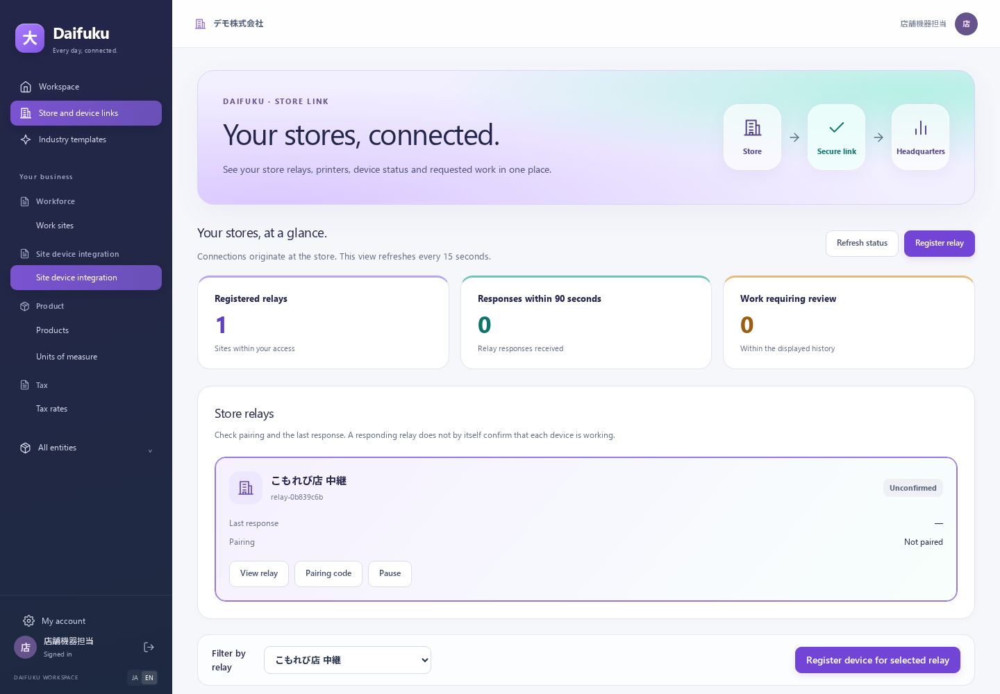
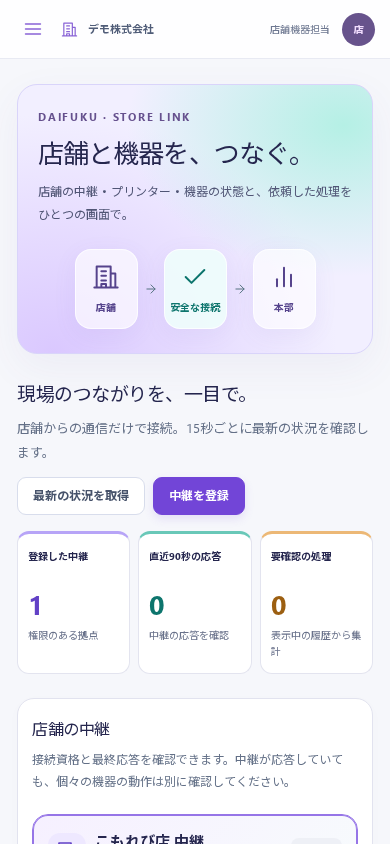

# 付録 J 店舗・機器連携とクラウド・オンプレ導入

店舗のLANにLinux中継を置き、本部のERPへ外向きに接続します。クラウドとオンプレで同じ中継・管理画面を使います。店舗ルーターの受信ポート開放は不要です。オンプレERPが別拠点から見えない場合は、VPN等でERPのHTTPS接続先へ到達できる構成を用意します。

初版は **IPPテキストプリンターと模擬機器** に対応します。自動釣銭機の実機、USB/シリアル、ESC/POS、PDF・画像印刷は機種別の追加対応が必要です。釣銭シミュレーターは現金・会計・支払伝票を操作しません。

## 最初に準備するもの

| 担当 | 準備 |
| --- | --- |
| 導入担当 | [クラウド・オンプレ共通配備](../operations/deployment.md)に従いERP、HTTPS、DB、保管先、監視を設定 |
| 認証管理者 | [本人確認の設定](../operations/enterprise-identity.md)を実施。接続コード発行・失効時にパスワード/MFAの再確認が必要 |
| 会社管理者 | 従業員・勤怠管理で設置拠点を登録。「利用者と権限」で機器管理者・機器担当者を割当 |
| 店舗設置担当 | Linux、Node.js 22、flock、耐久ディスクを準備し、[中継の運用手順](../operations/edge-agent.md)に従って設定 |

`edge_manager` は登録・接続・受付停止/再開・要確認処理の解決、`edge_operator` は処理依頼と待機中取消を担当します。「指定した拠点のみ」で会社内の拠点を限定できます。機器ロールだけで社員・給与資料を読めるようにはなりません。飲食店の旧「指定した店舗のみ」とは別の拠点設定です。

## 1. 中継と機器を登録する

1. 「店舗・機器連携」を開き、「中継を登録」で設置拠点、コード、名前を入力します。拠点は登録後に変更できません。
2. 中継の「接続コード」から本人確認を行います。10分有効・単回のコードを店舗側の保護ファイルへ転記し、中継の `pair` を実行します。コードをURL・コマンド引数・共有文書へ貼り付けません。
3. 「この中継を見る」を選び、「選択した中継に機器を登録」で機器名、店舗内機器ID、接続方式を設定します。
4. 管理画面の機器UUID、店舗内機器ID、接続方式を店舗側設定と合わせます。プリンターのLAN宛先とCAは店舗側にだけ保存します。
5. 中継を起動し、最終応答を確認します。中継の応答と、個々のプリンターの動作確認は別です。機器は最終観測時の報告を表示し、観測時刻と受信時刻を区別します。「受付停止」は通信不能を意味しません。

接続資格・開始前の依頼には期限があります。パソコンを交換する際は旧中継を停止・失効させ、未解決処理を確認してから新しく登録します。動作記録を消して再接続する運用はしません。

## 2. 印刷・状態取得・模擬釣銭を依頼する

機器の「処理を依頼」から種類を選択します。印刷では表題、本文、1〜5部の部数を入力し、1分・15分・1時間の開始期限を指定します。模擬釣銭はシミュレーターにだけ表示されます。開始後でも期限までに結果を確認できなければ要確認になります。期限は実機の動作を止める機能ではありません。IPPは機器のtext/plain対応を照合し、日本語にはUTF-8の明示対応が必要です。

送信後に応答が失われた場合、「同じ依頼を確認」を使います。内容と依頼IDを固定し、同じ処理を二重登録しません。画面を閉じて別の依頼を作る前には履歴を確認してください。

## 3. 履歴・要確認を扱う

| 表示 | 意味と操作 |
| --- | --- |
| 待機中 | 未取得。理由付きで取消可能 |
| 取得済み・開始前 | 中継が取得した段階。開始許可前に切断したものだけ再取得対象 |
| 実行中 | 開始許可済み。開始後の取消・自動巻き戻しはできない |
| 完了報告 | 機器・シミュレーターから完了報告を受けた。IPPの受付だけで完了としない |
| 実機の確認が必要 | 物理動作の結果が不明。同じ機器への後続処理を停止 |
| 失敗・取消済み・期限切れ | 終了状態。必要な再依頼は履歴確認後に新しい依頼で行う |

要確認の場合は出力物、プリンター履歴、現金の状態等を現場で確認し、「実機確認・解決」から確認結果、根拠、理由を記録します。これは結果を確定する操作で、機器を再実行しません。別担当者と同時に操作した場合は最新の版を読み直します。

中継/機器の「受付停止」は開始済みの物理動作を止める機能ではありません。紛失・漏えい時は接続資格を失効させます。失効済みの資格でHTTPS取得やWSS接続を継続できません。

一覧は15秒ごとに更新します。通信失敗時には最後の取得結果と再取得案内を表示し、開いている入力を保持します。会社や権限が変わった場合は以前の会社の情報・入力を表示しません。表示上限に達したら中継で絞り込み、全履歴は業務メニューから確認します。

## 導入・運用の範囲

WebSocketは処理の存在だけを通知し、本文・金額・秘密を含めません。HTTPSで処理取得と結果報告を行い、通知が失われても定期取得で回復します。通常の通知確認は約5秒、通知断時の取得は約15秒を基準とし、負荷や通信状況で遅れます。

配布物はLinuxのクラウドVM/オンプレ単一APIとローカル添付保存を対象にします。DB/添付のバックアップ、OS更新、TLS/CA、実機受入と監視は導入先で実施します。物理動作とDBの記録を原子的に確定できないため、機器操作のexactly-onceは保証しません。不明時に自動再実行せず確認へ進むことで二重処理を抑えます。

検証: 合成データによる店舗限定のブラウザ登録・模擬依頼・取消・再送と390px/英語画面を確認。HTTPS/WSS/IPPの模擬サーバーおよび実ERP APIとの試験を実施。メーカー実機・導入先のCA/OSサービス・本番ネットワークの受入は未実施です。詳細は [仕様](../specs/deployment-edge.md)、[中継運用](../operations/edge-agent.md)、[配備](../operations/deployment.md) を参照してください。
