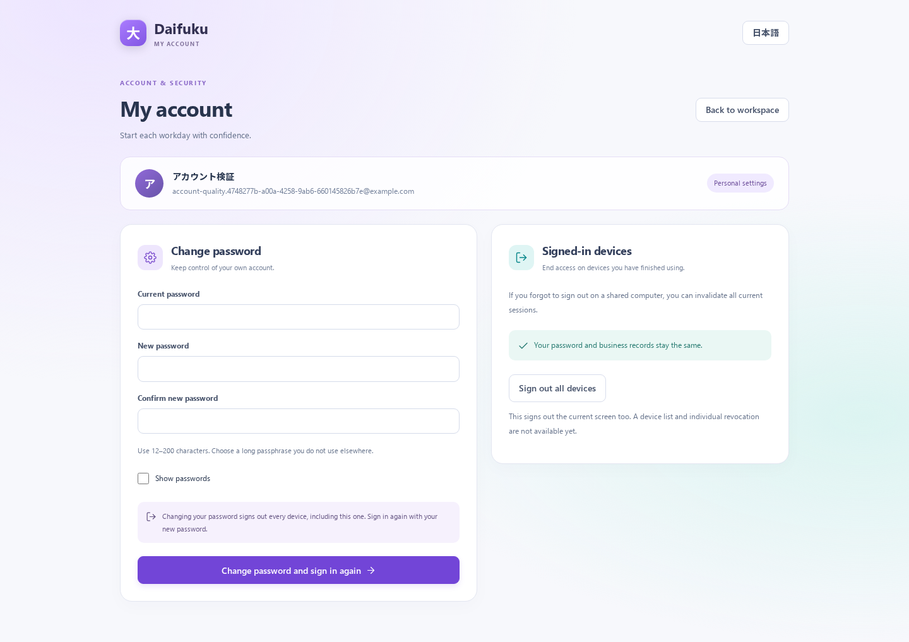

# 自分のアカウントとログインの管理

[README](../../README.md) / [権限の設計](../architecture/permissions.md) / [品質改善仕様](../specs/quality-foundation.md)

[スマホ375pxの画面例](../manual/img/account-security-mobile-20260912.png)

## 本人用の設定を開く

ログイン後、メニュー下部または上部の利用者名から「自分のアカウント」を開きます。URLは `/account` です。スマホではメニュー内からも開けます。会社への所属がまだない利用者でも、ログイン中の自分のアカウントを管理できます。

この画面は利用者管理の管理者画面とは別です。他人のパスワード・権限・会社所属は変更できません。

## パスワードを変更する

1. 現在のパスワード、新しいパスワード、確認用の入力を行います。新しいパスワードは12〜200文字で、現在とは異なる値にします。
2. 「変更してログインし直す」を押します。現在のパスワードが合っていない場合は変更されません。
3. 成功するとすべての既存ログインが失効します。この画面もログイン画面へ戻るので、新しいパスワードでログインします。

通信が一時的に失敗したときは、この画面の入力を保持します。通信切断で結果を受け取れなかった場合でも、サーバーでは変更が完了している可能性があります。再試行でログイン画面へ戻された場合は、新しいパスワードを使ってください。入力中に別画面へ移動する際には破棄を確認します。認証失効時には入力を残して操作を続けません。

パスワードはURL・ブラウザーの永続ストレージ・アプリの監査記録には保存しません。変更後はRESTとMCPの両方で、それまでのセッションを使えなくなります。ブラウザー上の既表示内容を遠隔消去する仕組みではなく、失効後の次のAPI利用を拒否します。

## すべての端末をログアウトする

共有PCで終了を忘れた場合などは「全端末からログアウト」を押し、対象を確認して実行します。この端末も含めてログインし直す必要があります。パスワードと業務データは変更しません。閉じた端末も、次の通信で失効を確認します。

通常のメニューのログアウトは、そのタブの認証を破棄します。他の端末も含めて終了したい場合に本人設定の全端末ログアウトを使います。端末一覧・個別端末の失効はまだありません。

## 管理者・運用担当向け

- `POST /auth/password` は `{ currentPassword, newPassword }`、`POST /auth/logout-all` は空のオブジェクトを受け取り、成功時は `{ ok: true }` を返します。ログイン中の本人だけが対象で、会社を選ぶ必要はありません。
- 有効ユーザーとsessionVersionをDBで再確認し、同一利用者の変更を行ロックで直列化します。パスワード更新/失効と秘密を除いた監査記録は同じトランザクションです。
- 予期しないAPI/MCPエラーはSQL・パラメーター・DB詳細を公開しません。APIのrequestIdと安全なエラー分類で運用ログを照合します。リクエストURLの検索条件はログへ残しません。
- 遅れて到着した古いセッションの401応答で、新しいログインを取り消さないようクライアントでも送信時の認証を照合します。
- パスワードを忘れた場合のメール再設定、招待メール、SSO/MFAは未実装です。管理者による既存の利用者管理で復旧し、秘密を公開Issueに書かないでください。
