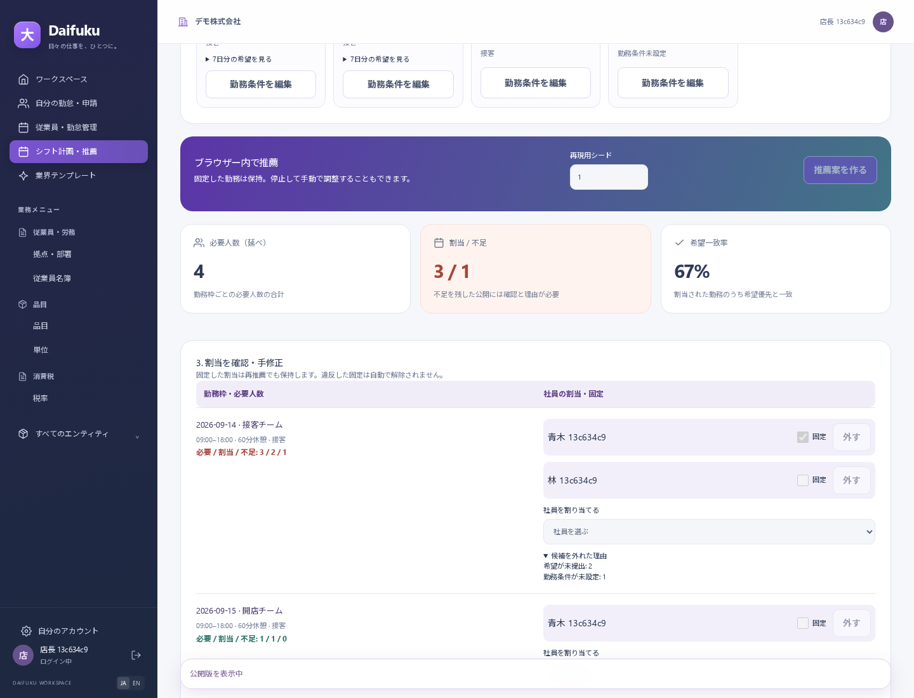

# 社員とシフト計画の使い方

[README](../../README.md) / [従業員ガイド](../manual/appendix-f-workforce.md) / [設計](../architecture/shift-planning.md)

## 最初の準備

本部の人事担当者が拠点と社員を登録し、利用者へ対象会社・拠点の所属と役割を設定します。店長は担当する拠点、本部担当者は許可された範囲を扱います。社員一覧は氏名・社員コード・拠点・在籍状態から絞り込めます。

社員の「勤務条件を編集」でスキル、雇用区分、週の目標と上限、日上限、週の勤務日数、連勤上限、最小勤務間隔を設定します。目標と上限は分単位です。例えば週20時間は1,200分、1日8時間は480分です。条件の未設定者は推薦されません。将来入社する社員の準備は可能ですが、入社前・退職後の日には割り当てません。

会社の通常勤務policyが対象期間を覆い、週の開始が月曜日である必要があります。非月曜の会社設定を暗黙に月曜へ読み替えません。標準の勤務間隔660分は本機能の運用初期値で、法定値の主張ではありません。会社と個人の厳しい方の時間・休憩条件が使われます。

## 社員がスマホから希望を出す

1. 「自分の勤怠・申請」の「シフト」で対象の月曜日を選びます。
2. 「希望を提出」を開き、7日それぞれを「勤務不可」「勤務可能」「優先して勤務希望」から選びます。
3. 可能・希望の日は開始と終了を指定します。日末まで可能な場合は24:00の選択を使います。
4. 7日分を確認して提出します。初期値は全日不可で、未提出のまま推薦されることはありません。

提出後も希望を更新できます。公開された勤務は自動では消えず、管理者に再確認が必要な状態になります。本人画面には現在公開されている自分の勤務だけを表示します。通信失敗時は入力を保持し、再試行できます。会社や本人の権限が失われた場合は閲覧を続けられません。

## 管理者が推薦を整えて公開する

1. 「シフト計画・推薦」で拠点と週を選び、勤務枠の名前・開始終了・休憩分・必要人数・任意の必要スキルを入力します。
2. 希望の提出状況と勤務条件を確認し、「推薦案を作る」を実行します。計算中も操作画面は止まらず、途中停止できます。
3. 不足人数、希望一致率、社員別の時間を確認します。「候補を外れた理由」で未提出・スキル・時間上限などを確認できます。
4. 手動で割当を追加・削除し、動かしたくない勤務を「固定」にして再推薦できます。固定した内容が条件違反なら、問題を表示して修正を求めます。
5. 下書きを保存し、「内容を確認して公開へ」で確認します。不足を残す場合はチェックと対応方針の記入が必要です。条件違反は不足確認で上書きできません。
6. 公開後、社員のスマホで勤務を確認できます。計画は勤怠の打刻や給与実績へ自動転記されません。

同じ資料・入力・シードなら同じ推薦になります。推薦は「欠員を減らす→希望と週目標に近づける」の順で改善します。欠員0や最適な組合せを保証する機能ではありません。希望一致率は優先希望と一致した割当の割合、偏り指標は社員ごとの週目標に対する計画時間のばらつきです。査定には使いません。

[スマホで確認する公開勤務の画面](../manual/img/shift-published-mobile-20260912.png)

## 変更と取り消し

編集中に希望・社員条件・休暇・会社制度や他の管理者の下書きが変わると、古い資料のまま保存・公開できません。「最新の資料を確認」で取得し、入力を残して再評価するか最新の保存済み案を読みます。再取得に失敗したときは、成功してから再評価してください。

公開済みの本文は直接編集しません。「公開版から改訂案を作る」で下書きを作り、再確認して公開します。新しい版の公開と古い版の引退を一度に行い、履歴を残します。改訂下書きの取り消しでは元の公開勤務を維持します。公開計画自体の取り消しでは、その勤務を本人への現行予定から外します。

公開後の希望・休暇・条件変更は、管理側が最新資料を取得して公開版の問題を確認し、必要な改訂を行います。自動通知・自動再公開は行いません。履歴や将来の公開勤務を失わせる異動・拠点無効化は理由付きで拒否します。

## 現在の対応範囲

1拠点・月曜開始の7日間、100社員、42勤務枠、1枠20人までです。1日の希望は1時間帯、勤務は同一日内に限ります。有給申請中・承認済みの日は対象外で、半日休暇も時間帯が定義されていないため日全体を除外します。

複数拠点への応援、夜勤、複数希望時間帯、資格者の人数比率、休憩を取る具体的な時刻、売上からの必要人数予測、変形・フレックス勤務は今後の対象です。推薦はブラウザーのWeb Worker内で動き、外部AIへ社員情報を送りません。計算のために社員資料を端末の永続ストレージへ保存しません。
